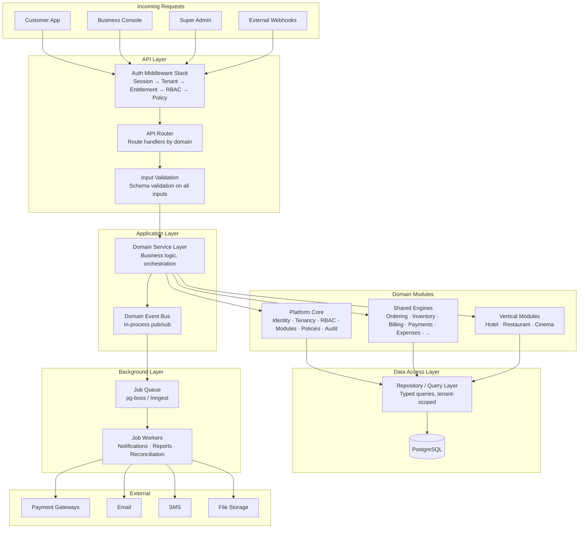

# ASSO — Backend Architecture

**Phase**: 2 — Master Architecture  
**Status**: Approved for Phase 2  
**Last Updated**: 2026-09-26

---

## 1. Backend Principle

ASSO's backend is a **production-grade modular monolith**:

- One deployable application process
- Strong internal domain boundaries (engines and vertical modules are separate code domains)
- Shared data store with tenant-isolated access
- Stateless application design (horizontally scalable)
- Synchronous request handling for the primary API; asynchronous for background work

---

## 2. Application Server Architecture



---

## 3. Module Boundary Model

ASSO's backend is organized into three layers, each with strict boundaries:

### Layer 1: Platform Core

The foundation all other modules depend on. Never depends on domain engines or vertical modules.

```text
platform/
├── identity/       — User accounts, authentication, sessions
├── tenancy/        — Organizations, properties, outlets, business types
├── rbac/           — Roles, permissions, role assignments
├── modules/        — Module registry, entitlements, dependencies
├── policies/       — Business policy rules, approval workflow
├── audit/          — Audit event recording
├── config/         — Business and outlet-level configuration
└── notifications/  — Notification delivery orchestration
```

### Layer 2: Shared Domain Engines

Business capability engines. May depend on Platform Core. Must not depend on Vertical Modules.

```text
engines/
├── customer/       — Customer records, identification
├── qr/             — QR generation, resolution, lifecycle
├── context/        — Business context (room/table/seat abstraction)
├── session/        — Customer session lifecycle
├── catalog/        — Menu/catalog items, availability
├── ordering/       — Order lifecycle
├── fulfillment/    — Order fulfillment and KDS routing
├── service-requests/ — Service request lifecycle
├── conversations/  — Chat/conversation management
├── pos/            — Point of sale
├── billing/        — Charge accumulation, bill generation
├── payments/       — Payment processing, verification, refunds
├── inventory/      — Stock management, movement ledger
├── procurement/    — Purchase orders, goods receiving
├── expenses/       — Expense recording and approval
├── cash/           — Cash management and reconciliation
├── reporting/      — Metrics computation and report generation
└── files/          — File upload, storage, retrieval
```

### Layer 3: Vertical Modules

Industry-specific workflows. May depend on Platform Core and Shared Engines. Must not depend on other vertical modules.

```text
verticals/
├── hotel/
│   ├── rooms/          — Room types, room configuration
│   ├── stays/          — Guest stay lifecycle
│   ├── reservations/   — Hotel reservations
│   ├── front-desk/     — Front desk operations
│   ├── housekeeping/   — Housekeeping task management
│   └── folio/          — Guest folio management
├── restaurant/
│   ├── areas/          — Dining areas
│   ├── tables/         — Table management
│   ├── queue/          — Walk-in queue / waitlist
│   └── reservations/   — Table reservations
└── cinema/
    ├── screens/        — Screen configuration
    ├── seats/          — Seat layout
    └── shows/          — Show scheduling
```

### Dependency Rules

```text
Platform Core     ← Shared Engines depend on it
Shared Engines    ← Vertical Modules use them
Vertical Modules  ← Independent of each other
```

Cross-vertical dependencies do not exist. A vertical must never import code from another vertical.

---

## 4. API Design

### 4.1 API Style

REST with JSON. Resource-oriented endpoints organized by domain:

```text
/api/v1/[domain]/[resource]
```

Examples:
```text
POST   /api/v1/orders
GET    /api/v1/orders/:id
PATCH  /api/v1/orders/:id/status
POST   /api/v1/inventory/movements
GET    /api/v1/reports/sales?from=...&to=...
```

### 4.2 Customer API

Customer-facing API routes are separate and only accept customer session tokens:

```text
/api/customer/context        — Resolve session context
/api/customer/catalog        — Fetch catalog for context
/api/customer/orders         — Create and view orders
/api/customer/requests       — Create service requests
/api/customer/conversations  — Customer chat
/api/customer/bill           — View current bill
/api/customer/payments       — Submit payment
```

### 4.3 Tenant Context

Every staff API request carries tenant context, established by the middleware:

```text
Request → Auth Middleware → Attach {tenantId, outletId, userId, roles, permissions}
              ↓
Domain Handler → Uses context for all queries and mutations
```

Tenant ID is never taken from request body. It is derived from the authenticated session.

### 4.4 Versioning

- API versioning via URL path prefix: `/api/v1/`
- No breaking changes without a new version prefix
- Deprecated endpoints maintained for one version cycle with warnings
- API contracts defined in Phase 3

### 4.5 Error Model

```json
{
  "error": {
    "code": "ORDER_ITEM_UNAVAILABLE",
    "message": "Item 'Margherita Pizza' is currently unavailable",
    "field": "items[1].catalogItemId",
    "requestId": "req_abc123"
  }
}
```

Standard HTTP status codes:
- `400` — Validation error (malformed input)
- `401` — Not authenticated
- `403` — Authenticated but not authorized
- `404` — Resource not found
- `409` — Conflict (idempotency, state conflict)
- `422` — Business rule violation
- `429` — Rate limit exceeded
- `500` — Unexpected server error

### 4.6 Pagination

All list endpoints are paginated:

```text
GET /api/v1/orders?page=1&pageSize=20&sortBy=createdAt&sortOrder=desc

Response:
{
  "data": [...],
  "pagination": {
    "page": 1,
    "pageSize": 20,
    "totalCount": 148,
    "totalPages": 8
  }
}
```

Cursor-based pagination considered for high-volume streams (e.g., audit logs, stock movements). Documented in Phase 3.

### 4.7 Idempotency

High-risk operations require an idempotency key:

```text
POST /api/v1/payments
Headers: Idempotency-Key: <client-generated-uuid>
```

The server stores the result of the first request. Duplicate requests with the same key return the stored result without re-executing.

Operations requiring idempotency keys: payment creation, order creation from POS, expense submission, stock movement creation, folio charge posting.

---

## 5. Middleware Stack

Every API request passes through this ordered middleware stack:

```text
1. Request Logger          — Structured log entry per request
2. Rate Limiter            — Per-IP and per-user rate limiting
3. CORS / Security Headers — Appropriate headers for each route group
4. Body Parser             — JSON parsing with size limits
5. Authentication          — Validate session token; reject 401 if invalid
6. Tenant Resolver         — Attach tenant/outlet/user context
7. Module Entitlement      — Check if the tenant has the required module
8. RBAC Check              — Check if the user has the required permission
9. Policy Evaluation       — Check if the operation meets policy conditions
10. Input Validation       — Validate request body against schema
11. Route Handler          — Domain operation executes
12. Audit Logger           — Record important operations
13. Response Formatter     — Consistent response envelope
```

Customer API routes use a lighter stack (no RBAC/policy; instead uses session scope validation).

---

## 6. Background Processing

Background jobs handle asynchronous work that must not block the HTTP response:

| Job Type | Trigger | Examples |
|---|---|---|
| Notification dispatch | Domain event | Order confirmed → notify kitchen; expense approved → notify submitter |
| Email / SMS delivery | Domain event | Guest receipt, low-stock alert, payment confirmation |
| Report generation | Scheduled / on-demand | Nightly sales summary, inventory report |
| Webhook processing | External provider | Payment gateway webhooks |
| Reconciliation | Scheduled | Cash reconciliation reminders, outstanding approvals |
| Low-stock alerts | Inventory movement | Stock falls below reorder point |
| Session expiry cleanup | Scheduled | Expire stale customer sessions |

### Job Queue Design

- Jobs are stored in the primary PostgreSQL database (using pg-boss or equivalent) — **no Redis dependency required initially**
- Jobs have retry limits with exponential backoff
- Failed jobs are recorded with error details for operator review
- Jobs are idempotent — processing the same job twice must not cause double-effects

```text
Domain Operation → Commit transaction → Enqueue job (in same transaction)
                                              ↓
                                    Job Worker picks up → Processes → Marks done
```

Enqueueing the job inside the same transaction as the domain operation prevents orphaned jobs when operations fail.

---

## 7. Webhook Handling

External webhooks (payment gateway callbacks, future integrations):

```text
POST /api/webhooks/[provider]
        ↓
1. Verify webhook signature (HMAC or provider-specific)
2. Reject if signature invalid (401)
3. Parse payload
4. Enqueue job for processing (return 200 immediately)
5. Background worker processes the webhook
```

Webhook processing is idempotent. The same webhook delivered twice must not cause duplicate effects.

---

## 8. Database Access Pattern

All database access goes through a typed repository layer:

```text
Domain Service
      ↓
Repository (typed, tenant-scoped queries)
      ↓
Database Client (e.g., Drizzle ORM or Prisma)
      ↓
PostgreSQL
```

Tenant scoping is applied at the repository level, not in application code. Every query includes `tenant_id` as a filter condition.

Row-Level Security (RLS) in PostgreSQL provides a second layer of tenant isolation. Even if application-level tenant filtering has a bug, RLS prevents cross-tenant data access.

---

## 9. Caching Strategy

Initial approach: **no external cache (no Redis initially)**. In-process LRU caching is used strictly for safe, high-frequency, read-mostly metadata.

### 9.1 What Must NEVER Be Cached
Due to financial correctness, tenant security, and data integrity requirements, the following data classes must **NEVER** be cached:
1. **Financial Records & Balances**: Active bill totals, folio balances, payment transaction states, cash register positions, refunds. These must always query PostgreSQL directly.
2. **Security & Session Revocations**: Active token blacklists, account lockouts, immediate role revocations.
3. **Active Inventory Levels**: Current on-hand stock balances during order placement or inventory movement transactions (must evaluate against current ledger sum or row locks).
4. **Cross-Tenant Data**: No static global variables or un-scoped cache structures that could leak across tenant boundaries.

### 9.2 Safe In-Process Cached Data

| Data | Cache Strategy | Scope & Key Pattern | Rationale |
|---|---|---|---|
| Module entitlement map | In-process LRU (TTL: 5 min) | `tenant:{tenantId}:outlet:{outletId}:modules` | Read on every request; changes via Super Admin |
| RBAC permission map | In-process LRU (TTL: 10 min) | `role:{roleId}:permissions` | Read on every staff request; changes rarely |
| Catalog / menu items | In-process LRU (TTL: 2 min) | `tenant:{tenantId}:outlet:{outletId}:catalog:{catId}` | Read on customer visits; invalidated on menu edit |
| Outlet configuration | In-process LRU (TTL: 5 min) | `tenant:{tenantId}:outlet:{outletId}:config` | Read frequently; changes rarely |

### 9.3 Cache Scoping and Invalidation
- **Strict Key Scoping**: Every cache key must include `tenant_id` and `outlet_id` prefixes.
- **Cache Invalidation**: On mutation (e.g. role update, catalog edit, module toggle), the domain service publishes an internal cache-bust event clearing the relevant key.
- **Horizontal Scaling Path**: When multi-instance deployment is reached, cache invalidation events will broadcast via PostgreSQL `LISTEN/NOTIFY` channels without requiring Redis (ADR-002, Open Decision #5).

---

## 10. Real-Time Architecture (ADR-010)

ASSO implements a **Hybrid Real-Time Architecture** balancing simplicity and resilience without maintaining stateful WebSocket clusters:

```text
                  Downstream Push: Server-Sent Events (SSE)
            ┌──────────────────────────────────────────────────┐
            │   GET /api/v1/realtime/stream?outletId=...       │
            ▼                                                  │
┌─────────────────────────┐                        ┌───────────────────────┐
│ Client Applications     │                        │ ASSO API Server       │
│ - Kitchen Display (KDS) │                        │ (Stateless Monolith)  │
│ - Staff Operations      │                        │ - Publishes events    │
│ - Customer Order Status │                        │ - Outbox event replay │
│ - In-app Guest Chat     │                        └───────────────────────┘
└───────────┬─────────────┘                                    ▲
            │                                                  │
            └──────────────────────────────────────────────────┘
                 Upstream Actions: Standard HTTP POST / PATCH
                   (With Idempotency-Key & 5-Layer Auth)
```

### 10.1 Mechanism Breakdown
- **Downstream Push**: Server-Sent Events (SSE) via `GET /api/v1/realtime/stream`.
  - Used for: KDS order notifications, order state transitions, service request assignment, incoming chat messages, and live dashboard metrics.
  - Handshake: Authenticated via session cookie/header; strictly scoped to `tenant_id`, `outlet_id`, and `context_id` (for guests).
  - Ordering & Reconnection: Browser native `EventSource` automatically reconnects and passes `Last-Event-ID`. The server replays missed events from the database outbox.
- **Upstream Actions**: All client actions (place order, update KDS status, send chat message, assign request) are standard HTTP `POST`/`PATCH` endpoints passing through the full 5-stage middleware pipeline (Authentication, Tenant Context, Entitlements, RBAC, Policy).
- **Fallback**: Exponential backoff polling (5s for KDS, 10s for active customer orders, 15s for console dashboards) triggers automatically if the SSE stream is interrupted.
- **Chat**: Guest sends message via `POST /api/v1/conversations/:id/messages`. Server commits to database and dispatches `MessageSent` domain event, which SSE pushes to staff and guest instantaneously. Zero WebSockets required.

---

## 11. File Handling

Files (expense receipts, menu images, QR assets) are handled via:

```text
Client → API → Generate signed upload URL → Client uploads directly to storage → Client notifies API → API records file reference
```

This avoids routing large files through the application server.

Security:
- Signed upload URLs with short expiry
- File type validation (MIME type + extension)
- File size limits per file type
- Virus scanning on upload (to evaluate in Phase 5)
- Download URLs are pre-signed and tenant-scoped

---

## 12. Health Checks

The application exposes standard health endpoints:

```text
GET /api/health      — Application is running
GET /api/ready       — Application and database are ready to serve traffic
GET /api/version     — Build version and deployment identifier
```

Used by deployment infrastructure (Vercel, load balancers) for routing and restart decisions.
