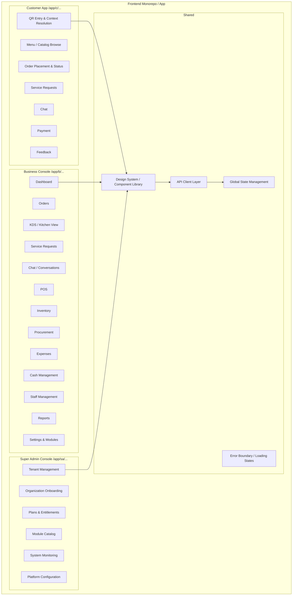
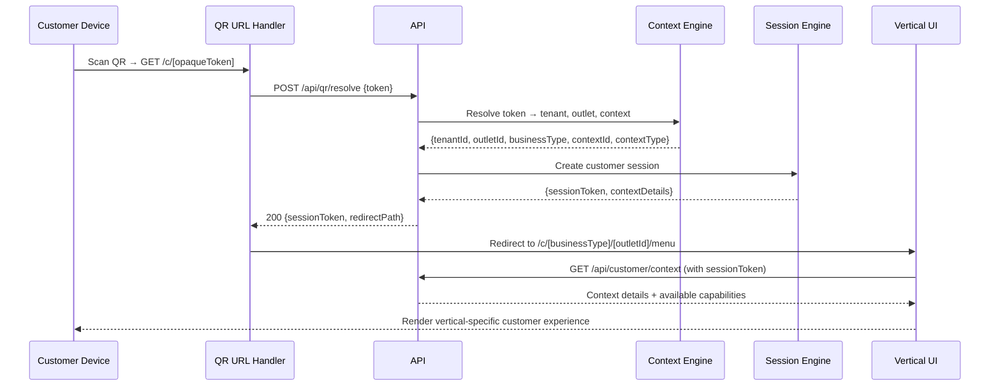

# ASSO — Frontend Architecture

**Phase**: 2 — Master Architecture  
**Status**: Approved for Phase 2  
**Last Updated**: 2026-09-26

---

## 1. Frontend Principle

ASSO has three distinct frontend applications sharing one codebase, common components, and a single API client layer:

```text
One Codebase
      ↓
┌─────────────────────────────────────────────┐
│  Customer App   │  Business Console  │  Super Admin  │
└─────────────────────────────────────────────┘
      ↓
Shared Component Library
      ↓
Shared API Client Layer
      ↓
ASSO API Server
```

Each application has separate routing roots, separate authentication state, and separate authorization-aware navigation. They share the design system, component library, and API client.

---

## 2. Application Structure



---

## 3. Route Architecture

### 3.1 Customer Application Routes

The customer app is accessed via QR code or direct web URL. All routes are under a `/c` prefix (or a dedicated customer subdomain in production):

```text
/c/[token]                    — QR entry: resolve token → context → redirect
/c/[tenantSlug]/[outlet]/...  — Resolved customer experience (vertical-specific)

Hotel context:
  /c/hotel/[outletId]/menu        — Room service menu
  /c/hotel/[outletId]/orders      — My orders
  /c/hotel/[outletId]/requests    — Service requests
  /c/hotel/[outletId]/chat        — Chat with staff
  /c/hotel/[outletId]/bill        — View folio / bill

Restaurant context:
  /c/restaurant/[outletId]/menu       — Table menu
  /c/restaurant/[outletId]/orders     — My orders at this table
  /c/restaurant/[outletId]/requests   — Call waiter / request
  /c/restaurant/[outletId]/chat       — Chat
  /c/restaurant/[outletId]/bill       — Request bill / pay

Cinema context:
  /c/cinema/[outletId]/menu       — Concession menu
  /c/cinema/[outletId]/orders     — My concession orders
  /c/cinema/[outletId]/requests   — Service requests
  /c/cinema/[outletId]/chat       — Chat
```

### 3.2 Business Console Routes

The business console is accessed via staff login. Routes are under `/b`:

```text
/b/login                         — Staff login
/b/[outletId]/dashboard          — Operations dashboard
/b/[outletId]/orders             — Live orders & fulfillment
/b/[outletId]/kitchen            — KDS view (kitchen / concession staff)
/b/[outletId]/requests           — Service requests
/b/[outletId]/chat               — Conversations
/b/[outletId]/pos                — POS terminal
/b/[outletId]/inventory          — Inventory management
/b/[outletId]/inventory/movements — Stock movement ledger
/b/[outletId]/procurement        — Purchase orders & receiving
/b/[outletId]/expenses           — Expense recording
/b/[outletId]/cash               — Cash management
/b/[outletId]/staff              — Staff & roles management
/b/[outletId]/reports            — Reports & metrics
/b/[outletId]/settings           — Outlet configuration
/b/[outletId]/settings/modules   — Module entitlements (read-only for admin)

Hotel-specific:
  /b/[outletId]/rooms            — Room management
  /b/[outletId]/stays            — Stays & check-in/check-out
  /b/[outletId]/reservations     — Hotel reservations
  /b/[outletId]/housekeeping     — Housekeeping tasks
  /b/[outletId]/folio/[stayId]   — Guest folio

Restaurant-specific:
  /b/[outletId]/tables           — Table floor plan / status
  /b/[outletId]/tables/[tableId] — Table detail
  /b/[outletId]/queue            — Queue / waitlist (if entitled)

Cinema-specific:
  /b/[outletId]/screens          — Screen management
  /b/[outletId]/shows            — Show schedule
```

### 3.3 Super Admin Routes

The super admin console is accessed via a separate admin login at `/sa`:

```text
/sa/login                        — Platform admin login
/sa/dashboard                    — Platform overview
/sa/tenants                      — Tenant (organization) list
/sa/tenants/[id]                 — Tenant detail
/sa/tenants/new                  — Onboard new organization
/sa/plans                        — Plan management
/sa/modules                      — Module catalog
/sa/modules/[id]                 — Module detail
/sa/monitoring                   — System health & usage
/sa/config                       — Platform-level configuration
```

---

## 4. Authentication State

### 4.1 Customer Sessions

Customer sessions are:
- Created server-side when a valid QR is resolved
- Stored as a short-lived, scoped, signed token (HttpOnly cookie or Authorization header)
- Scoped to: `tenant + outlet + context (room/table/seat)`
- Not necessarily linked to a registered user account (anonymous session initially)
- Invalidated on context lifecycle events (guest checkout, table cleared, show ended)

```text
QR Token → API validates → Returns signed session token
Session token → Attached to all customer API requests
API middleware → Validates + resolves context from session
```

### 4.2 Staff Sessions

Staff sessions are:
- Created via email/password login through the auth provider
- Stored as a signed JWT or session token (HttpOnly cookie)
- Scoped to: `tenant + assigned outlets + role`
- Subject to RBAC checks on every operation

### 4.3 Super Admin Sessions

Super admin sessions are:
- Highest-privilege sessions
- Backed by a separate admin authentication flow
- Not scoped to a tenant (can access all tenants)
- All operations produce audit logs

---

## 5. Authorization-Aware Navigation

Frontend navigation must respect authorization state, but **never rely on navigation hiding as the security mechanism**:

```text
Backend enforces: Module entitlement + RBAC permission + Policy
Frontend reflects: Hides unavailable navigation items for UX cleanliness only
```

Implementation approach:
1. On authenticated session load, fetch the user's entitlement and permission map from the API
2. Store in client-side state (not persisted to localStorage)
3. Use to conditionally render navigation items
4. Every API call still enforces authorization server-side regardless of frontend state

---

## 6. State Management

### 6.1 Server State (Primary)

ASSO's frontend primarily uses **server state management** (React Query / SWR pattern):
- All domain data is fetched from and synchronized with the API
- Stale-while-revalidate patterns for low-latency feel
- Optimistic updates for common mutations (order placement, request creation)
- Invalidation on mutation to keep server state authoritative

### 6.2 Client State (Secondary)

Client state is used for:
- Authentication session state (current user, permissions, outlet context)
- UI state (sidebar open/closed, selected tab, modal visibility)
- Cart / draft order state (before submission)
- Form state (unsaved form values)

Client state is **not** used as the authority for business data.

### 6.3 Cart State

The cart is a special case of client state:
- Items are held client-side before order submission
- Cart is validated server-side at order creation
- Cart is not persisted in the database until the order is created
- Client-side cart is cleared after successful order creation

---

## 7. API Client Layer

All frontend applications share a single typed API client:

```text
Frontend Components
      ↓
API Client (typed, centralized)
      ↓
HTTP Requests + Auth Headers + Tenant Context
      ↓
ASSO API Server
```

The API client provides:
- Typed request/response shapes
- Automatic auth token attachment
- Centralized error handling (401 → redirect to login, 403 → permission error, 409 → conflict)
- Retry logic for transient errors
- Request deduplication

The API client does NOT:
- Cache business data independently (that is the server-state layer's responsibility)
- Make authorization decisions
- Bypass the API for any business operation

---

## 8. Vertical-Specific UI Modules

The Business Console adapts its navigation and views based on the outlet's business type:

| Section | Hotel | Restaurant | Cinema |
|---|---|---|---|
| **Dashboard** | Room occupancy, today's check-ins/check-outs | Table status, active orders | Active shows, concession activity |
| **Context Management** | Rooms + Stays | Tables + Sections | Screens + Shows |
| **Orders** | Room service orders | Table orders | Concession orders |
| **Kitchen View** | Room service kitchen | Restaurant KDS | Concession fulfillment |
| **Billing** | Guest folio management | Table bill | Per-order billing |
| **Vertical-Specific** | Housekeeping, Reservations | Queue, Table Reservations | Show scheduling |
| **Shared** | Inventory, Procurement, Expenses, Cash, Staff, Reports, Settings |

UI modules that differ per vertical:
- **Context Management**: The concept is the same (manage rooms/tables/screens) but rendered with vertical-specific terminology, layout, and actions
- **Dashboard**: The metrics widget set adapts to the vertical
- **Fulfillment/KDS**: Layout and workflow adapted (hotel room delivery vs restaurant table service vs cinema concession counter)

UI modules that are identical across verticals:
- Inventory
- Procurement
- Expenses
- Cash Management
- Staff & Roles
- Reports (with vertical-specific metric sets)
- Module Settings

---

## 9. Customer Experience Architecture

### 9.1 QR Entry Flow



### 9.2 Customer App Design Principles

- **Mobile-first**: The primary customer device is a smartphone
- **Fast initial load**: Menu/catalog must render quickly; no heavy JavaScript before first paint
- **Progressive disclosure**: Start with browsing → guide toward ordering → payment
- **Session awareness**: Customer can see their active orders and requests at any time
- **Offline-tolerant**: Browsing the menu should work even with brief network interruption; order submission requires connectivity
- **Accessible**: WCAG AA compliance targeted

---

## 10. Responsive Behavior

| Breakpoint | Customer App | Business Console | Super Admin |
|---|---|---|---|
| **Mobile** (< 640px) | Primary target | Limited — basic operations | Not targeted |
| **Tablet** (640–1024px) | Good support | Primary target for KDS + table view | Basic support |
| **Desktop** (> 1024px) | Good support | Primary target for full console | Primary target |

The KDS kitchen display is designed specifically for large shared screens (tablet or desktop mounted in kitchen).

---

## 11. Loading, Error, and Empty States

All frontend views must implement three non-happy-path states:

### Loading States
- Skeleton screens for initial data loads
- Spinner for mutations in progress
- Optimistic updates where safe (e.g., adding item to cart)

### Error States
- API errors: Show user-friendly message, not raw errors
- 401: Redirect to login
- 403: Permission denied — explain what the user cannot do and why (if known)
- 404: Clear not-found message
- 5xx: Generic server error with retry option
- Network errors: Offline indicator

### Empty States
- Empty orders list: Prompt to create first order
- Empty inventory: Prompt to add items
- Empty tables: Prompt to configure dining areas
- Contextual and actionable — do not show blank screens

---

## 12. Shared UI Components

The shared component library provides:

**Core Primitives**: Button, Input, Select, Checkbox, Radio, Toggle, Textarea, DatePicker, TimePicker  
**Layout**: Page, Sidebar, TopBar, Card, Modal, Drawer, Tabs, Accordion, Divider  
**Data Display**: Table, DataGrid, List, Badge, Avatar, Tag, Tooltip, Popover, Chip  
**Feedback**: Toast, Alert, Banner, Skeleton, Spinner, ProgressBar, EmptyState, ErrorState  
**Navigation**: Breadcrumb, Pagination, Stepper, ContextMenu  
**Forms**: Form, FormField, FormSection, FormError, SubmitButton  
**Business**: OrderCard, OrderStatusBadge, InventoryItemRow, ServiceRequestCard, ChatBubble

Vertical-specific components (RoomCard, TableFloorPlan, ScreenLayout) live in their vertical UI module directories but may use shared primitives.

---

## 13. Open Frontend Decisions

| Decision | Status |
|---|---|
| Framework choice: Next.js App Router vs alternatives | OPEN DECISION — to evaluate in Phase 3 |
| State management library: React Query vs SWR vs Zustand | OPEN DECISION — to evaluate in Phase 3 |
| Design system: custom vs Radix + Tailwind vs shadcn/ui | OPEN DECISION — to evaluate in Phase 3 |
| Real-time: WebSocket vs SSE vs polling for orders/KDS/chat | OPEN DECISION — to evaluate in Phase 3 |
| Customer app subdomain vs path routing | OPEN DECISION — to evaluate in Phase 3 |
| Multi-language (i18n) implementation | OPEN DECISION — see OPEN-DECISIONS.md |
| Offline POS capability | OPEN DECISION — see OPEN-DECISIONS.md |
