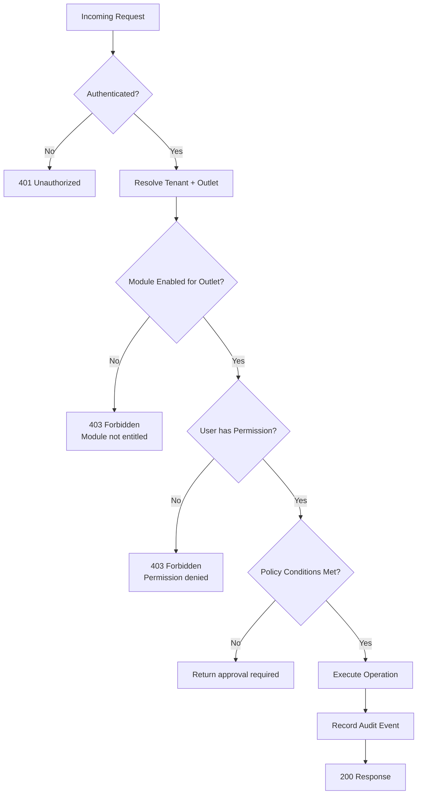

# ASSO — Module Entitlements Architecture

**Phase**: 2 — Master Architecture  
**Status**: Approved for Phase 2  
**Last Updated**: 2026-09-26

---

## 1. Conceptual Model

```text
Business Type
      ↓
Available Modules (what ASSO offers for this business type)
      ↓
Plan / Subscription (what this organization is subscribed to)
      ↓
Tenant Entitlements (which modules are enabled for this outlet)
      ↓
Staff Permissions (who can use what within enabled modules)
```

Module entitlement and RBAC are **separate concerns**:

```text
Module Entitlement  = Does this business have this capability?       (Tenant-level)
RBAC Permission     = Can this specific user perform this action?    (User-level)
Policy              = Under what conditions may this action proceed? (Operation-level)
```

All three are enforced server-side on every request. Never only in the frontend.

---

## 2. Module Registry

Every ASSO capability is a registered module with defined metadata:

```text
Module = {
  module_id       — Unique identifier (e.g., 'inventory', 'ordering', 'housekeeping')
  name            — Display name
  description     — What this module provides
  business_types  — Which verticals can use this module: [HOTEL, RESTAURANT, CINEMA]
  dependencies[]  — Other module_ids that must also be enabled
  tier            — CORE | STANDARD | ADVANCED | ADD_ON
  is_core         — Whether this module is always included (cannot be disabled)
}
```

**Core modules** (always enabled, cannot be disabled):
- `identity` — Authentication and user accounts
- `tenancy` — Multi-tenancy management
- `rbac` — Role-based access control
- `audit` — Audit logging
- `config` — Business configuration
- `notifications` — Basic notification delivery

**Standard modules** (included in standard plans):
- `ordering`, `catalog`, `fulfillment`
- `pos`, `billing`, `payments`
- `service-requests`
- `inventory`, `procurement`
- `expenses`, `cash-management`
- `reporting`

**Vertical-specific modules**:
- Hotel: `rooms`, `stays`, `reservations`, `housekeeping`, `guest-folio`
- Restaurant: `tables`, `dining-areas`, `queue` (OPEN DECISION), `table-reservations` (OPEN DECISION)
- Cinema: `screens`, `seats`, `shows`

**Advanced / Add-on modules**:
- `advanced-reporting` — Extended analytics and custom reports
- `chat` — Conversation engine for customer-staff chat
- `kds` — Kitchen/fulfillment display system

---

## 3. Module Dependencies

A module may depend on other modules. When a module is enabled, all its dependencies must also be enabled. The system enforces this:

| Module | Requires |
|---|---|
| `ordering` | `catalog` |
| `fulfillment` | `ordering` |
| `kds` | `fulfillment` |
| `billing` | `ordering`, `pos` |
| `payments` | `billing` |
| `guest-folio` | `billing`, `stays` |
| `stays` | `rooms` |
| `reservations` | `rooms` |
| `housekeeping` | `rooms` |
| `procurement` | `inventory` |
| `cash-management` | `pos` |

When a tenant attempts to disable a module, the system warns that dependent modules will also be disabled.

---

## 4. Plans

A Plan defines a curated set of modules available to a tenant for a given subscription:

```text
Plan = {
  plan_id
  name              — e.g. "Restaurant Starter", "Hotel Full Suite"
  business_types[]  — Which business types can subscribe
  included_modules[]— Modules included in this plan
  status            — ACTIVE | DEPRECATED
}
```

> `OPEN DECISION` — Pricing model and plan structure (per-module pricing vs tiered plans vs custom enterprise) is not finalized. See [OPEN-DECISIONS.md](./OPEN-DECISIONS.md).

---

## 5. Tenant Entitlements

An entitlement record tracks which modules are currently active for a specific outlet:

```text
TenantEntitlement = {
  entitlement_id
  organization_id
  outlet_id
  module_id
  status            — ENABLED | DISABLED | SUSPENDED
  enabled_at
  enabled_by        — Super Admin who enabled it
  expires_at        — Optional expiry (trial modules)
}
```

Entitlements are managed by Super Admins or through the organization's plan.

---

## 6. Entitlement Check Flow



---

## 7. Entitlement Caching

The entitlement map for a given outlet is cached in-process (e.g., LRU cache with 5-minute TTL) to avoid a database lookup on every request. When a module is toggled:

1. The entitlement record is updated in the database
2. A cache-bust signal is sent to all application instances (via database-level notification or lightweight coordination)
3. In-process cache for that outlet is cleared
4. Next request for that outlet fetches fresh entitlement map

> `OPEN DECISION` — Cache invalidation coordination across multiple application instances. Options: PostgreSQL LISTEN/NOTIFY, short TTL (accept 5-minute lag), or Redis pub/sub if Redis is introduced. Decision deferred to Phase 3.

---

## 8. Backend Enforcement

Module entitlement checks are enforced at two levels:

### 8.1 Middleware Level

Every route handler is decorated with the required module:

```typescript
// Conceptual example
router.post('/api/v1/orders', requireModule('ordering'), requirePermission('orders:create'), handler)
```

The `requireModule` middleware:
1. Extracts `outletId` from the authenticated session
2. Checks the entitlement cache (or database) for that outlet
3. Rejects with `403` if the module is not enabled

### 8.2 Service Level

Domain service functions also include explicit entitlement checks for critical operations, providing defense-in-depth even if the middleware is bypassed in testing.

---

## 9. Frontend Module Visibility

On authenticated session creation, the API returns the entitlement map for the current outlet:

```json
{
  "entitlements": {
    "ordering": true,
    "inventory": true,
    "queue": false,
    "advanced-reporting": false
  }
}
```

The frontend uses this map to:
- Show/hide navigation items
- Enable/disable feature buttons
- Render appropriate onboarding prompts for disabled modules

**This is for UX only.** The backend never trusts frontend entitlement state.

---

## 10. Module Lifecycle

```text
PROPOSED → AVAILABLE (registered in module catalog) → ENTITLED (tenant has it) → ENABLED (active for outlet)
                                                                                    ↕
                                                                               DISABLED (can be re-enabled)
                                                                               SUSPENDED (by ASSO, e.g. non-payment)
```

A suspended module blocks access to the capability for the tenant but preserves all data.

---

## 11. Super Admin Module Management

Super Admins can:
- View the full module catalog
- Enable/disable modules for specific outlets
- Assign plans to organizations
- Create or modify plan-module mappings
- View module usage across the platform

All super admin module changes are audit-logged.
