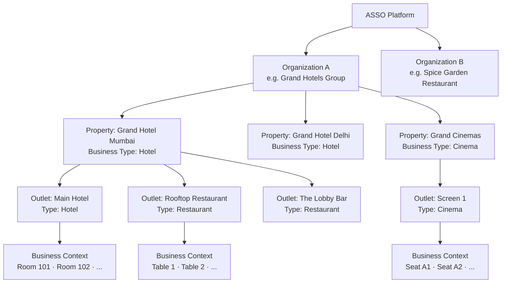
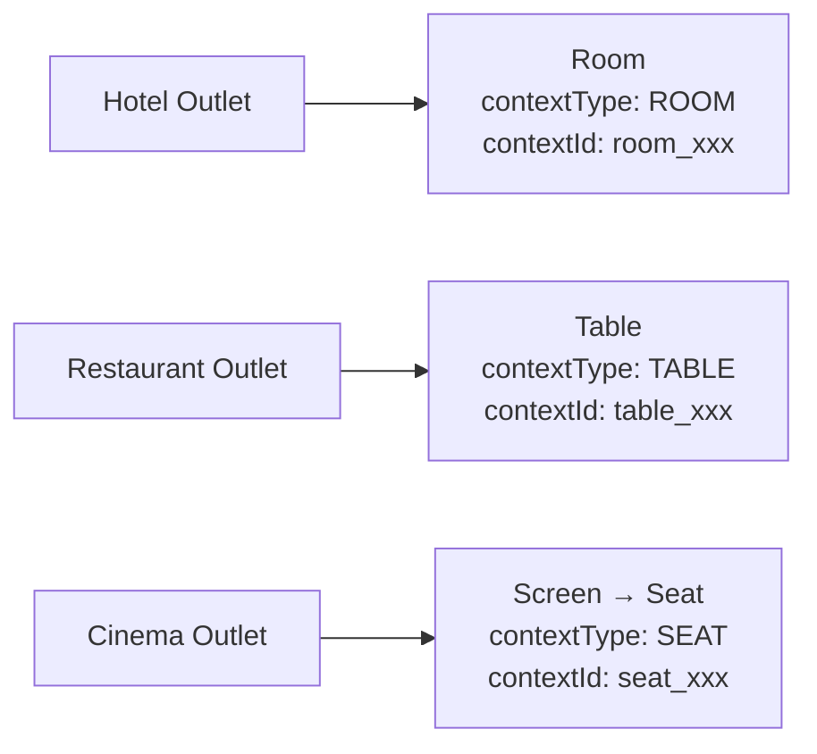
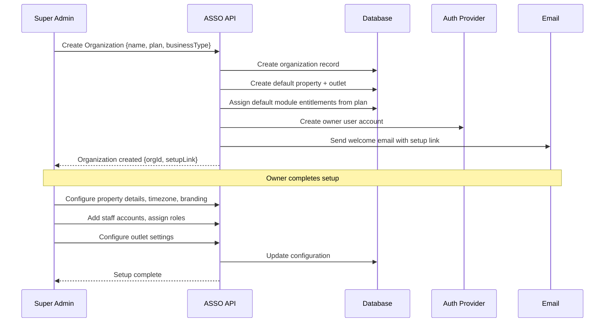

# ASSO — Multi-Tenancy Architecture

**Phase**: 2 — Master Architecture  
**Status**: Approved for Phase 2  
**Last Updated**: 2026-09-26

---

## 1. Tenant Hierarchy

ASSO's tenant model supports businesses of varying complexity — from a single-outlet restaurant to a hotel chain operating multiple properties with mixed business types.



### Hierarchy Levels

| Level | Entity | Description |
|---|---|---|
| **Platform** | ASSO | The global platform operated by the ASSO team |
| **Organization** | Organization / Tenant | A customer organization — a company or individual business owner |
| **Property** | Property | A physical business location (one hotel, one restaurant, one cinema) |
| **Outlet** | Outlet | A distinct operating unit within a property |
| **Context** | Business Context | The specific operational context (room, table, seat/screen) |

### Key Distinctions

- An **Organization** may have multiple Properties of different business types
- A **Property** has a primary business type (Hotel, Restaurant, Cinema)
- An **Outlet** inherits its business type from its Property but may have slightly different configuration
- One Property may have multiple Outlets of different types (e.g., a hotel property has a hotel outlet + a restaurant outlet)
- The **Business Context** (room/table/seat) belongs to a specific Outlet

---

## 2. Organizational Identity

### Organization (Tenant)

The top-level billing and contractual entity with ASSO:

| Field | Description |
|---|---|
| `organization_id` | System-generated UUID (primary tenant key) |
| `slug` | URL-safe unique identifier (e.g., `grand-hotels`) |
| `name` | Display name |
| `status` | `active`, `suspended`, `onboarding`, `churned` |
| `plan_id` | Subscribed plan |
| `created_at` | Registration date |
| `settings` | Organization-level configuration |

The `organization_id` is the root tenant isolation key. Every data record in ASSO carries a `tenant_id` that maps to an `organization_id`.

### Property

```text
organization_id (FK)
property_id (UUID, unique)
name
slug
primary_business_type  ← HOTEL | RESTAURANT | CINEMA
address
timezone
status
settings
```

### Outlet

```text
property_id (FK)
outlet_id (UUID, unique)
organization_id (FK, denormalized for efficient tenant scoping)
name
business_type  ← HOTEL | RESTAURANT | CINEMA (may differ from property for mixed properties)
status
settings (outlet-level overrides)
module_entitlements  ← which modules are enabled for this outlet
```

---

## 3. Business Context (Room / Table / Seat)

Business Context is an abstraction that represents the physical location of customer interaction.



### Common Context Attributes

```text
context_id          — Unique identifier
outlet_id (FK)
context_type        — ROOM | TABLE | SEAT | SCREEN_AREA
display_name        — "Room 205", "Table 7", "Seat C12"
status              — AVAILABLE | OCCUPIED | MAINTENANCE | INACTIVE
qr_id (FK)          — The QR code bound to this context
```

### Vertical-Specific Context Extension

Each vertical extends the base context with its own fields:

**Hotel Room**: room type, floor, bed configuration, amenities, rate  
**Restaurant Table**: section, capacity, shape, position on floor plan  
**Cinema Seat**: screen, row, seat number, seat type (standard/premium)

---

## 4. Customer Session Scoping

A customer session is scoped to a specific context within a specific outlet:

```text
Customer Session = {
  session_id        — Unique identifier
  session_token     — Opaque signed token (in HTTP cookie or auth header)
  organization_id   — Tenant (from context resolution)
  outlet_id         — Outlet (from context resolution)
  context_id        — Business context (room/table/seat)
  context_type      — ROOM | TABLE | SEAT | SCREEN_AREA
  customer_id       — Optional (if customer identified themselves)
  status            — ACTIVE | EXPIRED | INVALIDATED
  created_at
  expires_at        — Time-bounded
  invalidated_at    — Set when context lifecycle ends (checkout, table cleared)
}
```

Session expiry events:
- Hotel: Guest checks out → all sessions for room are invalidated
- Restaurant: Table is cleared / turned over → all table sessions invalidated
- Cinema: Show ends or screen area is cleared → all seat sessions invalidated

---

## 5. Staff Context

Staff sessions carry a different, privilege-based context:

```text
Staff Session = {
  user_id
  organization_id       — Primary tenant
  accessible_outlets[]  — Which outlets this staff member can access
  active_outlet_id      — Currently selected outlet (can switch)
  role_id               — Primary role
  permissions[]         — Derived permission set
  session_token
  expires_at
}
```

Staff can only access outlets they are assigned to. Cross-outlet access (e.g., a manager of multiple outlets) is granted via explicit outlet assignment in their staff profile.

---

## 6. Tenant Isolation Strategy

### 6.1 Application-Level Isolation

Every database query in ASSO filters by `tenant_id` (organization_id). This is enforced at the repository layer:

```text
Repository.findOrders({tenantId, outletId, ...filters})
→ SELECT * FROM orders WHERE tenant_id = $tenantId AND outlet_id = $outletId AND ...
```

`tenantId` is never taken from the request body. It is derived from the authenticated session token and attached by middleware.

### 6.2 Database-Level Isolation (RLS)

PostgreSQL Row-Level Security (RLS) provides a second mandatory layer:

```sql
-- Example RLS policy for orders table
ALTER TABLE orders ENABLE ROW LEVEL SECURITY;

CREATE POLICY tenant_isolation ON orders
  USING (tenant_id = current_setting('app.current_tenant_id')::uuid);
```

The application sets the session-level `app.current_tenant_id` before executing queries. Even if application-level tenant filtering has a bug, RLS prevents cross-tenant data leakage.

### 6.3 Super Admin Access

Super Admin users can access any tenant's data for support and platform management purposes. Super Admin access:
- Requires a separate admin session (not a staff session)
- Bypasses RLS via a specific super-admin database role
- All super-admin data access is audit-logged with explicit justification
- Read-only by default; destructive operations require explicit confirmation

### 6.4 Isolation Verification Points

Cross-tenant data must never be accessible through:
- Direct resource ID access (e.g., `GET /api/orders/[id]` must verify `tenant_id` matches session)
- List endpoints (tenant scope always applied)
- Report exports (scoped to tenant)
- File downloads (signed URLs include tenant scope)
- Webhook callbacks (verified against tenant's webhook secret)

---

## 7. Cross-Outlet Access Within a Tenant

Within a single organization, there are two scenarios where cross-outlet access may occur:

### 7.1 Manager Cross-Outlet Reporting

An owner or senior manager may need to view aggregated reports across multiple outlets. This is permitted when:
- The user has explicit assignment to multiple outlets, or
- The user has an organization-level manager role

All queries remain tenant-scoped. Cross-outlet access is cross-outlet within the same tenant, never cross-tenant.

### 7.2 Inventory Transfer Between Outlets

Inter-outlet inventory transfers are an approved architectural capability. Implementation:
- The transfer is a transaction with two movement records: stock-out at source outlet + stock-in at destination outlet
- Both outlet IDs must belong to the same organization
- Authorization is checked at both outlets
- A single transfer record links both movements

### 7.3 Cross-Vertical Folio Charging (PROPOSED / OPEN DECISION)

Cross-vertical folio charging (e.g., charging a restaurant meal to a hotel room folio) is architecturally possible given the shared billing engine and shared tenant model, but **is not approved scope for initial implementation**.

See [OPEN-DECISIONS.md](./OPEN-DECISIONS.md) — Decision #1.

---

## 8. Platform Admin Access

ASSO platform administrators (Super Admins) operate outside the tenant model:

```text
Platform Admin Session = {
  admin_user_id
  admin_role    — SUPER_ADMIN | SUPPORT | BILLING_ADMIN | READ_ONLY
  permissions[] — Platform-level permission set
}
```

| Admin Role | Capabilities |
|---|---|
| SUPER_ADMIN | Full access — tenant management, module catalog, platform config |
| SUPPORT | Read access to tenant data for support purposes; limited mutations |
| BILLING_ADMIN | Plan and entitlement management only |
| READ_ONLY | Monitoring and read-only platform overview |

All platform admin operations produce detailed audit logs.

---

## 9. Tenant Onboarding Flow



---

## 10. Tenant Data Isolation Checklist

Before any new API endpoint is added, verify:

- [ ] The endpoint reads tenant context from session (not from request body)
- [ ] All database queries include `tenant_id` filter
- [ ] RLS is enabled on all relevant tables
- [ ] The endpoint cannot be used to enumerate tenants or resources from another tenant
- [ ] File downloads are signed and tenant-scoped
- [ ] Webhook callbacks verify tenant-specific signatures
- [ ] List endpoints never return results from multiple tenants
- [ ] Super admin access to tenant data is audit-logged
