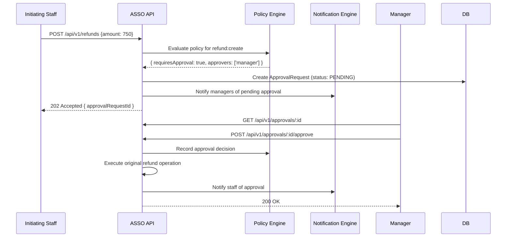

# ASSO — RBAC & Policies Architecture

**Phase**: 2 — Master Architecture  
**Status**: Approved for Phase 2  
**Last Updated**: 2026-09-26

---

## 1. Three-Layer Access Control

ASSO separates access control into three distinct, independently evaluated layers:

```text
Layer 1: RBAC Permission   — "Can this user perform this action?"
Layer 2: Module Entitlement — "Does this outlet have this capability?"  (see MODULE-ENTITLEMENTS.md)
Layer 3: Policy             — "Under what conditions may this action proceed?"
```

All three layers are enforced server-side. They are evaluated in sequence: Module → RBAC → Policy.

---

## 2. RBAC Model

### 2.1 Core Concepts

**Permission**: An atomic operation string representing a single action.

```text
Format: [resource]:[action]
Examples:
  orders:create
  orders:view
  orders:cancel
  inventory:view
  inventory:adjust
  expenses:approve
  refunds:process
  folio:post-charge
  staff:manage
  settings:configure
```

**Role**: A named, reusable collection of permissions assigned to a staff member for a specific outlet.

```text
Role = {
  role_id
  tenant_id              — null for platform-level role templates
  name                   — e.g. "Restaurant Manager"
  description
  business_type          — HOTEL | RESTAURANT | CINEMA | ALL
  permissions[]          — Set of permission strings
  is_template            — Whether this is a platform-provided role template
  is_custom              — Whether created by a tenant admin
}
```

**Role Assignment**: Scoped to an outlet:

```text
RoleAssignment = {
  staff_id
  role_id
  outlet_id              — Scope of this role assignment
  assigned_by
  assigned_at
  expires_at             — Optional
}
```

A staff member may have different roles at different outlets:
- Ravi is a Kitchen Staff at Outlet A and a Manager at Outlet B

### 2.2 Permission Resolution

At session creation, the user's effective permission set is computed for the active outlet:

```text
Active Outlet → Load role assignments for user at outlet → Collect all permissions from roles → Deduplicate → Store in session
```

Permission checks are done against this resolved set. Changing a user's role takes effect on their next login.

### 2.3 Permission Categories

| Domain | Permission Examples |
|---|---|
| Orders | `orders:create`, `orders:view`, `orders:cancel`, `orders:modify` |
| POS | `pos:create`, `pos:void` |
| Billing | `billing:view`, `billing:adjust`, `billing:settle` |
| Folio | `folio:view`, `folio:post-charge`, `folio:adjust`, `folio:settle` |
| Payments | `payments:view`, `payments:process` |
| Refunds | `refunds:initiate`, `refunds:approve` |
| Inventory | `inventory:view`, `inventory:receive`, `inventory:adjust`, `inventory:transfer` |
| Procurement | `procurement:create`, `procurement:approve`, `procurement:receive` |
| Expenses | `expenses:create`, `expenses:view`, `expenses:approve` |
| Cash | `cash:open`, `cash:close`, `cash:view` |
| Service Requests | `requests:create`, `requests:assign`, `requests:resolve` |
| Rooms | `rooms:view`, `rooms:update-status` |
| Stays | `stays:check-in`, `stays:check-out`, `stays:view` |
| Reservations | `reservations:create`, `reservations:cancel` |
| Housekeeping | `housekeeping:view`, `housekeeping:assign`, `housekeeping:update` |
| Tables | `tables:view`, `tables:update-status` |
| Reports | `reports:view`, `reports:export` |
| Staff | `staff:view`, `staff:manage`, `staff:assign-roles` |
| Settings | `settings:view`, `settings:configure` |
| Modules | `modules:view` |

---

## 3. Platform-Provided Role Templates

ASSO ships with role templates per vertical that tenants can use directly or customize:

### Hotel Role Templates

| Role | Key Permissions |
|---|---|
| Hotel Owner / Admin | All permissions |
| Hotel Manager | All operational + staff management |
| Front Desk Staff | Stays (check-in/out), reservations, folio view, service requests |
| Cashier | Billing settle, payments process, POS, cash |
| Housekeeping Staff | Housekeeping view/update, rooms status update |
| Room Service Staff | Orders view/fulfill |
| Maintenance Staff | Service requests (maintenance category) view/update |

### Restaurant Role Templates

| Role | Key Permissions |
|---|---|
| Restaurant Owner / Admin | All permissions |
| Restaurant Manager | All operational + staff management + reports |
| Host | Tables view/update-status, reservations, queue |
| Server / Captain | Orders create, tables view, service requests |
| Kitchen Staff | Orders view (kitchen), fulfillment update |
| Cashier | Billing settle, payments process, POS, cash |

### Cinema Role Templates

| Role | Key Permissions |
|---|---|
| Cinema Owner / Admin | All permissions |
| Cinema Manager | All operational + staff management + reports |
| Counter Staff | Orders create (POS), payments process, cash |
| Floor Staff | Service requests view/assign, screens management |
| Concession Staff | Orders view/fulfill (concession) |

---

## 4. Custom Roles

Tenant admins may create custom roles within their outlet:

- Can include any combination of permissions from the available permission set
- Cannot grant permissions beyond what the admin's own role allows
- Custom roles are tenant-scoped and not visible to other tenants

---

## 5. Policy Engine

### 5.1 Purpose

Policies define business rules that go beyond "can this user do this action?" to "under what conditions can this action proceed?".

### 5.2 Policy Record

```text
Policy = {
  policy_id
  tenant_id
  outlet_id (nullable — outlet-specific or org-wide)
  name
  description
  trigger_operation     — e.g. 'refund:create', 'expense:approve', 'inventory:adjust'
  conditions[]          — Rules (see below)
  action                — ALLOW | REQUIRE_APPROVAL | BLOCK
  approval_role         — Role required to approve (if action = REQUIRE_APPROVAL)
}
```

### 5.3 Policy Conditions

Conditions are attribute-based rules evaluated against operation context:

```text
Condition = {
  attribute     — e.g. 'amount', 'expense.category', 'order.item_count'
  operator      — gt | lt | eq | neq | in | not_in
  value         — threshold or value set
}

Examples:
  { attribute: 'amount', operator: 'gt', value: 500 }
  { attribute: 'expense.category', operator: 'in', value: ['maintenance', 'utility'] }
```

### 5.4 Policy Evaluation

```text
PolicyEngine.evaluate({
  operation: 'refund:create',
  context: {
    tenantId, outletId,
    actorId, actorRole,
    amount: 750,
    ...operationData
  }
})

→ {
    allowed: false,
    requiresApproval: true,
    approvalPolicyId: 'policy_abc',
    approvers: ['manager', 'owner']
  }
```

### 5.5 Approval Workflow

When a policy requires approval:



### 5.6 Default Policies

ASSO ships with sensible default policies per vertical. Tenant admins can customize thresholds:

| Operation | Default Policy |
|---|---|
| Refund creation | Requires manager approval if amount > configurable threshold |
| Expense submission | Requires manager approval if amount > configurable threshold |
| Inventory adjustment | Requires manager/supervisor authorization |
| Folio adjustment | Requires manager authorization |
| Purchase order approval | Required above configurable amount threshold |
| Late checkout | Requires manager approval (hotel) |
| Void POS transaction | Requires manager authorization |

---

## 6. Authorization Middleware Implementation

```typescript
// Conceptual — not production code
async function authorizationMiddleware(req, res, next) {
  // 1. Authenticate
  const session = await validateSessionToken(req.headers.authorization)
  if (!session) return res.status(401).json({ error: 'UNAUTHENTICATED' })
  
  // 2. Resolve tenant
  req.tenant = await resolveTenant(session)
  
  // 3. Check module entitlement
  const moduleRequired = req.route.meta.requiredModule
  if (moduleRequired) {
    const entitled = await moduleEntitlementEngine.isEnabled({
      outletId: req.tenant.outletId,
      module: moduleRequired
    })
    if (!entitled) return res.status(403).json({ error: 'MODULE_NOT_ENTITLED' })
  }
  
  // 4. Check RBAC permission
  const permissionRequired = req.route.meta.requiredPermission
  if (permissionRequired) {
    const permitted = session.permissions.includes(permissionRequired)
    if (!permitted) return res.status(403).json({ error: 'PERMISSION_DENIED' })
  }
  
  // Policy evaluation happens inside the domain service
  // (not in middleware, because it needs operation-specific data)
  
  next()
}
```

---

## 7. Super Admin Access Model

Super Admins bypass tenant RBAC but are subject to their own admin permission model:

| Admin Role | Capabilities |
|---|---|
| SUPER_ADMIN | Full platform access, all tenant data |
| SUPPORT | Read access to all tenant data, limited write (e.g., reset passwords) |
| BILLING_ADMIN | Plan and entitlement management |
| PLATFORM_READ_ONLY | System monitoring and read-only data access |

All super admin operations produce audit log entries with admin user ID and justification.

---

## 8. Security Considerations

- Permission set is resolved at session creation and attached to the session token
- Session tokens are signed — clients cannot modify their permission set
- Role/permission changes take effect on next session (re-login or explicit refresh)
- The permission set in the session token is the source of truth for RBAC checks — not the database on every request (performance), but invalidation on role change is handled via session expiry or token refresh
- All `403` responses include a generic error — do not reveal whether the resource exists or which specific permission was missing
- Audit log records every `403` from an authenticated session (potential access violation monitoring)
