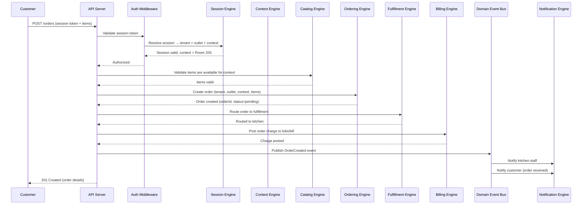

# ASSO — System Architecture

**Phase**: 2 — Master Architecture  
**Status**: Approved for Phase 2  
**Last Updated**: 2026-09-26

---

## 1. Architecture Principle

ASSO is designed as a **production-grade modular monolith** that unifies three business verticals — Hotel, Restaurant, and Cinema — on a single shared platform.

> One multi-tenant SaaS platform containing shared business engines and industry-specific vertical modules.

The core design principle:

```text
ASSO PLATFORM
      ↓
SHARED PLATFORM CORE
(Identity, Tenancy, RBAC, Modules, Policies, Audit)
      ↓
SHARED DOMAIN ENGINES
(Ordering, Inventory, Expenses, POS, Billing, Payments, ...)
      ↓
VERTICAL CONFIGURATION
(Context types, catalog terminology, fulfillment workflow, billing model)
      ↓
VERTICAL-SPECIFIC WORKFLOWS
(Hotel: stays/reservations/housekeeping | Restaurant: tables/KDS | Cinema: screens/shows)
      ↓
VERTICAL-SPECIFIC UI
(Hotel console | Restaurant console | Cinema console | Shared customer experience)
```

**No microservices prematurely.** The module boundaries are strong enough that individual components could be extracted later if operational requirements justify it — but this is not a current goal.

---

## 2. Overall System Diagram

```mermaid
graph TB
    subgraph "Customer-Facing Layer"
        CW[Customer Web App<br/>QR → Vertical Experience]
    end

    subgraph "Business Staff Layer"
        BA[Business Console<br/>Hotel / Restaurant / Cinema]
        KD[KDS Display<br/>Kitchen / Concession]
    end

    subgraph "Platform Admin Layer"
        SA[Super Admin Console]
    end

    subgraph "API Gateway / Application Server"
        API[ASSO API Server<br/>Next.js API Routes / App Router<br/>or Node.js Backend]
        AUTH[Auth Middleware<br/>Session · Tenant · RBAC · Module]
    end

    subgraph "Shared Platform Core"
        IDN[Identity & Auth Engine]
        TNT[Multi-Tenancy Engine]
        RBAC[RBAC Engine]
        MOD[Module Entitlement Engine]
        POL[Policy Engine]
        AUD[Audit Engine]
        CFG[Configuration Engine]
    end

    subgraph "Shared Domain Engines"
        CUST[Customer Engine]
        QR[QR Engine]
        CTX[Business Context Engine]
        SESS[Session Engine]
        CAT[Catalog Engine]
        ORD[Ordering Engine]
        FULL[Fulfillment Engine]
        SR[Service Request Engine]
        CHAT[Conversation Engine]
        NOTIF[Notification Engine]
        POS[POS Engine]
        BILL[Billing Engine]
        PAY[Payment Engine]
        INV[Inventory Engine]
        PROC[Procurement Engine]
        EXP[Expense Engine]
        CASH[Cash Management Engine]
        RPT[Reporting Engine]
        FILE[File Storage Engine]
        EVT[Domain Event Bus]
    end

    subgraph "Vertical Modules"
        HTL[Hotel Module<br/>Rooms · Stays · Reservations<br/>Housekeeping · Folio]
        RST[Restaurant Module<br/>Tables · Dining Areas<br/>Queue · Table Reservations]
        CIN[Cinema Module<br/>Screens · Seats · Shows]
    end

    subgraph "Data Layer"
        PG[(PostgreSQL / Supabase<br/>Primary Transactional DB)]
        FS[File Storage<br/>S3-compatible / Supabase Storage]
        CACHE[In-Process Cache<br/>Optional Redis later if justified]
    end

    subgraph "External Services"
        PGWAY[Payment Gateway]
        EMAIL[Email Provider]
        SMS[SMS / Messaging]
        PUSH[Push Notifications]
    end

    subgraph "Background Processing"
        BG[Background Job Runner<br/>pg-boss / Inngest or equivalent]
    end

    CW --> API
    BA --> API
    KD --> API
    SA --> API

    API --> AUTH
    AUTH --> IDN
    AUTH --> TNT
    AUTH --> RBAC
    AUTH --> MOD

    API --> CUST
    API --> QR
    API --> CTX
    API --> SESS
    API --> CAT
    API --> ORD
    API --> FULL
    API --> SR
    API --> CHAT
    API --> POS
    API --> BILL
    API --> PAY
    API --> INV
    API --> PROC
    API --> EXP
    API --> CASH
    API --> RPT
    API --> FILE
    API --> HTL
    API --> RST
    API --> CIN

    HTL --> ORD
    HTL --> BILL
    HTL --> SR
    RST --> ORD
    RST --> FULL
    CIN --> ORD
    CIN --> FULL

    EVT --> NOTIF
    EVT --> INV
    EVT --> BILL
    EVT --> AUD

    API --> PG
    FILE --> FS
    BG --> PG
    BG --> EVT

    PAY --> PGWAY
    NOTIF --> EMAIL
    NOTIF --> SMS
    NOTIF --> PUSH
```



---

## 3. Application Boundary Separation

ASSO has three distinct application boundaries:

| Boundary | Audience | Entry Point | Session Type |
|---|---|---|---|
| **Customer App** | Guests, diners, cinema patrons | QR scan → web URL | Customer session (anonymous or identified) |
| **Business Console** | Staff, managers, owners | Direct URL / login | Staff session (authenticated, RBAC-scoped) |
| **Super Admin Console** | ASSO platform administrators | Separate admin URL | Platform admin session (highest privilege) |

These share the same backend API but serve different route groups with separate authentication middleware and authorization policies.

---

## 4. Request Lifecycle

Every request through the ASSO API passes through a consistent authorization stack:

```text
Incoming Request
      ↓
1. Authentication (valid session token?)
      ↓
2. Tenant Resolution (which tenant/outlet does this request belong to?)
      ↓
3. Module Entitlement Check (does this tenant have access to this capability?)
      ↓
4. RBAC Permission Check (does this user have permission for this action?)
      ↓
5. Policy Check (are there approval rules or conditions that apply?)
      ↓
6. Domain Operation (business logic executes)
      ↓
7. Audit Event (important operations recorded)
      ↓
8. Response
```

All five checks are enforced server-side. Frontend navigation hiding is never the security mechanism.

---

## 5. Data Flow: Customer Order



---

## 6. Architecture Style Rationale

### Why a Modular Monolith?

ASSO is starting as a modular monolith because:

1. **Single team**: One primary developer + AI agent. Distributed systems require operational overhead that a small team cannot absorb productively.
2. **Strong boundaries first**: The engine/module boundaries in ASSO are explicit enough that extraction to services is a future option, not a current necessity.
3. **Data integrity**: Financial, inventory, and billing operations benefit from same-process transactions. Distributed transactions add significant complexity.
4. **Operational simplicity**: One deployment unit to manage, monitor, and scale horizontally.

### Scaling Path Without Microservices

```text
Phase 1: Single application instance + PostgreSQL (current design)
Phase 2: Horizontal application scaling (stateless design, connection pooling)
Phase 3: Read replicas for heavy reporting queries
Phase 4: Background worker pool separation (jobs in separate processes)
Phase 5: Extract genuinely isolated services if justified (e.g., notification worker)
```

See [SCALABILITY.md](./SCALABILITY.md) for full details.

---

## 7. Technology Direction

| Layer | Direction | Status / Reference |
|---|---|---|
| **Web Framework** | Next.js (App Router, TypeScript) — 3 surfaces (`/c`, `/b`, `/sa`) | **Accepted** (ADR-009) |
| **Design System** | Tailwind CSS + CSS custom property tokens + Radix UI primitives | **Accepted** (ADR-009) |
| **Real-Time** | Hybrid: Server-Sent Events (SSE) push + HTTP mutations + polling fallback | **Accepted** (ADR-010) |
| **Payment Gateway** | Adapter Pattern: Provider-neutral PaymentGatewayAdapter (Provider implementation deferred; Mock Adapter for Dev/Preview) | **Accepted** (ADR-011) |
| **POS Architecture**| Online-first with network resilience (memory cart, optimistic UI, retries) | **Accepted** (ADR-012) |
| **Vertical Order**  | Hotel → Restaurant → Cinema (Equal Sibling Verticals) | **Accepted / Resolved** (ADR-013) |
| **Database** | PostgreSQL via Supabase | Evaluated Direction (ADR-002) |
| **API Style** | REST with JSON + typed API client | Phase 3 Specification |
| **Auth** | NextAuth.js or Supabase Auth | Phase 3 Specification |
| **File Storage** | Supabase Storage / S3-compatible | Phase 3 Specification |
| **Background Jobs** | PostgreSQL-backed job queue (pg-boss) | Phase 3 Specification |
| **Cache** | In-process LRU; Redis only if operational need justified | Requirement-driven |
| **Deployment** | Vercel (Next.js unified deployment) | Evaluated Direction |

---

## 8. Environment Architecture

```text
LOCAL → PREVIEW → STAGING → PRODUCTION
```

| Environment | Purpose | Database | Credentials |
|---|---|---|---|
| LOCAL | Active development | Local PostgreSQL | Sandbox/dev credentials |
| PREVIEW | Branch/feature verification | Isolated preview DB | Sandbox credentials |
| STAGING | Pre-production integration | Staging DB (synthetic data) | Staging credentials |
| PRODUCTION | Live operations | Production DB | Production credentials (restricted) |

Production databases and credentials must never be used in non-production environments.

See [FAILURE-RECOVERY.md](./FAILURE-RECOVERY.md) and the delivery strategy for details.

---

## 9. Document Map

The Phase 2 architecture is documented across the following files:

| Document | Topic |
|---|---|
| `SYSTEM-ARCHITECTURE.md` (this file) | Overall system design, boundaries, and principles |
| `FRONTEND-ARCHITECTURE.md` | Single codebase 3-shell architecture, state management, design tokens |
| `BACKEND-ARCHITECTURE.md` | Modular monolith, API routes, middleware stack, caching, background jobs |
| `SHARED-ENGINES.md` | All 28 shared domain engine definitions |
| `VERTICAL-ARCHITECTURE.md` | Hotel, Restaurant, Cinema vertical modules and extension points |
| `MULTI-TENANCY.md` | Tenant hierarchy, data isolation, cross-outlet access, RLS |
| `MODULE-ENTITLEMENTS.md` | Module registry, dependency graph, subscription plans, enforcement |
| `RBAC-POLICIES.md` | Roles, permissions, policy approval engine |
| `WORKFLOWS-STATE-MACHINES.md` | State machines for important domain entities |
| `DOMAIN-EVENTS.md` | Domain event catalog, in-process pub/sub, transactional outbox |
| `DATA-OWNERSHIP.md` | Entity ownership, source of truth, immutability, soft-delete rules |
| `SECURITY-ARCHITECTURE.md` | Complete security, authorization, and isolation model |
| `SCALABILITY.md` | Horizontal scaling path and escape valves without microservices |
| `OBSERVABILITY.md` | Structured logging, audit trails, metrics, telemetry |
| `INTEGRATIONS.md` | External service integration adapter boundaries |
| `FAILURE-RECOVERY.md` | Idempotency, retry policies, and disaster recovery |
| `OPEN-DECISIONS.md` | Master 35-decision registry with Category A/B/C classification |
| `ADRs/ADR-001` to `ADR-013` | Architectural Decision Records (Foundations through Pre-Phase-3) |

