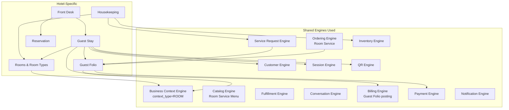
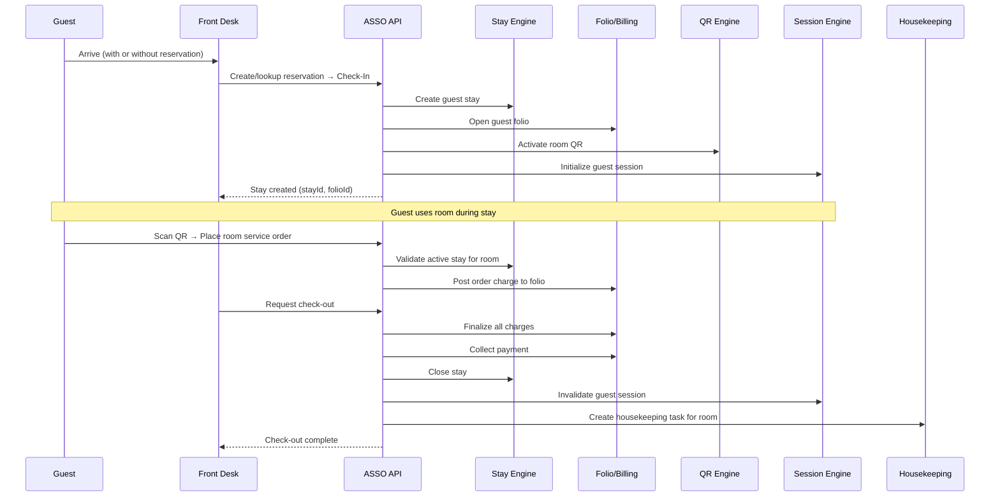
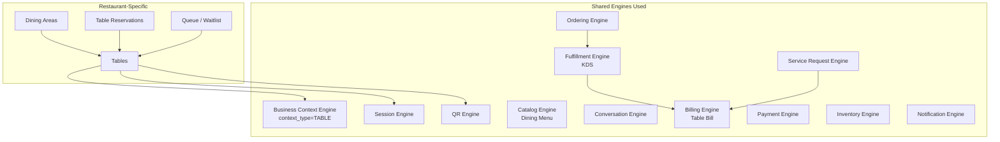
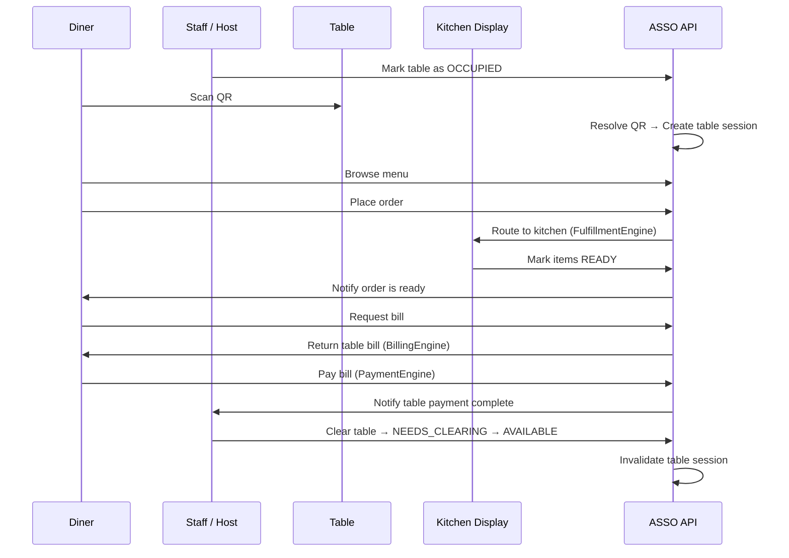
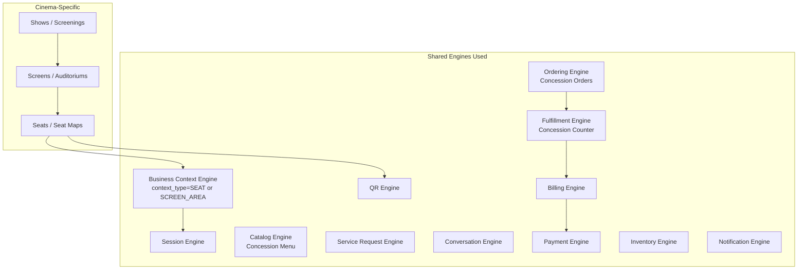
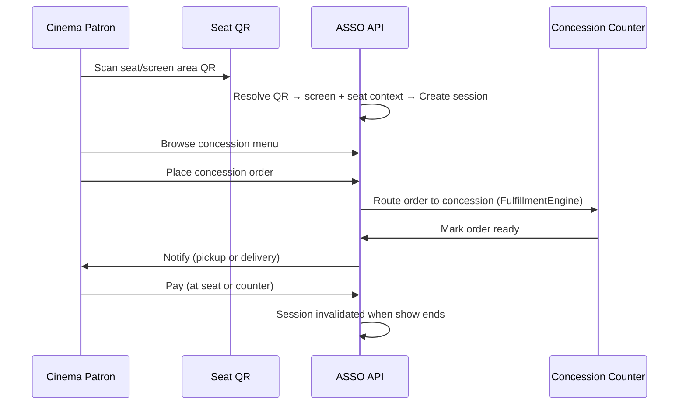

# ASSO — Vertical Architecture

**Phase**: 2 — Master Architecture  
**Status**: Approved for Phase 2  
**Last Updated**: 2026-09-26

This document defines the architectural boundaries for each business vertical: Hotel, Restaurant, and Cinema. Each vertical is an equal sibling. No vertical depends on another.

---

## Vertical Architecture Principle

```text
Shared Engine → Vertical Configuration → Vertical Workflow → Vertical UI
```

A vertical module:
- Owns entities that are genuinely unique to that business type
- Configures shared engines for its specific context and terminology
- Orchestrates shared engine calls for its specific workflows
- Does NOT re-implement capabilities that belong to shared engines
- Does NOT depend on other vertical modules

### Approved Vertical Implementation Sequence (DEC-014, ADR-013)

The Human Product Owner has approved the following implementation sequence:

```text
Stage 1: Shared Core Platform & Infrastructure Baseline
Stage 2: Hotel Vertical (Deepest architectural validation)
Stage 3: Restaurant Vertical (High-throughput validation, KDS, Tables)
Stage 4: Cinema Vertical (Auditoriums, Seats, Shows, Concessions)
```

> **Important Architectural Rule**:
> This establishes the **implementation sequence only**. It does **NOT** mean:
> - Hotel is the parent vertical.
> - Restaurant depends on Hotel.
> - Cinema depends on Restaurant.
> - Shared engines belong to Hotel.
>
> Hotel, Restaurant, and Cinema remain **equal sibling verticals** configured on top of shared ASSO domain engines. Shared engines belong exclusively to the platform. No vertical has structural hierarchy or dependency over another.

---

## 1. Hotel Vertical

### 1.1 What Hotel Owns

```text
verticals/hotel/
├── rooms/          — Room types, room inventory, room configuration
├── stays/          — Guest stay lifecycle (check-in → check-out)
├── reservations/   — Room booking management
├── front-desk/     — Front-desk operations and workflows
├── housekeeping/   — Housekeeping task lifecycle
└── folio/          — Guest folio (charge aggregation for a stay)
```

### 1.2 Hotel Architecture Diagram



### 1.3 Hotel Domain Entities

**Room Type**
```text
room_type_id, tenant_id, outlet_id
name (e.g. Deluxe, Suite, Standard)
description
base_rate
max_occupancy
amenities[]
is_active
```

**Room**
```text
room_id, tenant_id, outlet_id
room_type_id (FK)
number (e.g. "101", "205")
floor
status → AVAILABLE | OCCUPIED | MAINTENANCE | HOUSEKEEPING | BLOCKED
context_id (FK → BusinessContext where context_type = ROOM)
qr_id (FK)
notes
```

**Reservation**
```text
reservation_id, tenant_id, outlet_id
guest_id (FK → Customer)
room_type_id
room_id (assigned at check-in or pre-assigned)
check_in_date, check_out_date (expected)
status → CONFIRMED | CHECKED_IN | NO_SHOW | CANCELLED | COMPLETED
source → WALK_IN | DIRECT | FUTURE_ONLINE
adults, children
rate_at_booking
notes, special_requests
```

**Guest Stay** (the active stay record)
```text
stay_id, tenant_id, outlet_id
reservation_id (FK, nullable for walk-in)
guest_id (FK → Customer)
room_id (FK)
check_in_at (actual timestamp)
expected_check_out_date
actual_check_out_at
status → ACTIVE | CHECKED_OUT | CANCELLED
folio_id (FK)
assigned_by (staff user)
```

**Guest Folio**
```text
folio_id, tenant_id, outlet_id
stay_id (FK)
guest_id (FK)
status → OPEN | SETTLED | DISPUTED
opened_at, settled_at
currency
```

**Folio Entry** (line items on the folio)
```text
folio_entry_id
folio_id (FK)
entry_type → ROOM_CHARGE | ORDER_CHARGE | SERVICE_CHARGE | ADJUSTMENT | PAYMENT | REFUND | DISCOUNT
reference_id  — order_id, payment_id, or service_request_id
description
amount (positive = charge, negative = credit)
posted_at
posted_by     — staff user or system
is_void
void_reason
void_at
void_by
```

**Housekeeping Task**
```text
task_id, tenant_id, outlet_id
room_id (FK)
task_type → CHECKOUT_CLEAN | STAYOVER | ON_REQUEST | INSPECTION | MAINTENANCE
status → PENDING | ASSIGNED | IN_PROGRESS | COMPLETED | VERIFIED
assigned_to (staff)
created_at, started_at, completed_at
notes
priority
```

### 1.4 Hotel Guest Journey



### 1.5 Hotel Shared Engine Configuration

| Shared Engine | Hotel Configuration |
|---|---|
| Business Context | `context_type = ROOM` |
| Catalog | Room service menu items |
| Fulfillment | Room delivery workflow |
| Service Requests | Categories: Housekeeping, Maintenance, Amenities, Wake-up Call, Room Issue |
| Billing | Folio-based charge accumulation |
| Session | Stay-duration scoped |

### 1.6 Hotel Staff Roles (RBAC Templates)

| Role | Key Permissions |
|---|---|
| Hotel Manager | Full access to all hotel operations |
| Front Desk Staff | Check-in, check-out, reservation, folio view, guest requests |
| Housekeeping Staff | View/update housekeeping tasks, room status update |
| Room Service Staff | View and fulfill room service orders |
| Cashier | Process folio payments, POS |
| Maintenance | View and update maintenance requests |

### 1.7 Hotel Open Decisions

| Decision | Status |
|---|---|
| Online booking integration | `OPEN DECISION` |
| Reservation deposit/prepayment | `OPEN DECISION` |
| Hotel maintenance module depth | `OPEN DECISION` |
| Minibar management | `OPEN DECISION` |
| Rate plans and seasonal pricing | `OPEN DECISION` |

---

## 2. Restaurant Vertical

### 2.1 What Restaurant Owns

```text
verticals/restaurant/
├── areas/          — Dining areas (indoor, outdoor, bar, private)
├── tables/         — Table inventory, status, capacity
├── queue/          — Walk-in waitlist management
└── reservations/   — Table booking management
```

### 2.2 Restaurant Architecture Diagram



### 2.3 Restaurant Domain Entities

**Dining Area**
```text
area_id, tenant_id, outlet_id
name (e.g. Indoor, Outdoor, Bar, Private Dining)
description
capacity
is_active
sort_order
```

**Table**
```text
table_id, tenant_id, outlet_id
area_id (FK)
number (e.g. "T7", "B2")
display_name
capacity
status → AVAILABLE | OCCUPIED | RESERVED | NEEDS_CLEARING | MAINTENANCE
context_id (FK → BusinessContext where context_type = TABLE)
qr_id (FK)
position_x, position_y  — for floor plan layout (future)
notes
```

**Table Session** (what is active at a table — resolved from customer session)
```text
This is managed by the Session Engine with context_type = TABLE.
A restaurant-specific view may track:
- opened_at (table session start)
- occupied_by (party size, optional)
- server_assigned (staff user)
```

**Queue Entry** (if Queue module is enabled)
```text
queue_id, tenant_id, outlet_id
customer_name
party_size
phone (optional, for SMS notification)
status → WAITING | SEATED | CANCELLED | NO_SHOW
joined_at
notified_at
seated_at
estimated_wait_minutes
```

**Table Reservation** (if Reservations module is enabled)
```text
reservation_id, tenant_id, outlet_id
customer_id (FK → Customer, optional)
customer_name, customer_phone
party_size
date, time_slot
area_id (FK, preferred area)
table_id (assigned)
status → CONFIRMED | CHECKED_IN | CANCELLED | NO_SHOW | COMPLETED
notes, special_requests
```

### 2.4 Restaurant Customer Journey



### 2.5 Restaurant Shared Engine Configuration

| Shared Engine | Restaurant Configuration |
|---|---|
| Business Context | `context_type = TABLE` |
| Catalog | Dining menu (food categories, beverage categories) |
| Fulfillment | Kitchen/KDS workflow |
| Service Requests | Categories: Waiter Assistance, Special Request, Bill Request, Complaint |
| Billing | Per-table bill accumulation |
| Session | Dining-session scoped (until table cleared) |

### 2.6 Restaurant Staff Roles (RBAC Templates)

| Role | Key Permissions |
|---|---|
| Restaurant Manager | Full access to all restaurant operations |
| Host | Table management, queue management, reservation check-in |
| Server / Captain | View tables, take orders, update table status |
| Kitchen Staff | View and manage KDS orders |
| Cashier | Process table payments, POS |

### 2.7 Restaurant Open Decisions

| Decision | Status |
|---|---|
| Queue / Waitlist in initial scope | `OPEN DECISION` |
| Table Reservations depth in initial scope | `OPEN DECISION` |
| Multi-device table session (multiple customers scan same table QR) | `OPEN DECISION` |
| KDS feature depth (multi-station, course management) | `OPEN DECISION` |

---

## 3. Cinema Vertical

### 3.1 What Cinema Owns

```text
verticals/cinema/
├── screens/    — Screen/auditorium configuration
├── seats/      — Seat layout per screen
└── shows/      — Show/screening scheduling and management
```

### 3.2 Cinema Architecture Diagram



### 3.3 Cinema Domain Entities

**Screen**
```text
screen_id, tenant_id, outlet_id
name (e.g. "Screen 1", "Auditorium A")
total_capacity
status → ACTIVE | MAINTENANCE | INACTIVE
notes
```

**Seat**
```text
seat_id, tenant_id, outlet_id
screen_id (FK)
row_label (e.g. "A", "B")
seat_number (e.g. 1, 2, 15)
seat_type → STANDARD | PREMIUM | ACCESSIBLE
context_id (FK → BusinessContext where context_type = SEAT)
qr_id (FK)
is_active
```

**Show / Screening**
```text
show_id, tenant_id, outlet_id
screen_id (FK)
movie_title
start_time, end_time (expected)
status → SCHEDULED | ONGOING | COMPLETED | CANCELLED
notes
```

**Show Session** (ties a show to active customer sessions)
```text
This is managed by the Session Engine. When a show ends:
→ All customer sessions for seats in that screen are invalidated.
Show sessions do not require a separate cinema-specific entity.
```

### 3.4 Cinema Customer Journey (Current Scope)



### 3.5 Cinema Shared Engine Configuration

| Shared Engine | Cinema Configuration |
|---|---|
| Business Context | `context_type = SEAT` (or `SCREEN_AREA` for screen-level QR) |
| Catalog | Concession menu (food, beverages, snacks) |
| Fulfillment | Counter fulfillment (pickup or seat delivery) |
| Service Requests | Categories: Seat Issue, Temperature, Cleanliness, Disturbance |
| Billing | Per-order billing or concession tab |
| Session | Show-duration scoped |

### 3.6 Cinema Staff Roles (RBAC Templates)

| Role | Key Permissions |
|---|---|
| Cinema Manager | Full access to all cinema operations |
| Counter Staff | View and fulfill concession orders, POS |
| Floor Staff / Usher | View service requests, manage screen areas |
| Kitchen / Concession Staff | View KDS, update order status |

### 3.7 Cinema Open Decisions

| Decision | Status |
|---|---|
| Seat delivery vs counter pickup model | `OPEN DECISION` |
| Cinema ticketing | `FUTURE` — not in initial scope |
| Seat reservation | `FUTURE` — requires ticketing first |
| QR scope: per-seat vs per-screen-area | `OPEN DECISION` |

---

## 4. Adding a New Vertical

The architecture is designed to support future verticals (e.g., Spa, Gym, Retail) without redesigning shared engines. To add a new vertical:

1. Create a new vertical module directory under `verticals/`
2. Define the vertical's unique domain entities
3. Register business context type with the Context Engine
4. Define role templates with the RBAC Engine
5. Register service request categories with the Service Request Engine
6. Configure the Catalog Engine with appropriate item categories
7. Map the vertical's billing model to the Billing Engine
8. Register the vertical's module set with the Module Entitlement Engine
9. Build vertical-specific UI in the Business Console (within the shared component system)

No shared engine code needs to change to support a new vertical.
