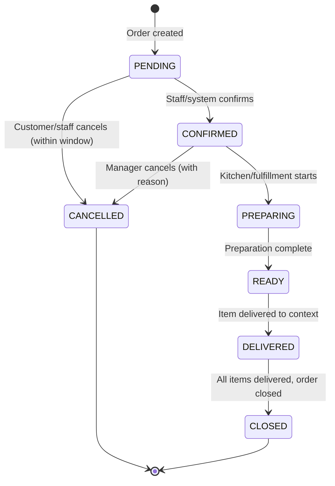
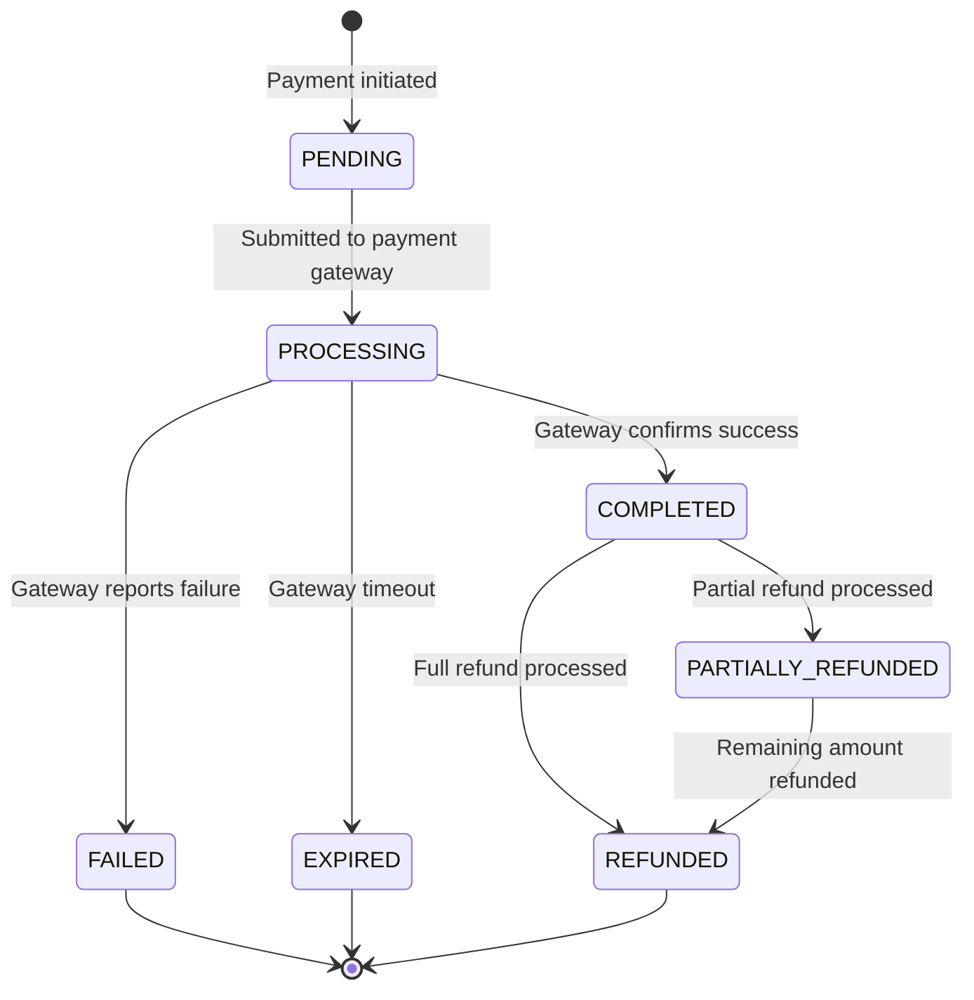
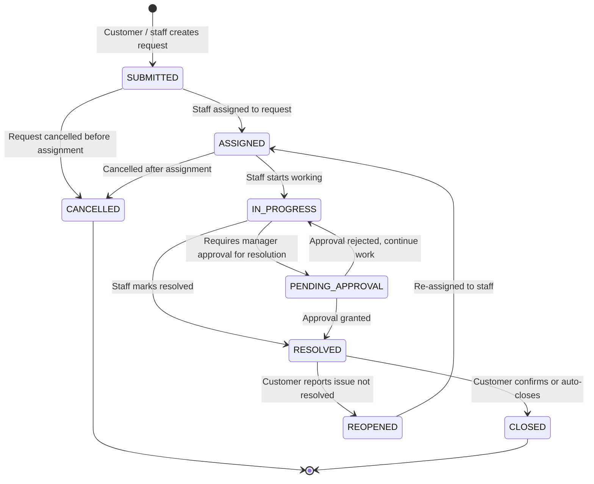
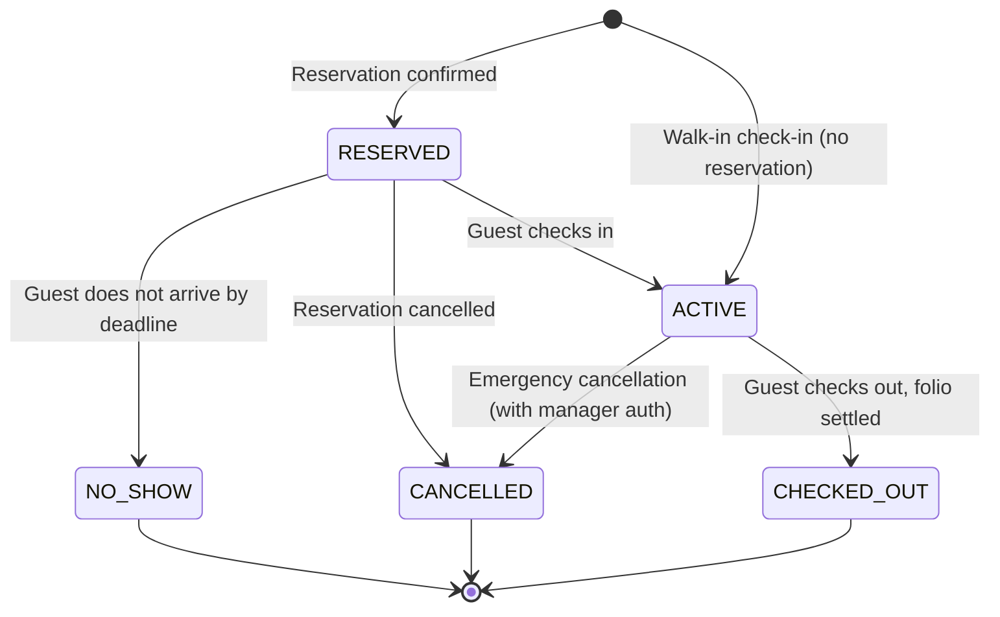
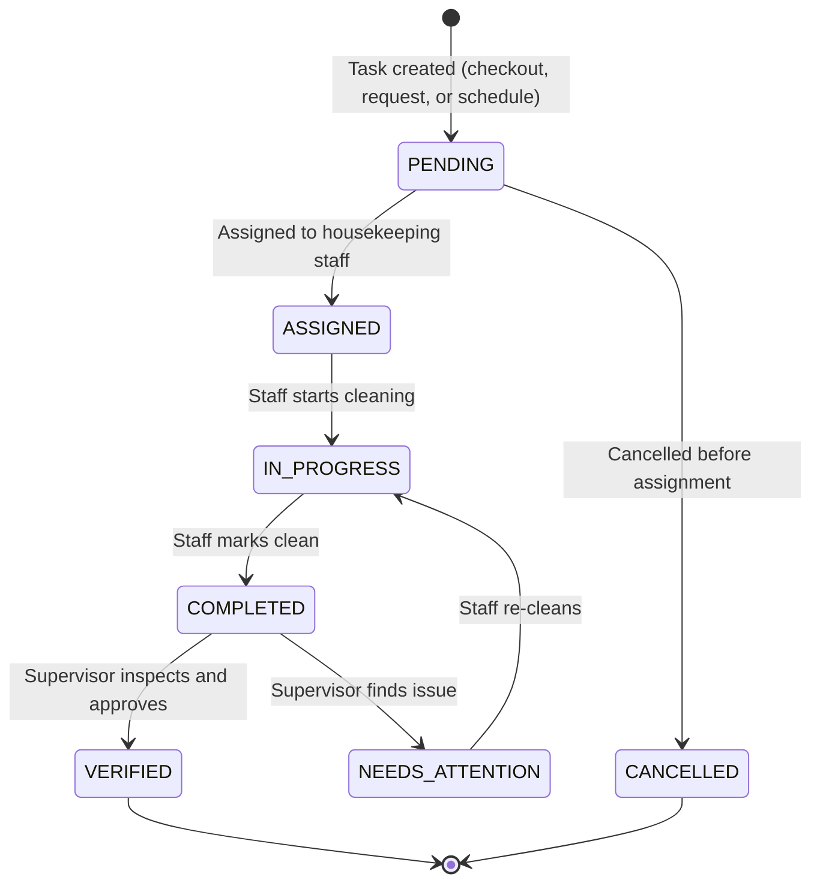
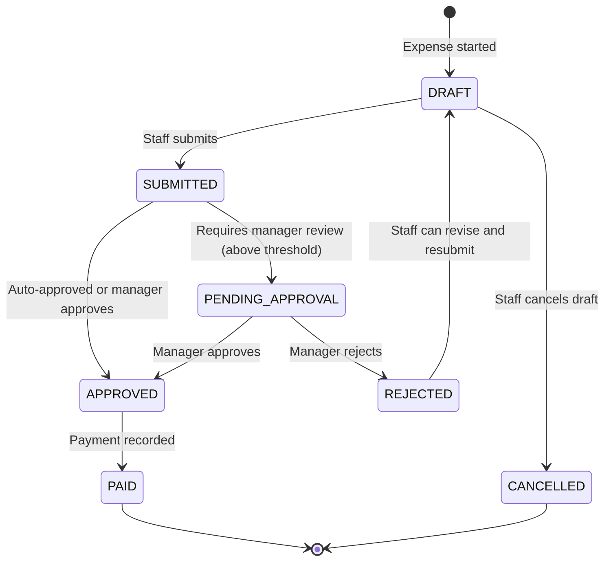
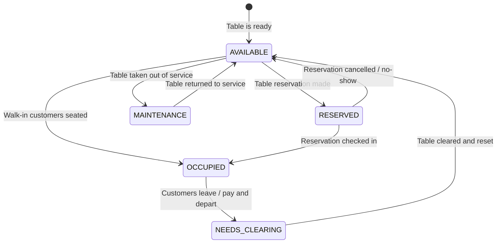
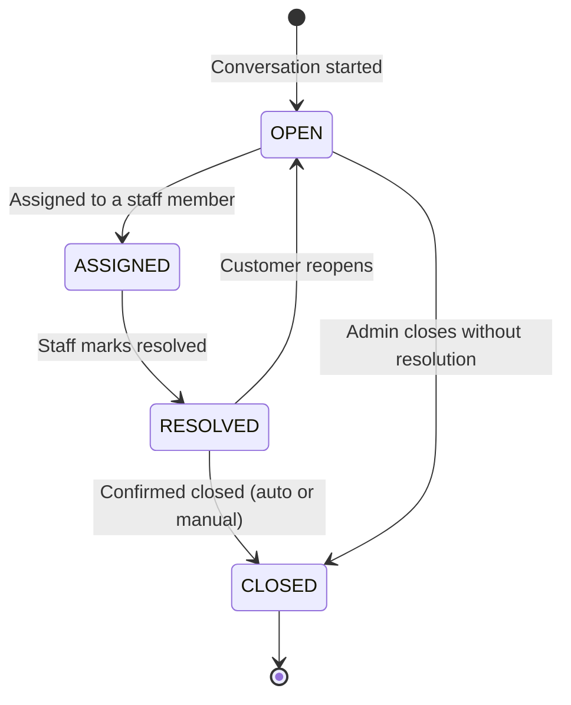

```mermaid
stateDiagram-v2
    [*] --> DRAFT : PO created
    DRAFT --> PENDING_APPROVAL : Submitted for approval
    DRAFT --> APPROVED : Auto-approved (below threshold)
    PENDING_APPROVAL --> APPROVED : Manager approves
    PENDING_APPROVAL --> REJECTED : Manager rejects
    APPROVED --> SENT : PO sent to supplier
    SENT --> PARTIALLY_RECEIVED : Some items received
    PARTIALLY_RECEIVED --> RECEIVED : All items received
    PARTIALLY_RECEIVED --> CLOSED : Partially received; remaining cancelled
    SENT --> RECEIVED : All items received at once
    RECEIVED --> CLOSED : PO closed
    REJECTED --> [*]
    DRAFT --> CANCELLED : Cancelled in draft
    APPROVED --> CANCELLED : Cancelled after approval (with authorization)
    CLOSED --> [*]
    CANCELLED --> [*]
```

# ASSO — Workflows & State Machines

**Phase**: 2 — Master Architecture  
**Status**: Approved for Phase 2  
**Last Updated**: 2026-09-26

Important domain entities use controlled state machines to prevent invalid transitions and ensure predictable business workflows. All state transitions are enforced at the backend domain layer.

---

## 1. Order State Machine

**Engine**: Ordering Engine  
**Scope**: All verticals



| State | Description | Actor |
|---|---|---|
| `PENDING` | Order submitted, awaiting confirmation | System (on creation) |
| `CONFIRMED` | Order acknowledged, routing to fulfillment | System or Staff |
| `PREPARING` | Fulfillment station working on it | Kitchen / Concession Staff |
| `READY` | Ready for delivery or pickup | Kitchen / Concession Staff |
| `DELIVERED` | Delivered to customer | Delivery Staff / System |
| `CLOSED` | Fully completed, no further changes | System |
| `CANCELLED` | Cancelled before or during preparation | Customer, Staff, Manager |

**Rules**:
- Cancellation has a configurable window (e.g., only `PENDING` or `CONFIRMED` orders can be customer-cancelled)
- Manager may cancel at any state, but must provide reason
- State changes produce audit records and domain events
- Partial fulfillment (item-level states) is tracked on `order_items`, not at order level

**Item-Level States** (`order_items`):
```text
PENDING → ACKNOWLEDGED → PREPARING → READY → DELIVERED | CANCELLED
```

---

## 2. Payment State Machine

**Engine**: Payment Engine  
**Scope**: All verticals



**Rules**:
- `COMPLETED` is terminal for the payment — it cannot be re-opened
- Corrections use a new refund transaction; the original payment record is not modified
- Idempotency key required for all payment initiations
- Webhook from payment gateway drives the `PROCESSING → COMPLETED/FAILED` transition

---

## 3. Service Request State Machine

**Engine**: Service Request Engine  
**Scope**: All verticals (categories differ)



**Rules**:
- Priority and assignment rules are configurable per vertical and category
- SLA-ready architecture: created_at tracked; escalation hooks can be added later
- Approval requirement on resolution is policy-controlled

---

## 4. Guest Stay State Machine (Hotel)

**Engine**: Hotel Vertical — Stays Module  
**Scope**: Hotel only



**Rules**:
- Transition `RESERVED → ACTIVE` creates the folio and initiates the guest session
- Transition `ACTIVE → CHECKED_OUT` requires the folio to be settled (zero or positive balance with payment)
- Only authorized staff can perform check-in / check-out

---

## 5. Housekeeping Task State Machine (Hotel)

**Engine**: Hotel Vertical — Housekeeping Module  
**Scope**: Hotel only



**Rules**:
- Room status updates in sync with task state (`OCCUPIED`, `HOUSEKEEPING`, `AVAILABLE`)
- Verification step is optional (configurable per property)

---

## 6. Purchase Order State Machine

**Engine**: Procurement Engine  
**Scope**: All verticals



**Rules**:
- Approval requirement controlled by policy (threshold-based)
- Partial receiving is supported; creates a goods receipt record
- Discrepancies (ordered vs received) are recorded on the goods receipt

---

## 7. Expense Approval State Machine

**Engine**: Expense Engine  
**Scope**: All verticals



---

## 8. Inventory Transfer State Machine

**Engine**: Inventory Engine  
**Scope**: All verticals (inter-outlet transfers)

```mermaid
stateDiagram-v2
    [*] --> REQUESTED : Transfer initiated
    REQUESTED --> PENDING_APPROVAL : Requires authorization
    REQUESTED --> APPROVED : Auto-approved (within threshold)
    PENDING_APPROVAL --> APPROVED : Authorized by manager
    PENDING_APPROVAL --> REJECTED : Rejected
    APPROVED --> IN_TRANSIT : Source outlet confirms dispatch
    IN_TRANSIT --> RECEIVED : Destination confirms receipt
    IN_TRANSIT --> PARTIALLY_RECEIVED : Some items received
    PARTIALLY_RECEIVED --> RECEIVED : Remaining items received
    PARTIALLY_RECEIVED --> CLOSED : Partial accepted; rest returned
    RECEIVED --> CLOSED : Transfer complete
    REJECTED --> [*]
    CLOSED --> [*]
```



**Rules**:
- Both outlets must be in the same organization (cross-tenant transfer is not supported)
- Stock movements are created at both endpoints (stock-out at source, stock-in at destination)
- Discrepancies between dispatched and received quantities are recorded

---

## 9. Table State Machine (Restaurant)

**Engine**: Restaurant Vertical — Tables Module  
**Scope**: Restaurant only



> `OPEN DECISION` — Exact table states and transitions to be finalized during Phase 3 implementation.

---

## 10. Conversation State Machine

**Engine**: Conversation Engine  
**Scope**: All verticals



---

## 11. State Machine Implementation Rules

For every state machine:

1. **Backend enforcement**: State transitions are validated by domain service code. Invalid transitions are rejected with `422 Unprocessable Entity`.
2. **History**: Every state transition creates a history record with: `entity_id`, `from_state`, `to_state`, `actor`, `timestamp`, `reason` (if required).
3. **Audit**: State transitions on financially significant entities (payments, folios, purchase orders) produce audit log entries.
4. **Idempotency**: Transition requests are idempotent — attempting the same valid transition twice returns the current state without error.
5. **Side effects**: Side effects (sending notifications, updating related entities) are triggered via domain events after the state transition commits — not inline in the state transition logic.
