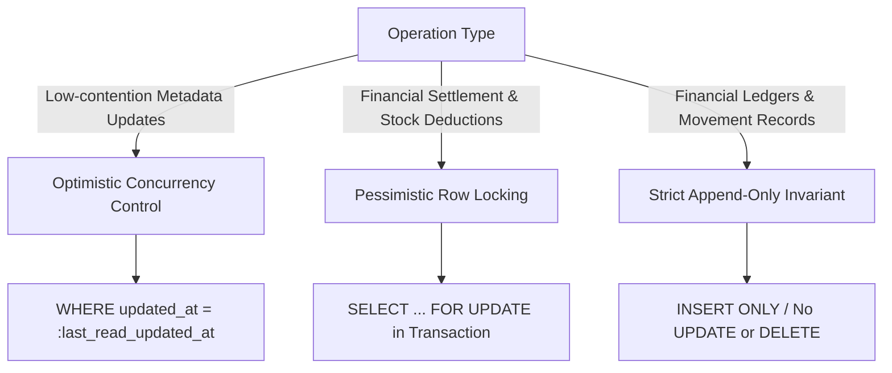

# ASSO Database Data Integrity & Concurrency Architecture

> **Version:** 1.0.0  
> **Status:** SPECIFICATION / DESIGN ARTIFACT (PHASE 3)  
> **Authority:** Aligned with `AGENTS.md` and Phase 2 Architecture (`DATA-OWNERSHIP.md`, `WORKFLOWS-AND-STATE-MACHINES.md`)  

---

## 1. Data Integrity Strategy

ASSO implements data integrity as a multi-tier defense system. While application code performs input sanitization and business validation, **the database schema is the ultimate enforcement barrier**. Invalid data must be rejected at the PostgreSQL layer regardless of client origin or application defects.

---

## 2. PostgreSQL Check Constraints

### 2.1 Financial & Amount Non-Negativity Constraints

```sql
-- Ensure unit prices, sub-totals, and taxes are non-negative
ALTER TABLE catalog_items ADD CONSTRAINT chk_catalog_items_price CHECK (base_price >= 0);
ALTER TABLE catalog_items ADD CONSTRAINT chk_catalog_items_tax CHECK (tax_rate >= 0 AND tax_rate <= 1.0000);

ALTER TABLE orders ADD CONSTRAINT chk_orders_subtotal CHECK (subtotal_amount >= 0);
ALTER TABLE orders ADD CONSTRAINT chk_orders_tax CHECK (tax_amount >= 0);
ALTER TABLE orders ADD CONSTRAINT chk_orders_discount CHECK (discount_amount >= 0);
ALTER TABLE orders ADD CONSTRAINT chk_orders_total CHECK (total_amount >= 0);

ALTER TABLE order_items ADD CONSTRAINT chk_order_items_qty CHECK (quantity > 0);
ALTER TABLE order_items ADD CONSTRAINT chk_order_items_price CHECK (unit_price >= 0);
ALTER TABLE order_items ADD CONSTRAINT chk_order_items_subtotal CHECK (subtotal >= 0);

ALTER TABLE bills ADD CONSTRAINT chk_bills_total CHECK (total_amount >= 0);
ALTER TABLE bills ADD CONSTRAINT chk_bills_settled CHECK (settled_amount >= 0);

ALTER TABLE payment_transactions ADD CONSTRAINT chk_payment_amount CHECK (amount > 0);
ALTER TABLE payment_refunds ADD CONSTRAINT chk_refund_amount CHECK (refund_amount > 0);

ALTER TABLE expenses ADD CONSTRAINT chk_expense_amount CHECK (amount > 0);
ALTER TABLE cash_sessions ADD CONSTRAINT chk_cash_opening CHECK (opening_balance >= 0);
```

### 2.2 Currency ISO Validation

```sql
-- Currency codes must strictly conform to uppercase 3-letter ISO-4217 standard
ALTER TABLE outlets ADD CONSTRAINT chk_outlet_currency CHECK (currency ~ '^[A-Z]{3}$');
ALTER TABLE pricing_configurations ADD CONSTRAINT chk_pricing_currency CHECK (currency ~ '^[A-Z]{3}$');
ALTER TABLE payment_transactions ADD CONSTRAINT chk_payment_currency CHECK (currency ~ '^[A-Z]{3}$');
```

### 2.3 Status Transition Enforceability via Check Constraints

```sql
-- Allowed enumeration bounds enforced at DB level
ALTER TABLE orders ADD CONSTRAINT chk_order_status_valid 
    CHECK (status IN ('DRAFT', 'PLACED', 'ACCEPTED', 'IN_PREPARATION', 'READY', 'SERVED', 'COMPLETED', 'CANCELLED'));

ALTER TABLE hotel_stays ADD CONSTRAINT chk_hotel_stay_status_valid 
    CHECK (status IN ('RESERVED', 'CHECKED_IN', 'CHECKED_OUT', 'CANCELLED', 'NO_SHOW'));

ALTER TABLE hotel_rooms ADD CONSTRAINT chk_hotel_room_hk_status 
    CHECK (housekeeping_status IN ('CLEAN', 'DIRTY', 'INSPECTED', 'MAINTENANCE', 'OUT_OF_SERVICE'));

ALTER TABLE inventory_stock_movements ADD CONSTRAINT chk_stock_movement_type 
    CHECK (movement_type IN ('PURCHASE_RECEIPT', 'INTER_OUTLET_TRANSFER', 'INTERNAL_TRANSFER', 'MANUAL_ADJUSTMENT', 'WASTAGE', 'RECONCILIATION'));
```

---

## 3. Concurrency Control Mechanisms

Concurrent updates in high-volume environments (e.g., POS terminal ordering, bill settlement, warehouse stock movements) require precise isolation strategies:



### 3.1 Pessimistic Row Locking (`SELECT ... FOR UPDATE`)

Used for:
- **Inventory Balance Updates:** When adjusting or receiving stock into an `inventory_stock_balances` record.
- **Bill Settlement:** When applying a payment transaction to a `bills` record to ensure total payments do not exceed the balance due.
- **Folio Checkout:** When finalizing guest folio balance before marking room status as available.

```sql
-- Example: Stock Movement Transaction Isolation
BEGIN;
-- Lock the stock balance row exclusively
SELECT current_quantity 
FROM inventory_stock_balances 
WHERE location_id = :loc_id AND item_id = :item_id
FOR UPDATE;

-- Record immutable movement ledger entry
INSERT INTO inventory_stock_movements (tenant_id, outlet_id, location_id, item_id, movement_type, quantity_delta, created_by_staff_id)
VALUES (:tenant_id, :outlet_id, :loc_id, :item_id, 'MANUAL_ADJUSTMENT', :delta, :staff_id);

-- Update cached balance
UPDATE inventory_stock_balances
SET current_quantity = current_quantity + :delta,
    updated_at = clock_timestamp()
WHERE location_id = :loc_id AND item_id = :item_id;

COMMIT;
```

### 3.2 Optimistic Concurrency Control (OCC)

Used for catalog editing, staff roster management, and reservation editing.
Every entity subject to OCC includes an `updated_at` or dedicated `version_number INT NOT NULL DEFAULT 1`.
Updates must check:
```sql
UPDATE catalog_items
SET name = :new_name,
    base_price = :new_price,
    updated_at = clock_timestamp()
WHERE item_id = :item_id AND updated_at = :expected_updated_at;

-- If rows affected == 0, application raises 409 Conflict (Concurrent Modification)
```

---

## 4. Deletion Strategy & Historical Preservation

Every entity in ASSO is classified into one of three deletion lifecycles:

| Lifecycle Policy | Applicable Tables | Behavior & Rationale |
| :--- | :--- | :--- |
| **Strictly Immutable (Append-Only Ledgers)** | `inventory_stock_movements`, `hotel_folio_entries`, `cash_movements`, `audit_events`, `security_events`, `payment_transactions`, `order_status_history` | **NO UPDATES OR DELETES ALLOWED.** Enforced by database RLS (`FOR UPDATE USING (false)`). Corrections require a compensating entry. Source of truth for all historical and financial events. |
| **Mutable Current / Derived State** | `inventory_stock_balances` (`current_quantity`), `hotel_rooms` (`housekeeping_status`, `is_occupied`), `orders` (`status`), `bills` (`status`, `settled_amount`), `hotel_folios` (`status`, `balance_due`) | **UPDATED IN-PLACE TRANSACTIONALLY.** Represents the live operational snapshot of the system. In any dispute or audit, current state is derived/reconciled from the immutable ledgers. |
| **Soft Delete** | `organizations`, `outlets`, `users`, `staff_profiles`, `catalog_items`, `restaurant_tables`, `hotel_rooms` | Uses `deleted_at TIMESTAMPTZ`. Records remain preserved for foreign key historical integrity and compliance. Filtered from UI via `WHERE deleted_at IS NULL`. |
| **Hard Delete (Restricted Cascade)** | `order_item_modifiers`, `purchase_order_items`, `role_permissions` | Strictly restricted to child composition rows that have no independent lifecycle and exist purely as detail lines of an uncommitted or draft parent. |

---

## 5. Historical Commercial Price Integrity & Snapshot Immutability

1. **Applied Price Snapshotting:** Whenever a financial transaction occurs (order placed, bill generated, folio charged, or tenant entitlement granted), the applied price is written as a permanent, immutable numerical value into the transaction record:
   - `order_items.unit_price` captures item price at order time.
   - `hotel_folio_entries.amount` captures tariff/charge at posting time.
   - `tenant_entitlements.applied_price` captures agreed plan/module fee at subscription time.
2. **Catalog Price Updates Never Mutate History:** Modifying prices in `catalog_items` or updating SaaS subscription fees in `pricing_configurations` only affects future transactions. Historical charges, settled invoices, and ledger entries remain immutable.
3. **Pricing Versioning (DEC-024):** Changes to platform pricing in `pricing_configurations` do not overwrite existing records. The active record's `effective_until` timestamp is set to `clock_timestamp()`, and a new record with an incremented `version_number` is inserted. Historical subscriptions link to `pricing_version_id`, preserving full auditability.
