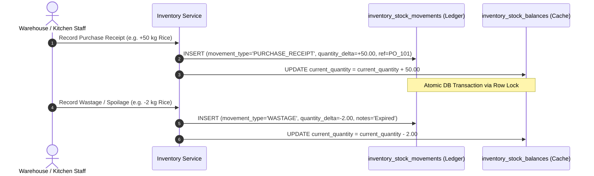
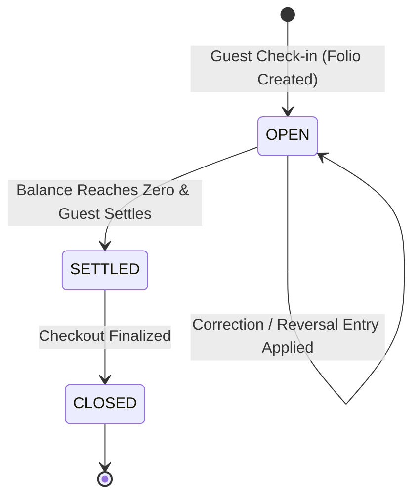
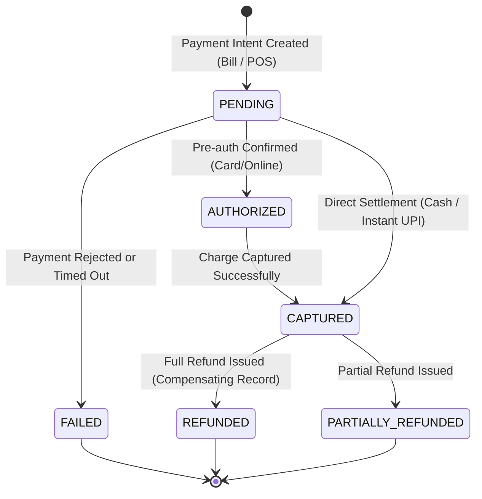

# ASSO Financial & Inventory Immutable Ledgers

> **Version:** 1.0.0  
> **Status:** SPECIFICATION / DESIGN ARTIFACT (PHASE 3)  
> **Authority:** Aligned with `AGENTS.md` (Financial Immutability, Current State vs Historical Record)  

---

## 1. The Three Canonical Ledgers

ASSO enforces strict financial and physical stock integrity through three append-only ledgers:
1. **The Inventory Movement Ledger** (`inventory_stock_movements`)
2. **The Hotel Guest Folio Ledger** (`hotel_folio_entries`)
3. **The Payment & Settlement Ledger** (`payment_transactions`, `payment_refunds`, `cash_movements`)

### Golden Rules of Ledger Immutability
- **No In-Place Updates:** Once written, ledger rows cannot be updated or deleted.
- **Compensating Corrections:** Any error, return, discount post-facto, or dispute resolution must be recorded as an explicit compensating transaction with negative value or reversal type, pointing back to the original entry via `reverses_entry_id`.
- **Audit Traceability:** Every movement mandates `created_by_staff_id` and strict timestamps.

---

## 2. Inventory Movement Ledger

Current stock (`inventory_stock_balances.current_quantity`) is a materialized cache of the chronological sum of all movements:

$$\text{Current Quantity} = \sum \text{quantity\_delta}$$



### Movement Types
- `PURCHASE_RECEIPT`: Stock received against an approved Purchase Order (`+` delta).
- `INTER_OUTLET_TRANSFER`: Movement between authorized property outlets (deducted from origin `-`, added to destination `+`).
- `INTERNAL_TRANSFER`: Movement between internal locations (e.g., Central Store to Kitchen Pantry).
- `MANUAL_ADJUSTMENT`: Cycle count or audit adjustment (`+` or `-` delta).
- `WASTAGE`: Damaged, expired, or dropped goods (`-` delta).
- `RECONCILIATION`: End-of-period inventory true-up.

---

## 3. Hotel Guest Folio Ledger

The guest folio tracks all stay-related charges and payments. In-place alteration of room charges or services is strictly prohibited.



### Reversal Pattern
If a ₹1,000 laundry charge was posted in error:
1. Original Entry `E1`: `entry_type='SERVICE', amount=+1000.00, description='Laundry'`
2. Correcting Entry `E2`: `entry_type='REVERSAL', amount=-1000.00, reverses_entry_id=E1, description='Correction: Room 204 charged to Room 205 in error'`

---

## 4. Payment & Settlement Ledger

The payment engine handles multi-channel collections (Cash, UPI, Card, Gateway) while maintaining exact idempotency and settlement status.



### Idempotency and Webhook Reconciliation
When an asynchronous payment gateway (such as UPI or card gateway) dispatches webhook confirmations:
1. Gateway event signature is validated.
2. Inbound event is stored in `inbound_webhook_events` with `UNIQUE(provider, event_id)`.
3. If already processed, HTTP 200 is immediately returned without re-executing business logic.
4. If fresh, a database transaction transitions `payment_transactions` to `CAPTURED`, adjusts `bills.settled_amount`, and emits a domain event `PaymentCapturedEvent`.

---

## 5. Architectural Distinction: Immutable Historical Record vs Current / Derived State

ASSO strictly maintains the architectural boundary between immutable history and mutable operational state:

```text
Immutable Ledger / Historical Record (Source of Truth)
                         ↓
  Projection / Materialized Snapshot / Current Operational State
```

| Domain | Immutable Historical Ledger (Append-Only) | Current Operational / Derived State (Mutable Projection) | Relationship & Mechanics |
| :--- | :--- | :--- | :--- |
| **Inventory** | `inventory_stock_movements` | `inventory_stock_balances` (`current_quantity`) | Ledger is append-only. Stock balance is a materialized snapshot updated atomically under pessimistic row lock (`FOR UPDATE`). Balance can always be verified by summing ledger deltas. |
| **Hotel Folio** | `hotel_folio_entries` | `hotel_folios` (`status`, `total_charges`, `total_payments`, `balance_due`) | Folio entries cannot be mutated; corrections require reversal entries. Folio header totals are transactional projections reflecting current settlement status. |
| **Billing & Payments**| `payment_transactions`, `payment_refunds`, `cash_movements` | `bills` (`status`, `settled_amount`) | Payment rows record discrete financial events. Bill balance is an operational projection indicating whether the bill is OPEN, PARTIALLY_SETTLED, or SETTLED. |
| **Orders** | `order_status_history` | `orders` (`status`), `order_items` (`item_status`) | History log records every status change with actor and timestamp. Order and item status represent live operational state on POS and KDS screens. |

### Architectural Rules
1. **Operational Tables are NOT Append-Only:** Operational state tables (`inventory_stock_balances`, `orders`, `bills`, `hotel_rooms`) are updated in place to support high-throughput lookups, POS feeds, and UI state rendering.
2. **Ledgers are Strictly Append-Only:** Historical ledgers never permit `UPDATE` or `DELETE` statements.
3. **Reconciliation Invariant:** The immutable ledger is the single source of truth. In any audit, dispute, or discrepancy, current state can be recomputed and verified directly from the ledger.
