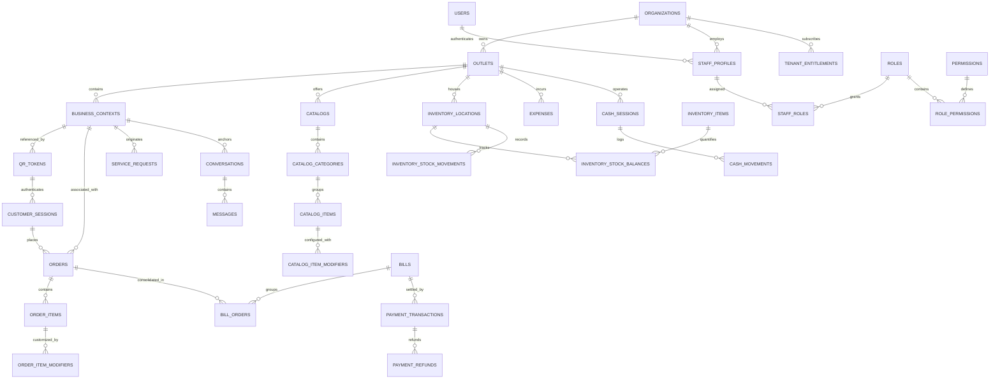
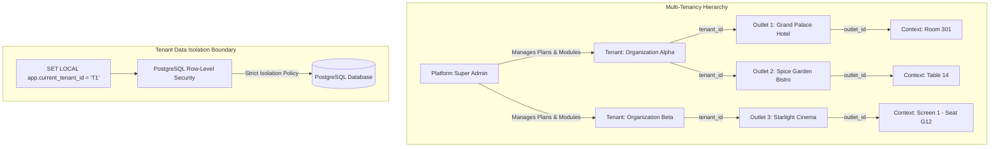
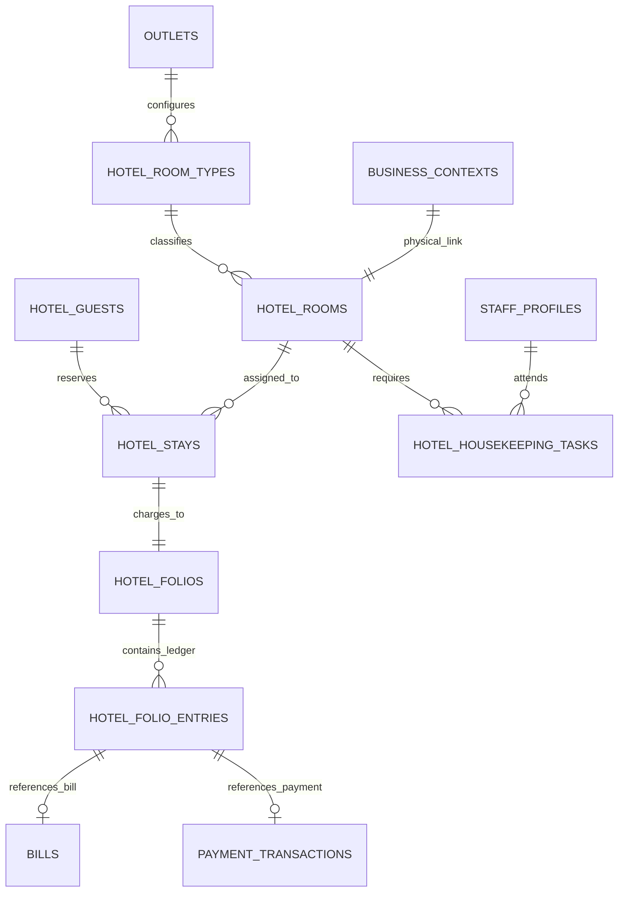
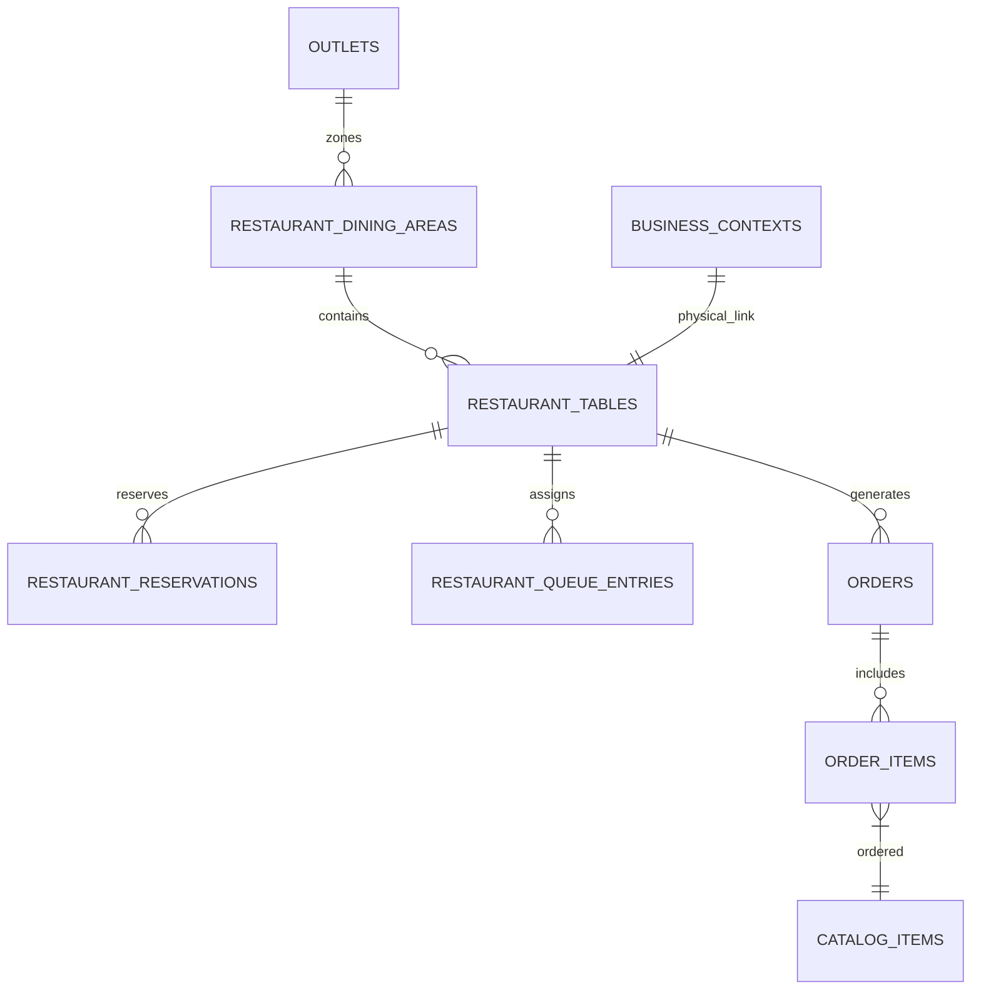
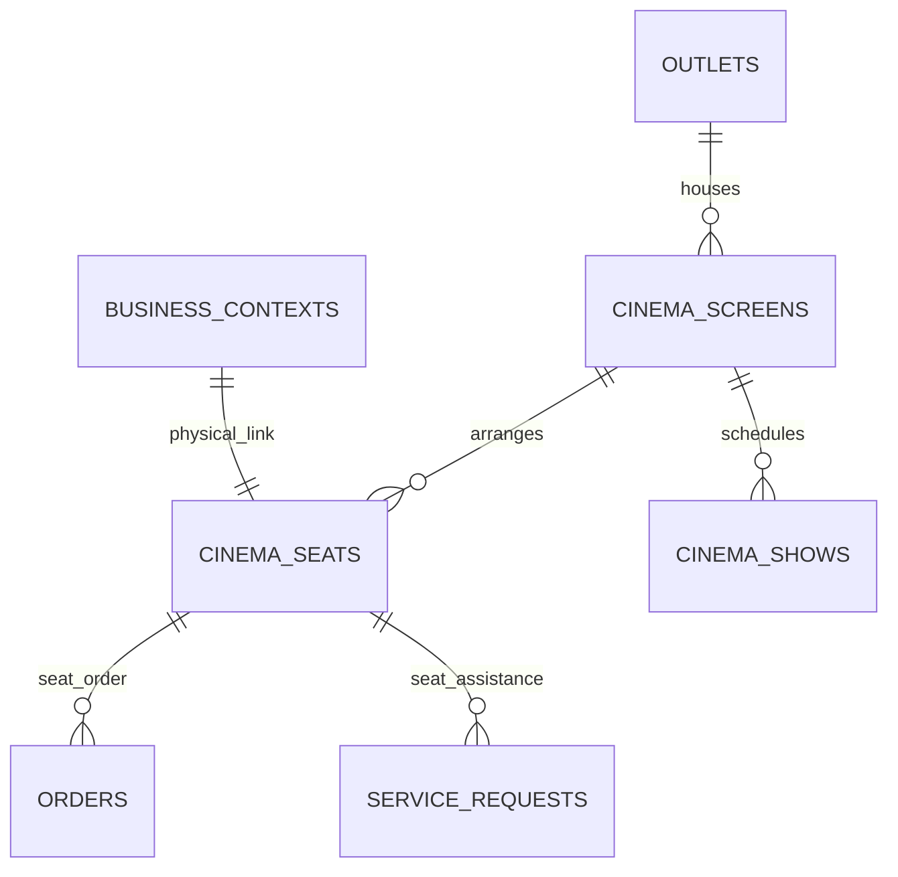

# ASSO Entity Relationships & Architecture Diagrams

> **Version:** 1.0.0  
> **Status:** SPECIFICATION / DESIGN ARTIFACT (PHASE 3)  
> **Authority:** Aligned with `ENTITY-CATALOG.md` and `DATABASE-SCHEMA.md`  

---

## 1. Canonical ER Overview

The diagram below maps the relationships across Core Platform, Identity, Context, Catalog, Ordering, Billing, and Shared Engines.

---

## 2. Tenant Isolation Architecture

The multi-tenant hierarchy is strictly enforced at every level. No entity escapes the `tenant_id` boundary.

---

## 3. Hotel Vertical Data Model

Hotel maps physical rooms to `business_contexts` and links Guest Stays, Folios, and Housekeeping to shared platform engines.

---

## 4. Restaurant Vertical Data Model

Restaurant maps dining areas and tables to `business_contexts`, linking Queues, Reservations, and Kitchen Display Systems (KDS).

---

## 5. Cinema Vertical Data Model

Cinema maps screens and seats to `business_contexts`, supporting in-seat ordering and screen-area concessions.

