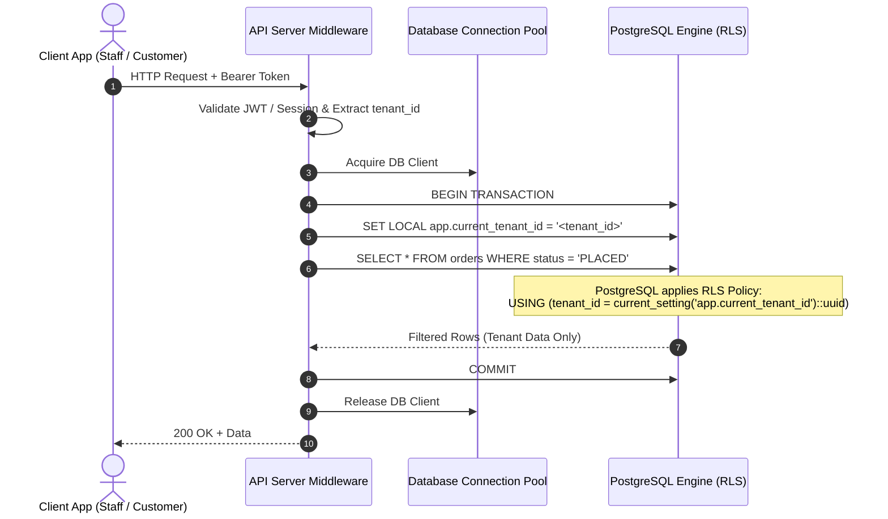

# ASSO Row-Level Security (RLS) Architecture & Specifications

> **Version:** 1.0.0  
> **Status:** SPECIFICATION / DESIGN ARTIFACT (PHASE 3)  
> **Authority:** Aligned with `AGENTS.md` and Phase 2 Security Architecture (`ADR-005`, `SECURITY-ARCHITECTURE.md`)  

---

## 1. RLS Strategy & Philosophy

In ASSO, security operates via defense-in-depth:
1. **Application-Level Authorization:** Application middleware validates tenant context, user roles, module entitlements, and specific RBAC permissions before dispatching queries.
2. **Database-Level Row-Level Security (RLS):** PostgreSQL enforces row-level isolation at the query execution engine. Even if an application bug, IDOR, or developer oversight fails to append a `WHERE tenant_id = ...` clause, the database guarantees that records from other tenants are invisible and immutable.

Database RLS is **never** bypassed for standard operational tenant queries.

---

## 2. Tenant Context Setting Mechanics

Application database connections set a local session variable within every transaction:

```sql
-- Executed inside the transaction immediately upon acquiring connection from pool
SET LOCAL app.current_tenant_id = 'c0a80123-4567-89ab-cdef-0123456789ab';
```

When checking the context in policies, ASSO uses:
```sql
NULLIF(current_setting('app.current_tenant_id', true), '')::uuid
```
The second parameter `true` ensures that if `app.current_tenant_id` has not been set, PostgreSQL returns `NULL` rather than throwing an unhandled runtime exception. When `NULL` is returned, any comparison `tenant_id = NULL` evaluates to `UNKNOWN` (falsy), immediately blocking all data access.

---

## 3. RLS Request Flow Diagram



---

## 4. Standard RLS Policy Templates

### 4.1 Tenant-Owned Operational Tables (Standard Pattern)

For tables such as `orders`, `bills`, `expenses`, `service_requests`, `catalog_items`, `inventory_items`:

```sql
-- Enable RLS
ALTER TABLE orders ENABLE ROW LEVEL SECURITY;
ALTER TABLE orders FORCE ROW LEVEL SECURITY;

-- 1. SELECT Policy
CREATE POLICY orders_tenant_select ON orders
    FOR SELECT
    USING (
        tenant_id = NULLIF(current_setting('app.current_tenant_id', true), '')::uuid
        OR (NULLIF(current_setting('app.is_super_admin', true), 'false')::boolean = true)
    );

-- 2. INSERT Policy (Ensures tenant_id cannot be forged or mismatch session)
CREATE POLICY orders_tenant_insert ON orders
    FOR INSERT
    WITH CHECK (
        tenant_id = NULLIF(current_setting('app.current_tenant_id', true), '')::uuid
    );

-- 3. UPDATE Policy
CREATE POLICY orders_tenant_update ON orders
    FOR UPDATE
    USING (
        tenant_id = NULLIF(current_setting('app.current_tenant_id', true), '')::uuid
    )
    WITH CHECK (
        tenant_id = NULLIF(current_setting('app.current_tenant_id', true), '')::uuid
    );

-- 4. DELETE Policy
CREATE POLICY orders_tenant_delete ON orders
    FOR DELETE
    USING (
        tenant_id = NULLIF(current_setting('app.current_tenant_id', true), '')::uuid
    );
```

### 4.2 Append-Only Financial and Inventory Ledgers

For strictly immutable tables (`inventory_stock_movements`, `hotel_folio_entries`, `cash_movements`, `audit_events`, `security_events`):

```sql
ALTER TABLE inventory_stock_movements ENABLE ROW LEVEL SECURITY;
ALTER TABLE inventory_stock_movements FORCE ROW LEVEL SECURITY;

-- Allow SELECT within tenant
CREATE POLICY inv_movements_tenant_select ON inventory_stock_movements
    FOR SELECT
    USING (tenant_id = NULLIF(current_setting('app.current_tenant_id', true), '')::uuid);

-- Allow INSERT within tenant
CREATE POLICY inv_movements_tenant_insert ON inventory_stock_movements
    FOR INSERT
    WITH CHECK (tenant_id = NULLIF(current_setting('app.current_tenant_id', true), '')::uuid);

-- Strictly FORBID UPDATE & DELETE by omitting UPDATE/DELETE policies or using FALSE
CREATE POLICY inv_movements_no_update ON inventory_stock_movements
    FOR UPDATE USING (false);

CREATE POLICY inv_movements_no_delete ON inventory_stock_movements
    FOR DELETE USING (false);
```

### 4.3 Child Items Without Direct Tenant ID (Cascade Inheritance)

For normalized child tables that reference a tenant-scoped parent (e.g., `order_item_modifiers` referencing `order_items`):

```sql
ALTER TABLE order_item_modifiers ENABLE ROW LEVEL SECURITY;

CREATE POLICY order_item_modifiers_select ON order_item_modifiers
    FOR SELECT
    USING (
        EXISTS (
            SELECT 1 FROM order_items oi
            WHERE oi.order_item_id = order_item_modifiers.order_item_id
              AND oi.tenant_id = NULLIF(current_setting('app.current_tenant_id', true), '')::uuid
        )
    );
```
*(Note: As defined in `DATABASE-SCHEMA.md`, all high-volume tables include direct `tenant_id` denormalization to maximize RLS query optimization and avoid expensive joins during RLS evaluation).*

---

## 5. Security Reviews & Threat Defenses

| Threat Scenario | Attack Vector | RLS Defense Mechanism |
| :--- | :--- | :--- |
| **Missing Tenant Context** | Buggy endpoint fails to set `app.current_tenant_id`. | `NULLIF(..., true)` returns `NULL`. Policy evaluates `tenant_id = NULL` → Returns zero rows. No data leakage. |
| **Forged Tenant ID in Payload** | Malicious actor passes `{ "tenant_id": "other-tenant-id" }` in JSON body. | `WITH CHECK (tenant_id = current_setting(...))` rejects the INSERT/UPDATE with PostgreSQL policy violation error `42501`. |
| **Cross-Tenant IDOR via UUID Guessing** | User submits `GET /orders/<uuid-of-other-tenant>`. | Even with direct primary key `WHERE order_id = '...'`, the RLS `USING` filter silently excludes foreign tenant rows, returning `404 Not Found`. |
| **Super Admin Privilege Abuse** | Compromised staff session claiming super-admin privileges. | `app.is_super_admin` session setting is strictly controlled by backend auth gateway and rejected unless verified by dedicated Super Admin JWT and MFA claims. |
| **SQL Injection Boundary Leak** | Attacker injects `UNION SELECT * FROM organizations`. | Standard application connection role has RLS enabled with `FORCE ROW LEVEL SECURITY`, preventing cross-tenant extraction even through secondary SQL injection vectors. |
