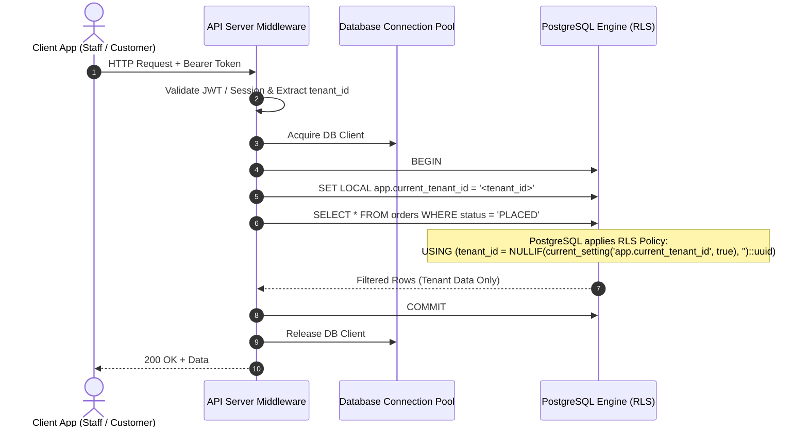

# ASSO Row-Level Security (RLS) Architecture & Specifications

> **Version:** 1.1.0  
> **Status:** SPECIFICATION / DESIGN ARTIFACT (PHASE 3 — VERIFIED & AUDITED)  
> **Authority:** Aligned with `AGENTS.md` and Phase 2 Security Architecture (`ADR-005`, `SECURITY-ARCHITECTURE.md`)  

---

## 1. RLS Strategy & Defense-in-Depth Philosophy

In ASSO, multi-tenant security operates via strict defense-in-depth across two completely independent, mandatory layers:
1. **Application-Level Authorization:** Application middleware validates tenant context, user roles, module entitlements, and specific RBAC permissions before dispatching queries.
2. **Database-Level Row-Level Security (RLS):** PostgreSQL enforces row-level isolation inside the database query engine. Even if an application bug, IDOR vulnerability, or developer oversight fails to append a `WHERE tenant_id = ...` clause, the database guarantees that records belonging to other tenants are mathematically invisible and immutable.

Application authorization does **not** replace RLS, and RLS does **not** replace application authorization.

---

## 2. Canonical Tenant Context Semantics & Failure Modes

### 2.1 How `app.current_tenant_id` is Set
Every application database connection acquires a client from the connection pool and, within an isolated transaction, executes:

```sql
-- Executed inside the transaction immediately upon acquiring connection from pool
SET LOCAL app.current_tenant_id = 'c0a80123-4567-89ab-cdef-0123456789ab';
```
Using `SET LOCAL` ensures the variable is scoped strictly to the lifetime of the current transaction and is automatically cleared when the transaction commits, rolls back, or the connection is returned to the pool.

### 2.2 How `app.current_tenant_id` is Read
Policies evaluate the session variable using the canonical, type-safe PostgreSQL expression:

```sql
NULLIF(current_setting('app.current_tenant_id', true), '')::uuid
```

### 2.3 Comprehensive Semantic & Failure Analysis (Fail-Closed)

The behavior of this expression across all possible runtime states is rigorously defined:

| Runtime State | Session Variable Value | `current_setting(..., true)` | `NULLIF(..., '')` | Cast to `::uuid` | SQL Evaluation Result | Security Outcome |
| :--- | :--- | :--- | :--- | :--- | :--- | :--- |
| **Normal Valid** | `'c0a80123-...'` (Valid UUID) | `'c0a80123-...'` | `'c0a80123-...'` | Typed `UUID` | `tenant_id = 'c0a80123-...'::uuid` | **Matches only current tenant rows** |
| **Context Missing** | Unset / not executed | `NULL` (due to `missing_ok=true`) | `NULL` | `NULL::uuid` | `tenant_id = NULL` → `UNKNOWN` (falsy) | **Fail-Closed: 0 rows read; writes error** |
| **Context Empty** | `''` (Empty string) | `''` | `NULL` | `NULL::uuid` | `tenant_id = NULL` → `UNKNOWN` (falsy) | **Fail-Closed: 0 rows read; writes error** |
| **Context Malformed**| `'not-a-uuid'` / SQL inject | `'not-a-uuid'` | `'not-a-uuid'` | **Throws `22P02` Exception** | Transaction aborts immediately | **Fail-Closed: Query blocked at parser** |
| **Foreign Tenant** | UUID of Tenant B | UUID of Tenant B | UUID of Tenant B | Typed `UUID` | Evaluates to `FALSE` for Tenant A data | **Cross-tenant access blocked** |

### 2.4 Why Absent Context Fails Closed
In PostgreSQL SQL ternary logic (`TRUE`, `FALSE`, `UNKNOWN`):
- In `USING` clauses (for `SELECT`, `UPDATE`, `DELETE`), any row where the condition evaluates to `UNKNOWN` or `FALSE` is excluded. Comparing any value to `NULL` (e.g. `tenant_id = NULL::uuid`) evaluates to `UNKNOWN`. Thus, if the context is absent or empty, **zero rows are returned, updated, or deleted**.
- In `WITH CHECK` clauses (for `INSERT`, `UPDATE`), the condition must evaluate strictly to `TRUE`. An `UNKNOWN` or `FALSE` evaluation immediately triggers PostgreSQL error code `42501 (insufficient_privilege)`.

---

## 3. RLS Request Flow Diagram



---

## 4. Standard RLS Policy Templates

### 4.1 Tenant-Owned Operational Tables (Standard Pattern)

For tables such as `orders`, `bills`, `expenses`, `service_requests`, `catalog_items`, `inventory_items`:

```sql
-- Enable and force RLS (prevents table owner bypass in pooled application connections)
ALTER TABLE orders ENABLE ROW LEVEL SECURITY;
ALTER TABLE orders FORCE ROW LEVEL SECURITY;

-- 1. SELECT Policy (Supports tenant isolation and audited platform admin bypass)
CREATE POLICY orders_tenant_select ON orders
    FOR SELECT
    USING (
        tenant_id = NULLIF(current_setting('app.current_tenant_id', true), '')::uuid
        OR (COALESCE(NULLIF(current_setting('app.is_super_admin', true), ''), 'false')::boolean = true)
    );

-- 2. INSERT Policy (Ensures tenant_id cannot be forged or mismatch session)
CREATE POLICY orders_tenant_insert ON orders
    FOR INSERT
    WITH CHECK (
        tenant_id = NULLIF(current_setting('app.current_tenant_id', true), '')::uuid
    );

-- 3. UPDATE Policy (Guarantees rows cannot be hijacked across tenants)
CREATE POLICY orders_tenant_update ON orders
    FOR UPDATE
    USING (
        tenant_id = NULLIF(current_setting('app.current_tenant_id', true), '')::uuid
    )
    WITH CHECK (
        tenant_id = NULLIF(current_setting('app.current_tenant_id', true), '')::uuid
    );

-- 4. DELETE Policy
CREATE POLICY orders_tenant_delete ON orders
    FOR DELETE
    USING (
        tenant_id = NULLIF(current_setting('app.current_tenant_id', true), '')::uuid
    );
```

### 4.2 Append-Only Financial and Inventory Ledgers

For strictly immutable tables (`inventory_stock_movements`, `hotel_folio_entries`, `cash_movements`, `audit_events`, `security_events`):

```sql
ALTER TABLE inventory_stock_movements ENABLE ROW LEVEL SECURITY;
ALTER TABLE inventory_stock_movements FORCE ROW LEVEL SECURITY;

-- Allow SELECT within tenant
CREATE POLICY inv_movements_tenant_select ON inventory_stock_movements
    FOR SELECT
    USING (
        tenant_id = NULLIF(current_setting('app.current_tenant_id', true), '')::uuid
        OR (COALESCE(NULLIF(current_setting('app.is_super_admin', true), ''), 'false')::boolean = true)
    );

-- Allow INSERT within tenant
CREATE POLICY inv_movements_tenant_insert ON inventory_stock_movements
    FOR INSERT
    WITH CHECK (
        tenant_id = NULLIF(current_setting('app.current_tenant_id', true), '')::uuid
    );

-- Strictly FORBID UPDATE & DELETE by evaluating to FALSE
CREATE POLICY inv_movements_no_update ON inventory_stock_movements
    FOR UPDATE USING (false);

CREATE POLICY inv_movements_no_delete ON inventory_stock_movements
    FOR DELETE USING (false);
```

### 4.3 Child Items Without Direct Tenant ID (Cascade Inheritance)

For normalized detail tables that reference a tenant-scoped parent (e.g., `order_item_modifiers` referencing `order_items`):

```sql
ALTER TABLE order_item_modifiers ENABLE ROW LEVEL SECURITY;
ALTER TABLE order_item_modifiers FORCE ROW LEVEL SECURITY;

CREATE POLICY order_item_modifiers_select ON order_item_modifiers
    FOR SELECT
    USING (
        EXISTS (
            SELECT 1 FROM order_items oi
            WHERE oi.order_item_id = order_item_modifiers.order_item_id
              AND oi.tenant_id = NULLIF(current_setting('app.current_tenant_id', true), '')::uuid
        )
    );
```
*(Note: As defined in `DATABASE-SCHEMA.md`, all high-volume tables include direct `tenant_id` denormalization to maximize RLS query optimization and avoid expensive joins during RLS evaluation).*

---

## 5. Service-Role and Platform Admin Bypass Rules

1. **No Application Pool Bypass:** Standard application connection pools connect under an unprivileged PostgreSQL role that has `FORCE ROW LEVEL SECURITY` active. Application code cannot disable RLS.
2. **Platform Admin (`is_super_admin`):**
   - The expression `COALESCE(NULLIF(current_setting('app.is_super_admin', true), ''), 'false')::boolean = true` is evaluated safely.
   - If `app.is_super_admin` is unset or empty, it defaults to `false`.
   - The API Gateway only issues `SET LOCAL app.is_super_admin = 'true'` when the requesting identity has been authenticated via MFA as a verified Super Admin user.
3. **Database Migrations and CI/CD:** Migration scripts run under a dedicated `postgres_admin` or `service_role` user that possesses the PostgreSQL `BYPASSRLS` attribute. This is restricted strictly to automated migration runners and prohibited for live user queries.

---

## 6. Security Reviews & Threat Defenses

| Threat Scenario | Attack Vector | RLS Defense Mechanism |
| :--- | :--- | :--- |
| **Missing Tenant Context** | Buggy endpoint fails to execute `SET LOCAL app.current_tenant_id`. | `NULLIF(..., '')` evaluates to `NULL`. Policy evaluates `tenant_id = NULL` → `UNKNOWN`. Returns zero rows; writes fail. |
| **Forged Tenant ID in Payload** | Malicious actor passes `{ "tenant_id": "foreign-id" }` in JSON body. | `WITH CHECK (tenant_id = current_setting(...))` rejects the INSERT/UPDATE with PostgreSQL policy violation error `42501`. |
| **Cross-Tenant IDOR via UUID Guessing** | User submits `GET /orders/<uuid-of-other-tenant>`. | Even with direct primary key `WHERE order_id = '...'`, the RLS `USING` filter silently excludes foreign tenant rows, returning `404 Not Found`. |
| **Super Admin Privilege Abuse** | Compromised staff session claiming super-admin privileges. | `app.is_super_admin` session setting is strictly controlled by backend auth gateway and rejected unless verified by dedicated Super Admin JWT and MFA claims. |
| **SQL Injection Boundary Leak** | Attacker injects `UNION SELECT * FROM organizations`. | Standard application connection role has RLS enabled with `FORCE ROW LEVEL SECURITY`, preventing cross-tenant extraction even through secondary SQL injection vectors. |
