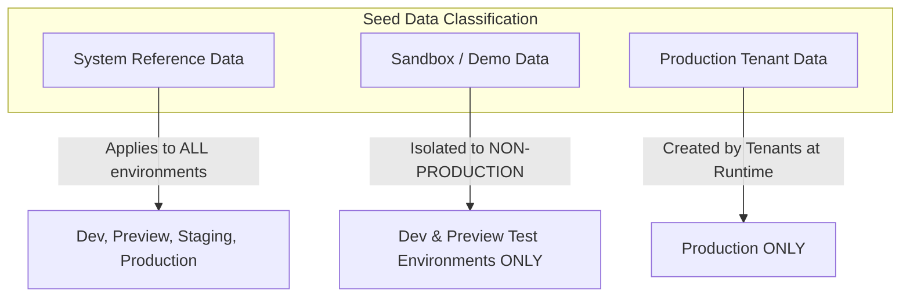

# ASSO Database Seed & Reference Data Strategy

> **Version:** 1.0.0  
> **Status:** SPECIFICATION / DESIGN ARTIFACT (PHASE 3)  
> **Authority:** Aligned with `ENTITY-CATALOG.md` and `MIGRATION-STRATEGY.md`  

---

## 1. Classification of Seed Data

ASSO enforces strict boundaries between three distinct classes of data:



---

## 2. System Reference Data (Idempotent Universal Catalog)

System reference data defines platform capabilities, business verticals, and security structures. These rows are seeded in every environment via idempotent scripts (`ON CONFLICT DO NOTHING` or `DO UPDATE`).

### 2.1 Platform Modules & Features
```sql
INSERT INTO platform_modules (module_code, name, is_core, description) VALUES
('CORE_PLATFORM', 'Core Platform & Multi-Tenancy', true, 'Tenants, outlets, auth, RBAC'),
('CATALOG', 'Catalog & Menu Engine', true, 'Menu items, categories, variants'),
('ORDERING', 'Ordering Engine & KDS', true, 'Unified order lifecycle and kitchen routing'),
('BILLING_PAYMENTS', 'Billing & Payments Engine', true, 'Bills, payment gateway abstraction, refunds'),
('INVENTORY', 'Inventory Engine', false, 'Stock movements, multi-location balances, wastage'),
('PROCUREMENT', 'Procurement Engine', false, 'Purchase orders and supplier management'),
('EXPENSES', 'Expense Management', false, 'Operating expense tracking and approvals'),
('CASH_MANAGEMENT', 'Cash Management', false, 'Cash drawers, sessions, float movements'),
('SERVICE_REQUESTS', 'Service Requests', true, 'Housekeeping, maintenance, guest requests'),
('CONVERSATIONS', 'Chat & Conversations', true, 'Guest-staff messaging engine'),
('HOTEL_CORE', 'Hotel Management', false, 'Rooms, stays, folios, housekeeping'),
('RESTAURANT_CORE', 'Restaurant Management', false, 'Dining areas, tables, waitlist, reservations'),
('CINEMA_CORE', 'Cinema Management', false, 'Auditoriums, seats, shows')
ON CONFLICT (module_code) DO NOTHING;
```

### 2.2 System Role Templates
```sql
INSERT INTO roles (role_id, tenant_id, name, description, is_system_role) VALUES
('00000000-0000-0000-0000-000000000001', NULL, 'TENANT_ADMIN', 'Full administrative authority over tenant', true),
('00000000-0000-0000-0000-000000000002', NULL, 'OUTLET_MANAGER', 'Operational manager for specific outlet', true),
('00000000-0000-0000-0000-000000000003', NULL, 'CASHIER_POS', 'POS and billing operator', true),
('00000000-0000-0000-0000-000000000004', NULL, 'KITCHEN_STAFF', 'KDS station operator', true),
('00000000-0000-0000-0000-000000000005', NULL, 'HOUSEKEEPING_STAFF', 'Room cleaning and maintenance staff', true),
('00000000-0000-0000-0000-000000000006', NULL, 'CINEMA_USHER', 'Auditorium usher and seat service staff', true)
ON CONFLICT (role_id) DO NOTHING;
```

---

## 3. Demo / Sandbox Data Specification

Demo data is maintained in dedicated scripts (e.g., `seed-demo-hotel.sql`, `seed-demo-restaurant.sql`) and is **strictly prohibited** in Production and Staging.
- Demo Tenant: "Demo Hospitality Group"
- Outlets: "Demo Grand Hotel (Hotel)", "Demo Bistro (Restaurant)", "Demo Multiplex (Cinema)"
- Pre-populated test rooms, tables, seats, catalog items, and mock staff credentials for preview testing.
