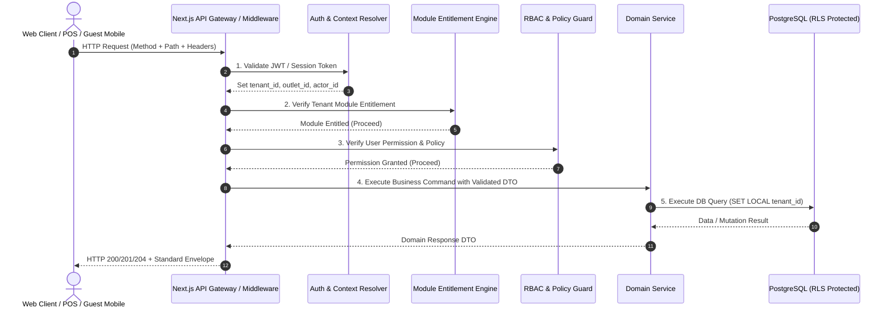

# ASSO API Architecture & Design Specifications

> **Version:** 1.0.0  
> **Status:** SPECIFICATION / DESIGN ARTIFACT (PHASE 3)  
> **Base Path:** `/api/v1/`  
> **Authority:** Aligned with Phase 2 Backend Architecture (`BACKEND-ARCHITECTURE.md`)  

---

## 1. REST Conventions & Standards

ASSO exposes a canonical, production-grade REST API:
- **Base URI:** `/api/v1/<domain-resource>`
- **Content-Type:** `application/json; charset=utf-8`
- **Standard HTTP Verbs:**
  - `GET`: Read resource or collection (safe, idempotent).
  - `POST`: Create resource or initiate an operation.
  - `PUT`: Complete resource replacement (idempotent).
  - `PATCH`: Partial resource update.
  - `DELETE`: Mark resource as deleted or remove.
- **Resource Naming:** Lowercase, pluralized nouns (e.g., `/api/v1/orders`, `/api/v1/hotel/rooms`, `/api/v1/inventory/items`). Sub-resources represent clear parent-child relationships (e.g., `/api/v1/orders/{orderId}/items`).

---

## 2. API Request Lifecycle Diagram



---

## 3. Standard Response Envelopes

Every successful JSON API response wraps payloads in a predictable envelope:

### 3.1 Single Resource Response
```json
{
  "success": true,
  "data": {
    "orderId": "c0a80123-4567-89ab-cdef-0123456789ab",
    "orderNumber": "ORD-2026-0012",
    "status": "PLACED",
    "totalAmount": 450.00
  },
  "meta": {
    "requestId": "req_8f1b2c3d4e5f",
    "timestamp": "2026-09-26T12:00:00.000Z"
  }
}
```

### 3.2 Paginated Collection Response
```json
{
  "success": true,
  "data": [
    { "itemId": "uuid-1", "name": "Espresso" },
    { "itemId": "uuid-2", "name": "Cappuccino" }
  ],
  "meta": {
    "requestId": "req_8f1b2c3d4e5f",
    "timestamp": "2026-09-26T12:00:00.000Z"
  },
  "pagination": {
    "page": 1,
    "limit": 20,
    "totalRecords": 84,
    "totalPages": 5,
    "hasNext": true,
    "hasPrev": false
  }
}
```

---

## 4. Query Parameter Standards

- **Pagination:** `page` (default: 1) and `limit` (default: 20, max: 100).
- **Sorting:** `sort=<field>:<asc|desc>` (e.g., `?sort=createdAt:desc`).
- **Filtering:** Explicit equality parameters (e.g., `?status=PLACED&outletId=uuid`).
- **Date Range:** `startDate` and `endDate` in ISO-8601 UTC format.
