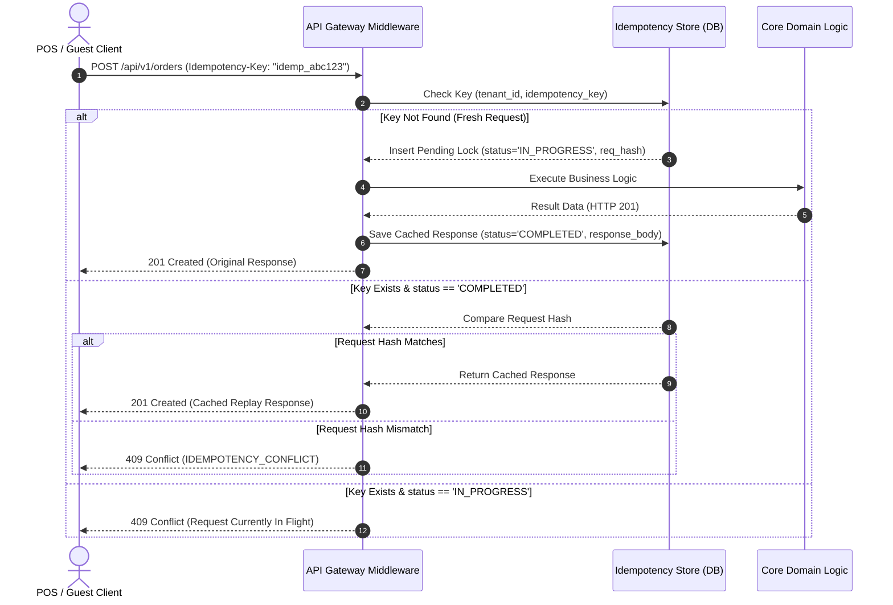

# ASSO API Idempotency Architecture & Contract

> **Version:** 1.0.0  
> **Status:** SPECIFICATION / DESIGN ARTIFACT (PHASE 3)  
> **Header:** `Idempotency-Key: <unique-string>`  
> **Authority:** Aligned with `AGENTS.md` (Duplicate-Request Safety on Critical Paths)  

---

## 1. Idempotency Scope & Principles

To guarantee exactly-once execution across unstable mobile and network environments (preventing double billing, duplicate order creation, or phantom inventory adjustments), ASSO mandates an `Idempotency-Key` for state-mutating financial and operational endpoints.

### Mandatory Idempotent Endpoints
- `POST /api/v1/orders` (Order Creation)
- `POST /api/v1/payments/intent` (Payment Initiation)
- `POST /api/v1/payments/record` (Direct Payment Settlement)
- `POST /api/v1/payments/refund` (Refund Processing)
- `POST /api/v1/procurement/orders/{id}/receive` (Goods Receiving)
- `POST /api/v1/inventory/adjustments` (Manual Stock Movements)
- `POST /api/v1/inventory/transfers` (Inter-location/outlet Transfers)
- `POST /api/v1/expenses` (Expense Voucher Recording)
- Inbound Webhook Ingestion

---

## 2. Idempotency Key Lifecycle & Processing Flow

---

## 3. Storage & Conflict Rules

1. **Storage Schema:** Idempotency records are tracked via `idempotency_keys` table with composite key `(tenant_id, idempotency_key)`:
   - `request_hash`: SHA-256 hash of `(method + path + request_body)`.
   - `status`: `IN_PROGRESS` or `COMPLETED`.
   - `response_code`: HTTP status code.
   - `response_body`: Cached JSON payload.
   - `created_at`: Creation timestamp.
   - `expires_at`: `created_at + INTERVAL '24 hours'`.
2. **Replay Invariant:** If an identical request is received within 24 hours with the same key, the gateway short-circuits the pipeline and immediately replays the cached status code and payload. No duplicate database mutation occurs.
3. **Payload Mismatch Invariant:** If a client reuses an idempotency key with different payload parameters, the API immediately halts and returns `409 Conflict` with error code `IDEMPOTENCY_CONFLICT`.
