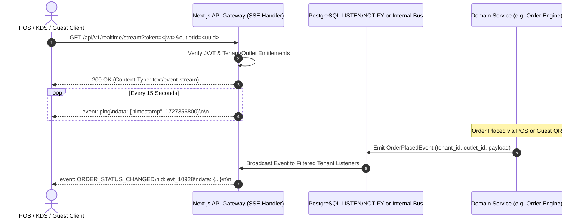

# ASSO Real-Time API Architecture (Server-Sent Events)

> **Version:** 1.0.0  
> **Status:** SPECIFICATION / DESIGN ARTIFACT (PHASE 3)  
> **Endpoint:** `GET /api/v1/realtime/stream`  
> **Authority:** Aligned with Phase 2 Architecture (`ADR-004`, `REAL-TIME-ARCHITECTURE.md`)  

---

## 1. Architectural Strategy

ASSO implements an efficient, enterprise-grade real-time event pipeline:
- **Downstream Push:** Server-Sent Events (SSE) over standard HTTP/2.
- **Upstream Mutations:** Standard REST API endpoints (`POST`, `PATCH`).
- **Resilience:** Automatic browser/client reconnection with `Last-Event-ID` replay buffer and heartbeat pings; fallback to periodic HTTP polling if SSE connection fails.

---

## 2. Real-Time Event Flow Diagram



---

## 3. SSE Wire Format & Event Envelope

All events pushed over the stream conform strictly to the standard SSE format:

```text
event: ORDER_UPDATED
id: 01HAB45678901234
retry: 5000
data: {
  "tenantId": "c0a80123-4567-89ab-cdef-0123456789ab",
  "outletId": "f9182381-8811-4192-ba22-118299102831",
  "eventType": "ORDER_UPDATED",
  "entityId": "7a3f4e12-8822-491a-96e0-1c394c8e7102",
  "data": {
    "orderNumber": "ORD-2026-0042",
    "status": "READY",
    "fulfillmentStation": "KITCHEN"
  },
  "timestamp": "2026-09-26T12:35:00.000Z"
}

```

### Core Event Types
- `ORDER_CREATED`, `ORDER_STATUS_CHANGED` (POS & KDS screens)
- `TABLE_STATUS_CHANGED` (Restaurant floor map)
- `SERVICE_REQUEST_CREATED`, `SERVICE_REQUEST_UPDATED` (Staff task dispatch)
- `CHAT_MESSAGE_RECEIVED` (Guest-staff conversations)
- `BILL_SETTLED`, `PAYMENT_CAPTURED` (Cashier checkout)

---

## 4. Reconnection & Tenant Channel Security

1. **Strict Tenant Isolation:** The SSE connection handler verifies that the authenticated user/session belongs to the requested `tenantId`. Clients only receive messages matching their tenant boundary.
2. **`Last-Event-ID` Header:** When reconnecting after network interruption, the client sends `Last-Event-ID`. The server replays missed events from the temporary event buffer (up to 5 minutes).
3. **Heartbeat Protocol:** The server sends a comment or `event: ping` every 15 seconds to prevent intermediate reverse proxies or Cloudflare from terminating idle HTTP connections.
