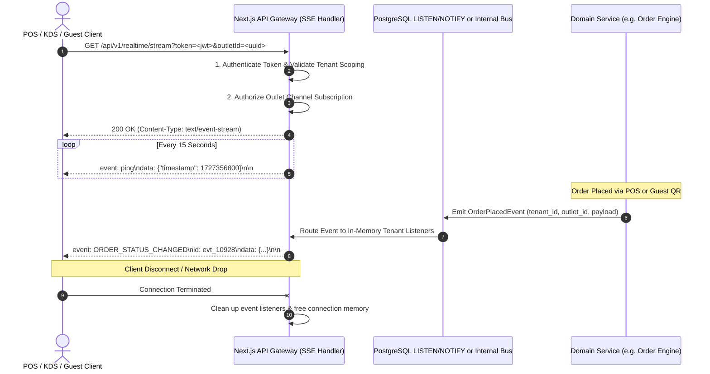

# ASSO Real-Time API Architecture (Server-Sent Events)

> **Version:** 1.1.0  
> **Status:** SPECIFICATION / DESIGN ARTIFACT (PHASE 3 — VERIFIED & AUDITED)  
> **Endpoint:** `GET /api/v1/realtime/stream`  
> **Authority:** Aligned with Phase 2 Architecture (`ADR-004`, `REAL-TIME-ARCHITECTURE.md`)  

---

## 1. Architectural Strategy & Technical Realism

ASSO adopts a lightweight, unidirectional real-time event pipeline for initial implementation:
- **Downstream Push:** Server-Sent Events (SSE) over standard HTTP connections.
- **Upstream Mutations:** Standard REST API endpoints (`POST`, `PATCH`, `DELETE`).
- **Resilience:** Automatic client reconnection with `Last-Event-ID` buffer and heartbeat pings; fallback to periodic HTTP polling if SSE connections fail.

### Important Infrastructure & Scalability Invariant
> [!IMPORTANT]
> **HTTP/2 multiplexing improves packet transport efficiency, but it does NOT by itself solve server-side connection concurrency, worker memory consumption, or event fan-out scaling.**  
> In serverless and containerized environments (such as Vercel or Node.js runtimes), maintaining long-lived connections holds open execution contexts, consumes memory, and requires careful connection lifecycle management.  
> SSE is the approved **initial delivery mechanism** for the modular monolith baseline. Its scaling limits are an explicit future infrastructure consideration, not something solved merely by HTTP/2.

---

## 2. Real-Time Event Flow Diagram

---

## 3. End-to-End Connection Lifecycle (6-Stage Pipeline)

Every SSE connection transitions through an explicit 6-stage lifecycle:

1. **Stage 1 — Client Authentication:** The client initiates `GET /api/v1/realtime/stream` providing a Bearer token via `Authorization` header (or ticket query parameter for browser EventSource compatibility). The gateway verifies signature, expiration, and user identity.
2. **Stage 2 — Tenant & Outlet Authorization:** The gateway confirms that the client has active access to the specified `tenant_id` and `outlet_id`. Unauthenticated or cross-tenant requests are rejected immediately with `401 Unauthorized` or `403 Forbidden`.
3. **Stage 3 — Channel Subscription & Handshake:** The connection handshake completes with HTTP 200 `text/event-stream`, and the client is registered in the process's local connection registry keyed by `(tenant_id, outlet_id, channel)`.
4. **Stage 4 — Heartbeat Protocol:** The server sends an `event: ping` every 15 seconds. If a client fails to receive a ping within 45 seconds, the client terminates and reconnects.
5. **Stage 5 — Graceful Timeout & Reconnection:** On serverless platforms with maximum request durations (e.g. Vercel edge/serverless functions), connections gracefully close before the execution limit (e.g. at 55 seconds), and the client automatically reconnects using `Last-Event-ID` without user disruption.
6. **Stage 6 — Disconnection & Resource Cleanup:** When a connection drops or closes, an `abort` listener fires, immediately unsubscribing the client from the event bus and releasing connection memory.

---

## 4. Reconnection & Message Replay

1. **`Last-Event-ID` Header:** The client's EventSource client automatically includes `Last-Event-ID` upon reconnection.
2. **In-Memory Replay Buffer:** The local process retains a ring buffer of recent events (last 5 minutes / 100 events per outlet). When reconnecting, the server checks `Last-Event-ID` and replays any missed events before resuming the live stream.
3. **Buffer Miss Recovery:** If a client was disconnected longer than the buffer retention window, the server pushes an `event: RESYNC_REQUIRED` message, instructing the client UI to perform a full REST state refresh (e.g. `GET /api/v1/orders`).

---

## 5. Event Source & Dispatching Architecture

In the initial modular monolith baseline:
- Real-time events originate from domain service mutations (e.g., `OrderService.placeOrder()` emitting `OrderPlacedEvent`).
- Events are distributed internally to connected SSE handlers on the same instance via Node.js `EventEmitter` or PostgreSQL `LISTEN / NOTIFY`.
- No distributed message broker (Kafka, RabbitMQ, Redis Pub/Sub) is introduced at this stage.

---

## 6. HTTP Polling Fallback

In restricted network environments where HTTP streaming or long-lived connections are blocked by corporate firewalls, reverse proxies, or client incompatibilities:
1. The client detects SSE connection failure after 3 failed attempts.
2. The client gracefully falls back to periodic short-polling via standard REST APIs:
   - KDS Screen: `GET /api/v1/fulfillment/kds?since=<timestamp>` every 5–10 seconds.
   - POS Screen: `GET /api/v1/orders?status=active` every 10 seconds.
   - Guest QR Status: `GET /api/v1/customer/orders` every 15 seconds.

---

## 7. Future Scaling Path

As concurrency and multi-instance deployments expand in future phases:
- If multiple server instances require cross-node event distribution, a dedicated pub/sub or fan-out service (such as Redis Pub/Sub or managed WebSocket/SSE infrastructure) will be evaluated under the decision process:
  $$\text{Identified Requirement} \longrightarrow \text{Architecture Evaluation} \longrightarrow \text{Documented Decision} \longrightarrow \text{Implementation}$$
- Speculative introduction of message brokers is prohibited during current phases.
