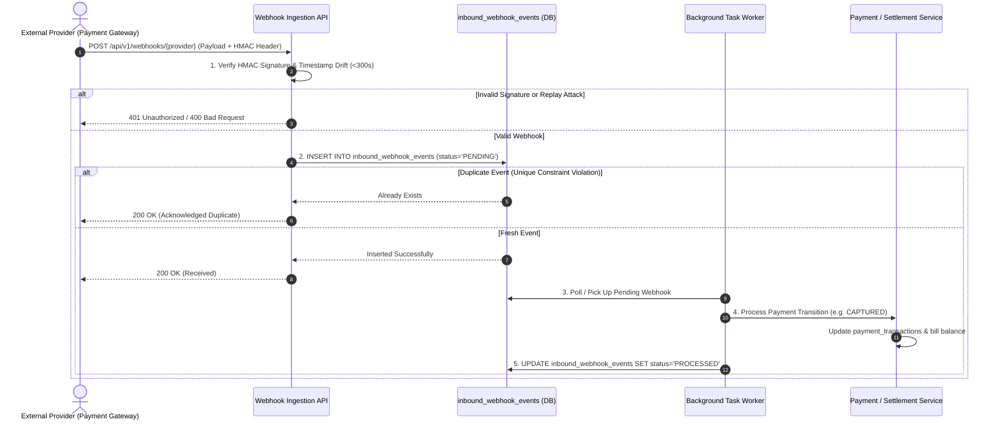

# ASSO Inbound Webhook Architecture & Contract

> **Version:** 1.0.0  
> **Status:** SPECIFICATION / DESIGN ARTIFACT (PHASE 3)  
> **Base Path:** `/api/v1/webhooks/{provider}`  
> **Authority:** Aligned with DEC-002 (Provider-Neutral Payment Gateway Architecture)  

---

## 1. Architectural Strategy

ASSO provides an asynchronous, provider-neutral ingestion pipeline for external third-party webhooks (payment gateways, messaging providers):
- **Immediate Acknowledgment:** The webhook receiver validates signatures, logs raw payloads immutably into `inbound_webhook_events`, and immediately responds with `200 OK` within 200ms.
- **Idempotency Deduplication:** The provider and event ID form a unique constraint `UNIQUE(provider, event_id)` to prevent replay attacks or duplicate deliveries.
- **Asynchronous Processing:** Background workers process the queued event, updating transactions and emitting internal domain events.

---

## 2. Inbound Webhook Flow Diagram

---

## 3. Webhook Security & Verification Rules

1. **HMAC Signature Verification:** Each provider configuration defines a secret webhook key. The raw request body is hashed via HMAC-SHA256 and compared using constant-time string comparison (`crypto.timingSafeEqual`) to prevent timing attacks.
2. **Timestamp Replay Defense:** Payloads containing event timestamps older than 300 seconds (5 minutes) are rejected to prevent replay attacks.
3. **Payload Archival:** The raw JSON payload is preserved in `inbound_webhook_events.payload` for audit, troubleshooting, and manual replay in case of unexpected processing failures.
4. **Error Handling & Retries:** If a background worker encounters a transient error (e.g. temporary database lock), the event status is updated to `FAILED`, incrementing `retry_count` with exponential backoff (1m, 5m, 15m, 1h).
