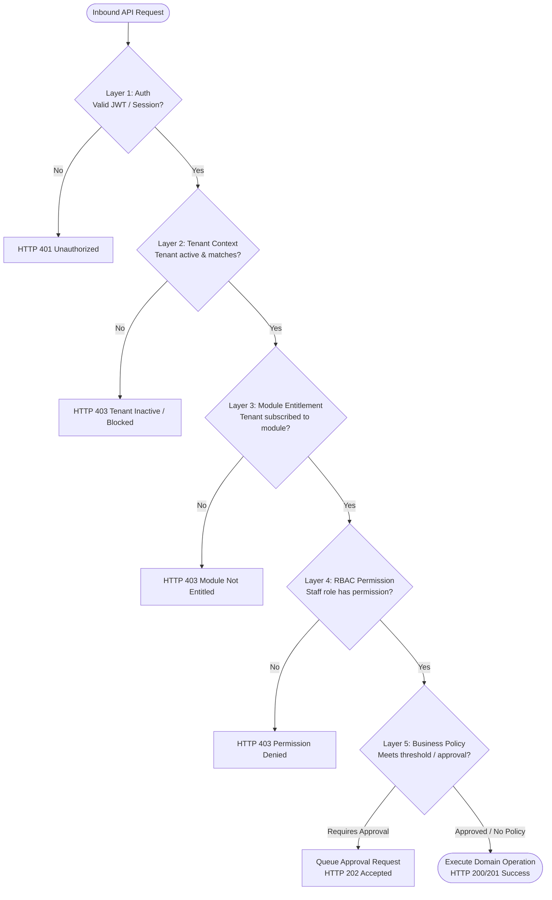
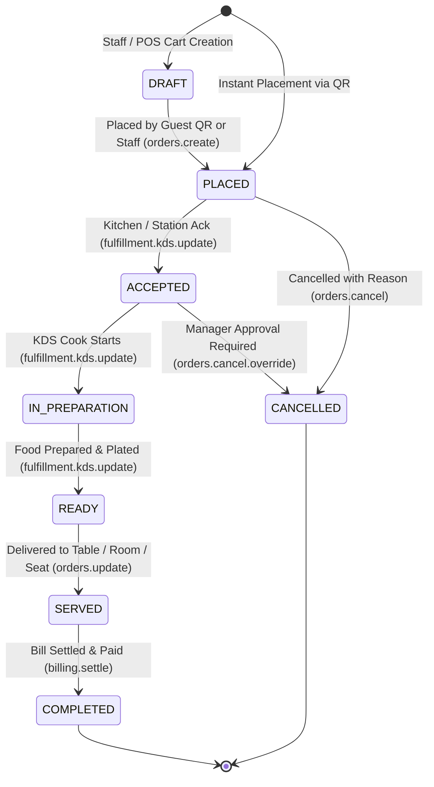

# ASSO Five-Layer Authorization Architecture

> **Version:** 1.0.0  
> **Status:** SPECIFICATION / DESIGN ARTIFACT (PHASE 3)  
> **Authority:** Aligned with `AGENTS.md` (Server-Side Authority, RBAC and Module Entitlements)  

---

## 1. The Five-Layer Enforcement Pipeline

Security and authorization in ASSO are evaluated sequentially. Frontend navigation or UI element hiding is strictly cosmetic; every request is independently verified across all five layers on the server:

$$\text{Request} \longrightarrow \text{1. Auth} \longrightarrow \text{2. Tenant} \longrightarrow \text{3. Entitlement} \longrightarrow \text{4. RBAC} \longrightarrow \text{5. Policy} \longrightarrow \text{Operation}$$

---

## 2. Layer Responsibilities & Failure Modes

### Layer 1: Authentication
- **Evaluates:** Is the requester who they claim to be?
- **Failure:** Returns `401 Unauthorized` with `AUTHENTICATION_REQUIRED` or `MFA_CHALLENGE_REQUIRED`.

### Layer 2: Tenant Isolation
- **Evaluates:** Does the requested resource belong to the authenticated user's organization? Is the tenant active?
- **Failure:** Returns `404 Not Found` (to prevent resource enumeration) or `403 Forbidden` if tenant is suspended.

### Layer 3: Module Entitlement
- **Evaluates:** Has the tenant purchased the commercial plan or add-on containing this feature (e.g. `INVENTORY`, `HOTEL_CORE`)?
- **Failure:** Returns `403 Forbidden` with `MODULE_NOT_ENTITLED`.

### Layer 4: RBAC Permission
- **Evaluates:** Does the specific user's assigned role have the granular permission (e.g. `orders.create`, `expenses.approve`)?
- **Failure:** Returns `403 Forbidden` with `PERMISSION_DENIED`.

### Layer 5: Policy Guard
- **Evaluates:** Does this operation exceed an financial approval threshold (e.g., refund > ₹1,000, expense > ₹5,000)?
- **Behavior:** Either executes immediately or creates an `approval_requests` entry and notifies designated approvers.

---

## 3. Order Lifecycle & Authorization State Transitions

