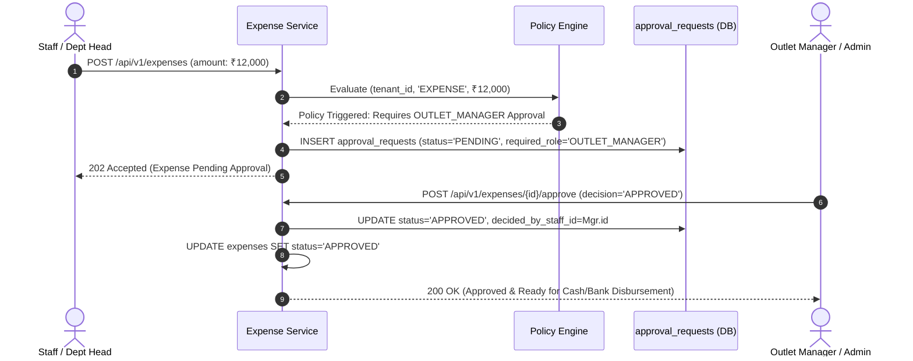
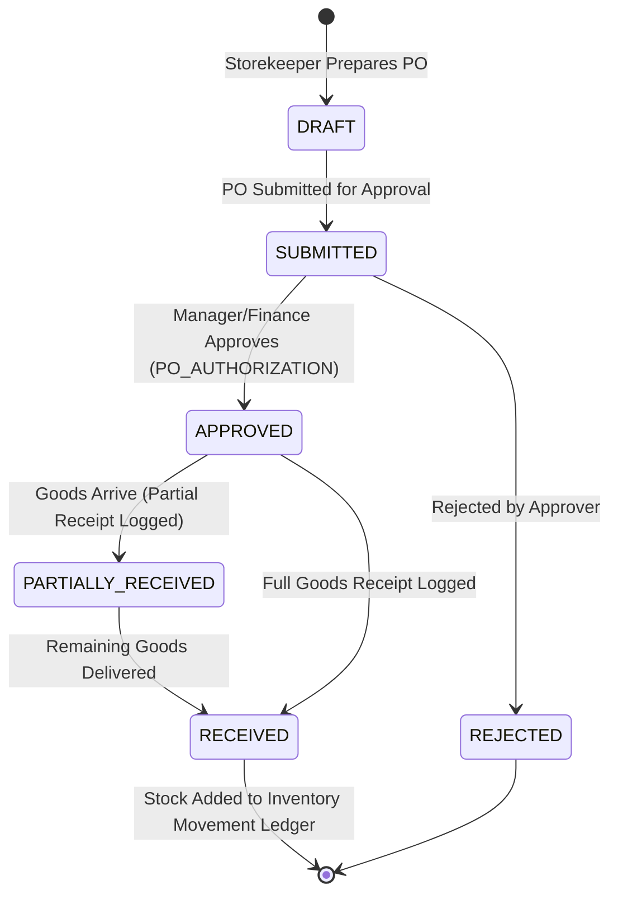

# ASSO Policy & Approval Engine Architecture

> **Version:** 1.0.0  
> **Status:** SPECIFICATION / DESIGN ARTIFACT (PHASE 3)  
> **Authority:** Aligned with `AGENTS.md` (Policies / Approval Rules)  

---

## 1. Architectural Philosophy: Permissions vs Policies

In ASSO:
- **Permissions answer:** *Who* has authority to initiate an action? (e.g., Staff with `expenses.create` can create an expense voucher).
- **Policies answer:** *Under what conditions* may this action immediately execute versus requiring secondary human approval? (e.g., Expenses exceeding ₹5,000 require Outlet Manager sign-off; expenses exceeding ₹50,000 require Tenant Admin sign-off).

---

## 2. Threshold Configuration Rules

Tenants configure policy thresholds in the `approval_policies` table without requiring code modifications:

| Policy Type | Target Entity | Threshold Criteria | Required Approver Role |
| :--- | :--- | :--- | :--- |
| `EXPENSE_APPROVAL_L1` | `expenses` | Amount > ₹5,000 | `OUTLET_MANAGER` |
| `EXPENSE_APPROVAL_L2` | `expenses` | Amount > ₹50,000 | `TENANT_ADMIN` |
| `REFUND_THRESHOLD` | `payment_refunds` | Refund Amount > ₹1,000 | `OUTLET_MANAGER` |
| `STOCK_ADJUSTMENT_VALUE`| `inventory_stock_movements` | Adjustment Value > ₹10,000 | `OUTLET_MANAGER` |
| `PO_AUTHORIZATION` | `purchase_orders` | Total Amount > ₹25,000 | `FINANCE_CONTROLLER` |
| `LATE_CHECKOUT_WAIVER` | `hotel_stays` | Extra hours > 2 hours | `HOTEL_MANAGER` |

---

## 3. Expense Approval Workflow Diagram

---

## 4. Procurement Approval & Receiving Flow Diagram

---

## 5. Decision Auditing & Immutability

1. **Tamper-Evident History:** Every decision writes to `approval_requests` with `decision_reason`, `decided_by_staff_id`, and `decided_at`.
2. **No Self-Approval:** A staff member cannot approve their own approval request, even if they possess the required managerial role (`CHECK (requested_by_staff_id != decided_by_staff_id)`).
