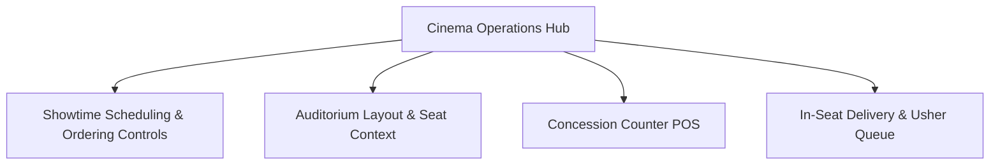

# ASSO Cinema Vertical UX Specification

> **Version:** 1.0.0  
> **Status:** SPECIFICATION / DESIGN ARTIFACT (PHASE 4)  
> **Implementation Sequence:** Stage 4 (Third Vertical in Approved Sequence)  
> **Authority:** Aligned with Phase 2 Architecture (`VERTICAL-ARCHITECTURE.md`) and Context Engine Model  

---

## 1. Cinema Operations Architecture

The Cinema vertical optimizes in-seat concession ordering, auditorium cleaning turnarounds, and usher delivery workflows:

---

## 2. Key Screen Specifications

### 2.1 Showtimes & Ordering Availability Schedule
- **Schedule Grid:** Displays auditoriums (`Screen 1 - IMAX`, `Screen 2 - Atmos`, `Screen 3 - VIP`).
- **Show Blocks:** Color-coded movie cards with start and end times, language, and censor rating (`UA`, `A`).
- **In-Seat Ordering Toggle:** Each showtime card features an active toggle switch: `Enable In-Seat Ordering`.
- **Automated Cut-Off Rule:** The UI visually displays an ordering curfew (e.g. *"In-seat ordering automatically closes 20 minutes before movie ends"*).

### 2.2 Interactive Auditorium Seat Map
- **Auditorium Geometry:**
  - Curved screen visual indicator at top labeled `SCREEN THIS WAY`.
  - Grid rows labeled `A` through `P`; seat numbers `1` through `24`.
  - Seating Tiers Color-Coded:
    - `Silver`: Standard Tier
    - `Gold`: Premium Club
    - `Purple`: Recliner / VIP Lounger
- **Seat States:**
  - `Available (White / Slate outline)`
  - `Selected (Indigo solid)`
  - `Occupied / Booked (Slate solid)`
  - `Active Order In-Flight (Amber pulsing dot)`
- **Seat QR Anchoring:** Each seat's physical QR resolves to `(tenant_id, outlet_id, context_id: Seat G-14)`.

### 2.3 Customer In-Seat Concession Ordering (Mobile QR)
When a moviegoer scans their seat armrest QR code:
1. **Welcome Screen:** Displays confirmed context: *"Starlight Multiplex • Screen 2 • Seat G-14"*.
2. **Concession Catalog:** Popcorn combos (Caramel, Cheese, Salted), nachos, soft drinks, gourmet snacks.
3. **Delivery Option Selector:**
   - `Deliver to My Seat` (Usher delivers during movie without interrupting screening).
   - `Pick Up at Express Counter` (Collect at concession counter with pickup token).
4. **Silent Mode UX:** UI defaults to a sleek dark mode theme (`#0F172A`) with subdued screen brightness hints to avoid disturbing fellow moviegoers inside the darkened theater.

### 2.4 Usher Runner Delivery Queue (Mobile Staff View)
- **Primary Goal:** Quick, silent delivery inside dark auditoriums.
- **Delivery Ticket Cards:**
  - Extra-large text: **SCREEN 2 — SEAT G-14**.
  - Order Contents: `1x Large Caramel Popcorn, 2x Pepsi 500ml`.
  - Timer: Elapsed since concession packing.
- **Workflow Action:** Single-swipe to confirm: `Swiped to Mark Delivered`.
