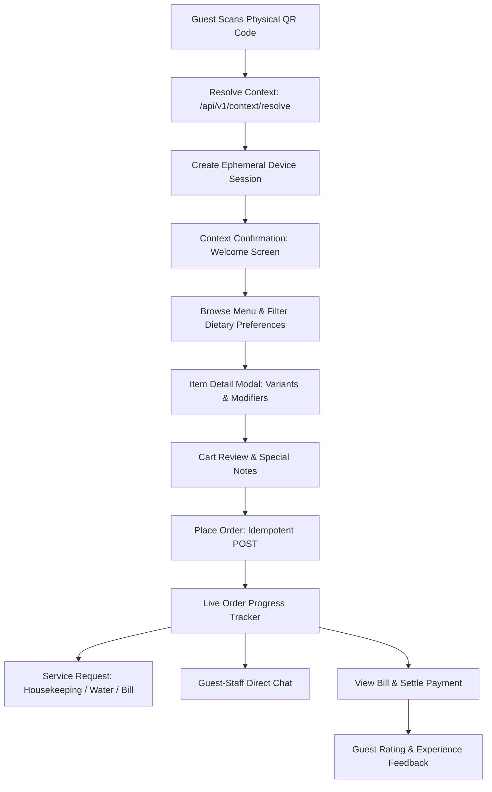

# ASSO Customer Guest Experience Specification

> **Version:** 1.0.0  
> **Status:** SPECIFICATION / DESIGN ARTIFACT (PHASE 4)  
> **Channel:** Responsive Mobile Web Application (Zero App Install Required)  
> **Authority:** Aligned with Phase 1 PRD (`CUSTOMER-EXPERIENCE.md`) and Phase 3 Customer Session Security  

---

## 1. Customer Journey Architecture

The guest interacts with ASSO through an unauthenticated, zero-install mobile web application initiated by scanning a physical QR code. The guest is insulated from all internal tenant complexities, organizations, and backend structures:

---

## 2. Screen-by-Screen UX Specifications

### 2.1 Context Confirmation (Welcome Landing)
- **Header:** High-resolution property logo, outlet name, and confirmed physical context:
  - Hotel: *"Welcome to Grand Palace • Room 304"*
  - Restaurant: *"Spice Garden Bistro • Table 14"*
  - Cinema: *"Starlight Multiplex • Screen 2 - Seat G-12"*
- **Tone:** Hospitable, premium, uncluttered.
- **Primary CTA:** `Browse Menu & Services`.

### 2.2 Interactive Catalog & Dietary Filtering
- **Sticky Category Carousel:** Top horizontal pills (`Breakfast`, `Appetizers`, `Main Course`, `Desserts`, `Beverages`).
- **Dietary Badges & Quick Toggle:**
  - Standard India dietary marks: Green Dot in Square (`Veg`), Red Dot in Square (`Non-Veg`), Brown Triangle (`Egg`).
  - Instant toggle button: `Veg Only` switch in search header.
- **Item Card Anatomy:**
  - High-quality food/amenity photograph (1:1 aspect ratio, optimized WebP).
  - Item Title + Brief culinary description.
  - Price formatted cleanly (`₹350`).
  - Add Button: `+ ADD`. If item has required variants/modifiers, button displays `ADD + Customise`.
  - Out-of-Stock: If item unavailable in backend, image is desaturated, button displays `SOLD OUT` (disabled).

### 2.3 Item Customization Sheet (Modal Drawer)
- Slides up from bottom on mobile.
- **Variant Selection (Radio):** e.g., Size (`Regular`, `Large +₹80`).
- **Modifier Add-ons (Checkbox):** e.g., Extra Cheese (`+₹50`), Jalapeños (`+₹30`).
- **Special Cooking Instructions:** Textarea (max 200 chars, e.g. "Less spicy, no onions").
- **Sticky Footer Action:** `Add to Order — ₹430` button with dynamic price recalculation.

### 2.4 Cart & Order Placement
- **Floating Bottom Pill:** While browsing, a floating bar displays: `2 Items • ₹680 [View Cart →]`.
- **Cart Screen:**
  - List of items with quantity steppers (`- 1 +`).
  - Detailed tax breakdown: Subtotal, CGST (2.5%), SGST (2.5%), Total Payable.
  - Context confirmation badge: *"Delivering to Room 304"*.
  - Primary CTA: `Place Order`. Triggers backend mutation with client-generated `Idempotency-Key` to prevent double-charging on patchy cellular networks.

### 2.5 Live Order Progress Tracker
Real-time state updates powered by Phase 3 SSE (`/api/v1/realtime/stream`):
- **Stepped Visual Progress Bar:**
  1. `Order Placed` (Acknowledged by system)
  2. `Accepted by Kitchen` (Cook confirmed)
  3. `Preparing` (Active in kitchen with elapsed timer)
  4. `Ready & En Route` (Plated / out for delivery)
  5. `Delivered / Completed`
- **Fallback:** If mobile network drops, connection indicator switches to `Refreshing...` and automatically polls status every 15 seconds.

### 2.6 Digital Bill & Payment Settlement
- Guest can request physical bill or pay digitally:
  - Options: `Pay Online (UPI / Card / NetBanking)` or `Pay Cash to Staff / Front Desk`.
  - Online flow uses provider-neutral gateway intent (`POST /api/v1/payments/intent`).
  - Instant payment confirmation screen with downloadable digital invoice/receipt.

---

## 3. Session Expiration & Error UX

| Scenario | UX Presentation & User Recovery |
| :--- | :--- |
| **Invalid QR Token** | Friendly error card: *"We couldn't recognize this QR code. Please ask staff for assistance."* |
| **Revoked / Inactive QR** | Warning screen: *"This table or room QR has been refreshed. Please scan the current code on your table."* |
| **Session Expired (e.g. Past Checkout)**| Information screen: *"Your session for Room 304 has ended. Thank you for staying with us!"* |
| **Kitchen Closed / Service Unavailable** | Informational banner above menu: *"Kitchen is currently closed. Reopens at 7:00 PM for dinner."* Add buttons disabled. |
