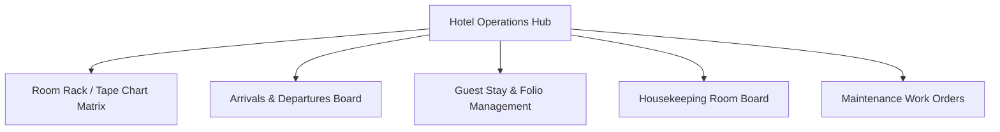

# ASSO Hotel Vertical UX Specification

> **Version:** 1.0.0  
> **Status:** SPECIFICATION / DESIGN ARTIFACT (PHASE 4)  
> **Implementation Sequence:** Stage 2 (First Vertical in Approved Sequence)  
> **Authority:** Aligned with Phase 2 Architecture (`VERTICAL-ARCHITECTURE.md`) and Phase 3 Database Schema  

---

## 1. Hotel Front Office & Operations Workspace

The Hotel Front Office interface unifies room inventory, guest reservations, arrivals/departures, and room status management.

---

## 2. Key Screen Specifications

### 2.1 The Room Rack / Tape Chart Matrix
- **Layout:** Two-dimensional timeline grid:
  - Y-Axis: Room numbers grouped by floor (`Floor 1: 101-112`, `Floor 2: 201-215`) and Room Type (`Deluxe King`, `Executive Suite`).
  - X-Axis: Dates / Days of the week (7-day, 14-day, or 30-day view).
- **Reservation Blocks:** Color-coded horizontal bars representing stays:
  - `Green`: Checked-In Active Stay
  - `Blue`: Confirmed Advance Reservation
  - `Amber`: Scheduled Departure Today
  - `Gray`: Maintenance / Blocked Room
- **Interactions:**
  - Click empty slot: Opens `New Reservation / Walk-in Check-in` modal.
  - Click reservation bar: Opens `Guest Stay Quick Sheet` showing guest name, balance due, expected checkout, and shortcut to `Open Folio`.

### 2.2 Arrivals & Departures Flow
- **Arrivals Tab:** List of expected guests today.
  - Quick Action: `Check In`.
  - Check-in Modal: Verify guest phone/email, select ID proof type (`Aadhaar`, `Passport`), input masked ID number, assign room number, set expected checkout, and click `Complete Check-in`. Triggers stay creation and initializes guest folio ledger.
- **Departures Tab:** List of guests checking out today.
  - Displays Folio Balance Due (`₹0.00` = Ready to Check Out; `>₹0.00` = Balance Pending).
  - Quick Action: `Settle & Check Out`. Opens Folio Settlement Sheet.

### 2.3 Guest Stay & Folio Management (Financial Ledger UX)
In strict accordance with Phase 3 immutable financial ledgers:
- **Stay Overview Header:** Room 304, Primary Guest Name, Check-in Time, Expected Checkout, Total Charges (`₹14,500.00`), Total Paid (`₹14,500.00`), Balance Due (`₹0.00`).
- **Folio Ledger Entries Table:**
  - Columns: `Date/Time`, `Type (ROOM_CHARGE, TAX, RESTAURANT_BILL, LAUNDRY, PAYMENT, REVERSAL)`, `Description`, `Reference #`, `Amount (₹)`, `Posted By`, `Actions`.
  - No "Edit" or "Delete" buttons exist on finalized entries.
- **Posting Actions:**
  - `+ Post Charge`: Select charge type, description, amount, and notes.
  - `+ Record Payment`: Select payment method (Cash, Card, UPI, Gateway), amount, and note.
  - `Apply Adjustment / Reversal`: For erroneous charges, opens reversal dialog requiring reason selection (`Billing Error`, `Manager Courtesy`). Writes compensating negative entry with `reverses_entry_id`.
- **Checkout Settlement:** When balance reaches ₹0.00, `Finalize Checkout` button activates, marking stay `CHECKED_OUT` and transitioning room status to `DIRTY`.

### 2.4 Housekeeping Room Board
- **Mobile-First Staff View:** Cleaners view tasks on mobile phone or tablet:
  - Card list grouped by floor: `Room 102 [DIRTY]`, `Room 103 [CLEAN - UNINSPECTED]`, `Room 104 [OCCUPIED]`.
- **Cleaning Workflow:**
  1. Staff taps `Start Cleaning` → Room transitions to `IN_PROGRESS`.
  2. Staff completes room checklist (Linen changed, amenities restocked, bathroom sanitized).
  3. Staff taps `Mark as Clean` → Room transitions to `CLEAN`.
  4. Supervisor inspects and taps `Approve` → Room transitions to `INSPECTED` (Ready for guest arrival).
