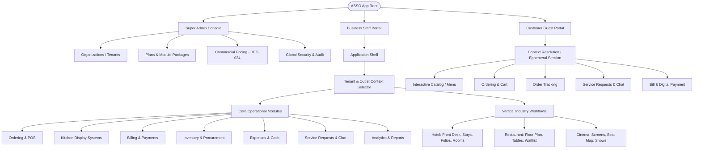

# ASSO Information Architecture & Navigation Hierarchy

> **Version:** 1.0.0  
> **Status:** SPECIFICATION / DESIGN ARTIFACT (PHASE 4)  
> **Authority:** Aligned with Phase 2 Architecture (`MULTI-TENANCY.md`, `VERTICAL-ARCHITECTURE.md`) and Phase 3 RBAC/Entitlements  

---

## 1. Information Architecture Overview

ASSO unifies multi-tenant business administration, vertical operational workflows (Hotel, Restaurant, Cinema), shared commercial engines, and customer guest experiences within a clear, hierarchical navigation tree.

---

## 2. Navigation Scoping Rules & Dimensional Matrix

Navigation visibility in ASSO is evaluated against three distinct dimensions:
1. **Tenant Entitlement:** Does this organization subscribe to the module containing this navigation item?
2. **Outlet Vertical:** Does the active outlet support this capability (e.g. Hotel Stays appear only in Hotel outlets)?
3. **Staff RBAC Permissions:** Does the current user's role possess the granular view permission (e.g. `inventory.view`)?

> [!IMPORTANT]
> **UI Visibility is Not Authorization:** Hiding a sidebar link or disabling a button is purely an ergonomics feature to reduce visual clutter. Every API endpoint independently enforces tenant isolation, module entitlements, and RBAC permissions on the server.

| Navigation Item | Entitlement Dependency | Vertical Scoping | Required RBAC Permission | Scope Level |
| :--- | :--- | :--- | :--- | :--- |
| **Organizations & Plans** | System Core | Platform Wide | `platform.tenants.manage` | Global / Super Admin |
| **Commercial Pricing** | System Core | Platform Wide | `platform.pricing.manage` | Global / Super Admin |
| **Organization Settings**| `CORE_PLATFORM` | Tenant Wide | `settings.view` | Tenant Scope |
| **Outlets & Properties** | `CORE_PLATFORM` | Tenant Wide | `outlets.view` | Tenant Scope |
| **Staff & Roles** | `CORE_PLATFORM` | Tenant / Outlet | `staff.view` | Tenant Scope |
| **POS & Orders** | `ORDERING` | All Verticals | `orders.view` | Outlet Scope |
| **KDS (Kitchen Display)**| `ORDERING` | All Verticals | `fulfillment.kds.view`| Outlet Scope |
| **Billing & Payments** | `BILLING_PAYMENTS` | All Verticals | `billing.view` | Outlet Scope |
| **Inventory & Stock** | `INVENTORY` | All Verticals | `inventory.view` | Outlet Scope |
| **Procurement** | `PROCUREMENT` | All Verticals | `procurement.view` | Outlet Scope |
| **Expenses** | `EXPENSES` | All Verticals | `expenses.view` | Outlet Scope |
| **Cash Management** | `CASH_MANAGEMENT` | All Verticals | `cash.view` | Outlet Scope |
| **Hotel Front Desk** | `HOTEL_CORE` | **Hotel Only** | `hotel.rooms.view` | Outlet Scope |
| **Hotel Folios** | `HOTEL_CORE` | **Hotel Only** | `hotel.folios.view` | Outlet Scope |
| **Housekeeping Board** | `HOTEL_CORE` | **Hotel Only** | `hotel.housekeeping.view`| Outlet Scope |
| **Restaurant Floor Map** | `RESTAURANT_CORE` | **Restaurant Only**| `restaurant.tables.view`| Outlet Scope |
| **Waitlist & Queue** | `RESTAURANT_CORE` | **Restaurant Only**| `restaurant.queue.view` | Outlet Scope |
| **Cinema Auditorium** | `CINEMA_CORE` | **Cinema Only** | `cinema.screens.view` | Outlet Scope |
| **Cinema Shows** | `CINEMA_CORE` | **Cinema Only** | `cinema.shows.view` | Outlet Scope |
| **Service Requests** | `SERVICE_REQUESTS`| All Verticals | `service.view` | Outlet Scope |
| **Guest Conversations** | `CONVERSATIONS` | All Verticals | `chat.view` | Outlet Scope |

---

## 3. Staff Navigation Tree Structure

### Primary Sidebar (Left Rail)
- **Top Brand / Context Area:**
  - ASSO Brand Logo
  - Active Tenant Switcher (if user belongs to multiple organizations)
  - Active Outlet Switcher (e.g., "Grand Palace Hotel", "Spice Garden Bistro")
- **Vertical Core Workflows (Dynamically injected based on active outlet vertical):**
  - *When Hotel Active:* Front Desk Rack, Guest Stays, Room Housekeeping, Maintenance.
  - *When Restaurant Active:* Floor Map & Tables, Waitlist Queue, Reservations.
  - *When Cinema Active:* Showtimes, Auditorium Seats, Concessions.
- **Shared Operational Engines:**
  - Orders & POS
  - Kitchen Display (KDS)
  - Billing & Cash Drawers
  - Service Requests
  - Guest Messages (Chat)
- **Back-Office & Administration (Collapsible):**
  - Inventory & Stock Balances
  - Purchase Orders & Procurement
  - Operating Expenses
  - Operational Reports
  - Staff & Shift Rosters
  - Settings (Outlet & Catalog)
- **Bottom Profile & Help Area:**
  - Current Staff Profile & Role Badge
  - Network / Realtime Connection Status Indicator
  - User Settings & Logout

---

## 4. Customer Guest Navigation Tree (Mobile Web View)

The customer enters via QR scan and interacts through a streamlined mobile layout without complex nested navigation:
1. **Header Bar:** Property Name + Physical Context (e.g. "Grand Palace — Room 304" or "Table 12").
2. **Category Scroll Rail:** Sticky horizontal scroll (`Appetizers`, `Mains`, `Beverages`, `House Amenities`).
3. **Floating Bottom Navigation Bar:**
   - **Menu / Catalog** (Fork & Knife Icon)
   - **My Orders / Tracking** (Receipt Icon + Active Status Badge)
   - **Service & Assistance** (Bell Icon)
   - **Guest Chat** (Chat Bubble Icon + Unread Badge)
   - **View Cart / Settle Bill** (Floating Bottom Sticky Action Button)
