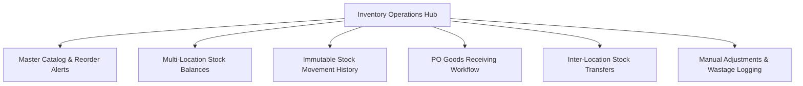

# ASSO Inventory & Procurement UX Specification

> **Version:** 1.0.0  
> **Status:** SPECIFICATION / DESIGN ARTIFACT (PHASE 4)  
> **Authority:** Aligned with Phase 2 Architecture (`SHARED-ENGINES.md`) and Phase 3 Inventory Ledger Model  

---

## 1. Inventory UX Philosophy

Inventory in ASSO serves all verticals (Hotel linens and amenities, Restaurant kitchen ingredients and bar liquor, Cinema popcorn corn and cups). The UX cleanly separates **Current Stock Availability** from the **Immutable Stock Movement Ledger**:

---

## 2. Key Screen Specifications

### 2.1 Multi-Location Stock Balances
- **Location Selector:** Dropdown to switch or filter locations: `All Locations`, `Central Warehouse`, `Main Kitchen Pantry`, `Rooftop Bar`, `Housekeeping Linen Closet`.
- **Stock Balance Grid:**
  - Columns: `SKU`, `Item Name`, `Category`, `Location`, `Current Quantity`, `Unit (KG, LTR, PCS)`, `Unit Cost (₹)`, `Total Valuation (₹)`, `Stock Status`.
- **Low Stock Indicator:** When `current_quantity <= reorder_threshold`, the row highlights with an Amber tag (`LOW STOCK`) and offers a quick action: `+ Create PO`.

### 2.2 Immutable Stock Movement Ledger View
- **Purpose:** Audit trail of every gram, liter, and piece that entered or left the business.
- **Table Columns:** `Timestamp`, `Item SKU & Name`, `Location`, `Movement Type (PURCHASE_RECEIPT, TRANSFER_IN, TRANSFER_OUT, WASTAGE, ADJUSTMENT)`, `Quantity Delta (+ / -)`, `Reference Doc (PO #, Transfer #)`, `Recorded By`, `Notes`.
- **Visuals:** Positive deltas in Emerald Green (`+50.00 KG`), Negative deltas in Slate/Rose (`-5.00 KG`). Filterable by movement type and date range.

### 2.3 Purchase Order Goods Receiving Flow
When supplier deliveries arrive at the loading bay or kitchen entrance:
1. **Search & Select PO:** Enter supplier name or PO Number (e.g. `PO-2026-0104`).
2. **Receiving Line Items Checklist:**
   - Displays: `Item Name`, `Ordered Qty`, `Previously Received Qty`, `Received Today Input`.
   - Supports **Partial Receiving:** If supplier delivered 80 out of 100 kg, clerk inputs `80`. System automatically calculates remaining balance of `20 kg` and marks PO as `PARTIALLY_RECEIVED`.
3. **Invoice / Delivery Challan Attachment:** Clerk captures photo of supplier delivery challan via device camera or file upload.
4. **Post to Ledger:** Clicking `Confirm Goods Receipt` writes atomic positive deltas to `inventory_stock_movements` and updates `inventory_stock_balances` under pessimistic row lock.

### 2.4 Inter-Location & Inter-Outlet Transfers
- **Two-Step Transfer Workflow:**
  1. *Dispatch:* Origin location clerk selects items and quantities, generating a `TRANSFER_OUT` (- delta) with status `IN_TRANSIT`.
  2. *Receive:* Destination location clerk verifies physical count upon arrival and clicks `Accept Transfer`, generating a `TRANSFER_IN` (+ delta).

### 2.5 Wastage & Cycle Count Adjustment Modal
- **Inputs:** `Location`, `Item SKU`, `Quantity Adjusted (- or +)`, `Wastage Reason (Expired, Dropped/Broken, Spoiled, Theft, Count Discrepancy)`.
- **Approval Policy Guard:** If adjustment value exceeds tenant policy threshold (e.g. >₹10,000), modal warns: *"Requires Outlet Manager sign-off before stock balance is updated."*
- **DEC-027 Scope Guard:** Automatic recipe/BOM depletion remains explicitly deferred. All stock movements are logged via PO receiving, transfers, manual sales reconciliation, or wastage records.
