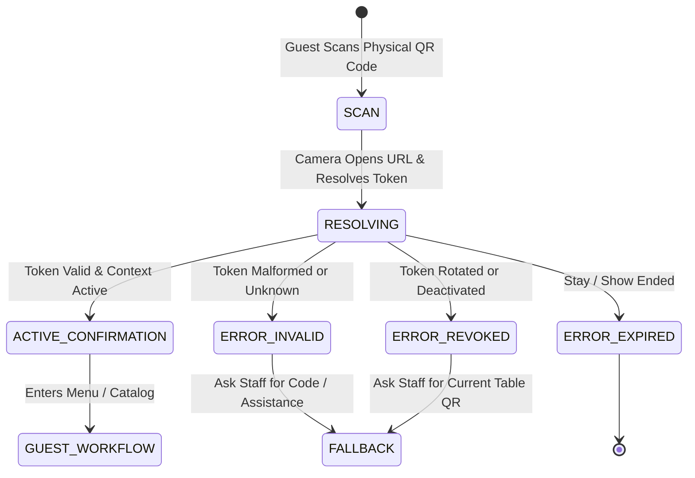

# ASSO QR Entry & Context Resolution UX Specification

> **Version:** 1.0.0  
> **Status:** SPECIFICATION / DESIGN ARTIFACT (PHASE 4)  
> **Authority:** Aligned with Phase 2 QR Engine and Phase 3 Customer Session Security Model  

---

## 1. QR Experience Philosophy & Security Invariant

In ASSO, physical QR codes printed on hotel room desks, restaurant tables, and cinema seat armrests serve as **entry and context resolution mechanisms**, not as authorization boundaries:
- The QR contains an opaque, cryptographically random token (e.g. `https://order.asso.app/qr/7f8a9b1c...`).
- Internal database primary keys, tenant IDs, or database structures are never exposed in the URL.
- Scanning the code resolves to an active physical context and provisions an ephemeral, device-bound customer session token.

---

## 2. Complete QR Resolution Lifecycle UX

---

## 3. Screen Specifications Across States

### 3.1 Resolving / Loading State
- **Presentation:** Minimalist loading screen with subtle animated brand pulse.
- **Micro-copy:** *"Locating your table / room details..."*
- **SLA:** Context resolution completes within 400ms on standard 4G cellular connections.

### 3.2 Success & Context Confirmation
- **Presentation:** High-impact confirmation banner:
  - Hotel: *"Grand Palace Hotel • Room 304"* (Sub-text: *"Stay of Ananya Sharma"*)
  - Restaurant: *"Spice Garden Bistro • Table 12"* (Sub-text: *"Seated in Main Dining"*)
  - Cinema: *"Starlight Multiplex • Screen 2 - Seat G-14"* (Sub-text: *"Avengers: Secret Wars • 7:30 PM"*)
- **User Verification:** If the guest accidentally scanned a neighboring table or old coaster, a small tertiary button allows: *"Wrong Table? Re-scan QR"*.

### 3.3 Error & Edge Cases

| Error Scenario | User-Facing Presentation | Clear Recovery Path |
| :--- | :--- | :--- |
| **Invalid / Damaged QR** | Illustration of scannable code. Headline: *"Unrecognized Code"*. Body: *"This QR code could not be verified by ASSO."* | Button: `Ask Staff for Assistance` or `Enter Code Manually`. |
| **Revoked / Rotated QR** | Headline: *"Code Refreshed"*. Body: *"For security, codes are refreshed periodically. Please scan the current code on your table."* | Button: `Open Camera to Re-scan`. |
| **Session Expired (Checkout)** | Headline: *"Session Concluded"*. Body: *"Your guest session for Room 304 has ended. We hope you enjoyed your stay!"* | Informational only. Access to orders and services closed. |
| **Physical Context Inactive** | Headline: *"Table Currently Closed"*. Body: *"This dining section is currently closed for service."* | Button: `View Open Outlets`. |

---

## 4. Manual Fallback Flow

In rare cases where a guest's smartphone camera is broken or the printed QR code sticker is physically scratched:
1. Every physical QR sticker includes a 4-digit human-readable fallback pin (e.g. `Code: T-12`).
2. The guest navigates to the property's public URL (`order.asso.app/spice-garden`) and enters the 4-digit code.
3. The system validates the code against the active outlet's context registry and establishes the ephemeral session.
