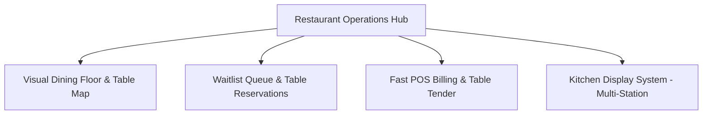

# ASSO Restaurant Vertical UX Specification

> **Version:** 1.0.0  
> **Status:** SPECIFICATION / DESIGN ARTIFACT (PHASE 4)  
> **Implementation Sequence:** Stage 3 (Second Vertical in Approved Sequence)  
> **Authority:** Aligned with Phase 2 Architecture (`VERTICAL-ARCHITECTURE.md`) and Ordering/KDS Shared Engines  

---

## 1. Restaurant Operations Architecture

The Restaurant vertical manages fast-paced dining rooms, bar service, walk-in waitlists, and kitchen fulfillment:

---

## 2. Key Screen Specifications

### 2.1 Interactive Floor & Table Map
- **Area Tabs:** Top segmented control switches dining zones (`Main Dining Room`, `Rooftop Terrace`, `Bar Lounge`, `Private Dining`).
- **Table Node Anatomy:**
  - Shape & Size: Circles for 2-tops/4-tops, Rectangles for 6-tops/8-tops.
  - Number & Capacity: e.g. `T-12 (4 Pax)`.
  - State Color Coding:
    - `Emerald Outline`: Available / Empty
    - `Rose Fill`: Occupied (Seated)
    - `Amber Badge`: Order Placed (Food Preparing)
    - `Sky Badge`: Food Served (Dining)
    - `Purple Badge`: Bill Printed (Awaiting Payment)
    - `Gray Stippled`: Dirty / Awaiting Bussing
- **Table Popover Action:** Tapping a table reveals live details: Seated time, Active Order #, Running Bill Subtotal (`₹1,240`), and Quick Actions (`+ Add Food`, `Print Bill`, `Settle Table`).

### 2.2 Waitlist & Walk-In Queue Manager
- **Queue Board:** Left drawer or split panel alongside floor map.
- **Entry Form:** Quick input: `Guest Name`, `Phone Number`, `Party Size (Pax)`, `Seating Preference (Any, Indoor, Outdoor)`.
- **Waiting Queue Cards:**
  - Card displays guest name, party size, wait time elapsed (`14 mins`), and estimated remaining wait.
  - Actions:
    - `Notify via SMS / Call`: Sends automated arrival notification to guest phone.
    - `Seat Party`: Prompts host to select an available table from floor plan, automatically marking table `OCCUPIED`.
    - `No Show / Cancel`: Removes entry with reason.

### 2.3 Fast Table POS & Bill Settlement
- **Table Order View:**
  - Left Menu Grid: High-speed food catalog with item tiles and modifier popovers.
  - Right Ticket: Ordered items grouped by seat or dining course (`Starters`, `Mains`, `Beverages`).
- **Bill Splitting UX:**
  - `Split by Item`: Drag items into Sub-Bill A, Sub-Bill B.
  - `Split Equally`: Enter number of ways (e.g. 4 ways → 4 equal ₹350 bills).
- **Tender Modal:** Instant payment options (Cash with change calculator, UPI Dynamic QR displayed on customer-facing terminal, Card POS integration).

### 2.4 Kitchen Display System (KDS Multi-Station Routing)
- **Station Filter:** Header switches views between `All Stations`, `Hot Kitchen`, `Cold Pantry`, `Bar / Drinks`.
- **Order Ticket Header:**
  - Table Number (large text `TABLE 14`), Order Number, Order Type (`Dine-In`, `Takeout`).
  - Aging Timer:
    - `0–10 mins`: Green text (Standard)
    - `10–20 mins`: Amber text (Attention)
    - `>20 mins`: Flashing Red text + gentle audio chime (Delayed)
- **Item Level Bumping:** Cooks can tap individual items to mark them complete (e.g. burger ready, fries still cooking) before bumping the entire ticket to `READY`.
