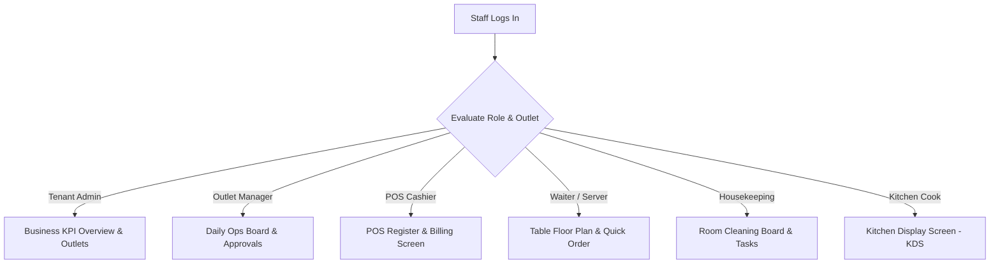

# ASSO Staff Operational Experience Specification

> **Version:** 1.0.0  
> **Status:** SPECIFICATION / DESIGN ARTIFACT (PHASE 4)  
> **Personas:** Tenant Admin, Outlet Manager, Cashier, Waiter, Housekeeping, Kitchen Staff  
> **Authority:** Aligned with Phase 1 PRD (`FEATURE-MATRIX.md`) and Phase 3 RBAC Authorization Matrix  

---

## 1. Role-Adaptive Interface Strategy

ASSO avoids forcing all staff into a generic dashboard. The application shell automatically adapts its default view and available tools based on the authenticated staff member's active role:

---

## 2. Staff Persona UX Standards

### 2.1 Cashier / POS Operator View
- **Primary Goal:** Maximum speed during checkout; minimize keystrokes and clicks.
- **Layout (Split View):**
  - Left Zone (60%): Fast Catalog Grid with category tabs and search. Tap item to add to bill.
  - Right Zone (40%): Current Order Ticket / Bill summary with item modifiers, discounts, and tax calculation.
- **Tender Bar:** Persistent large bottom buttons for payment methods: `[Cash - Exact]`, `[Cash - Calculate Change]`, `[UPI QR]`, `[Card Terminal]`.
- **Keyboard Shortcuts:** Dedicated keys (`F2: New Bill`, `F8: Discount`, `F12: Tender/Pay`, `Esc: Clear Cart`).

### 2.2 Waiter & Floor Staff View (Tablet / Mobile Optimized)
- **Primary Goal:** Table and room status visibility on hand-held devices; zero accidental order taps.
- **Floor Grid View:** Visual map of dining tables with color-coded status (`Green: Available`, `Red: Seated`, `Amber: Awaiting Bill`, `Blue: Reserved`).
- **Quick Order Flow:**
  1. Tap Table 12 → Popover displays active party size and elapsed time.
  2. Tap `+ Add Items` → Compact menu sheet opens with dietary quick-filter pills.
  3. Tap `Send to Kitchen` → Instant dispatch to KDS; visual checkmark confirmation.

### 2.3 Outlet Manager View (Operations & Approvals)
- **Primary Goal:** Spot bottlenecks, unblock staff, and review policy approval requests.
- **Daily Operations Strip:** Live KPI summary: Today's Gross Revenue, Active Occupancy (Rooms/Tables/Seats), Open KDS Orders, Pending Service Tickets.
- **Approval Queue Drawer:** High-visibility badge on header when requests await sign-off:
  - Refund Requests (>₹1,000)
  - Expense Vouchers (>₹5,000)
  - High-Value Stock Adjustments
  - Actions: `Approve` (with biometric/password prompt) vs `Reject` (with mandatory reason).

### 2.4 Kitchen / Bar Display (KDS) View
- **Primary Goal:** Ultra-high contrast, large touch targets, readable from 10 feet away in hot/busy kitchens.
- **Dark Mode Default:** Deep slate background (`#0F172A`) to reduce glare and eye fatigue.
- **Order Ticket Card:**
  - Header: Table/Room #, Order #, Elapsed Timer (changes to Amber at 15 mins, Red at 25 mins).
  - Body: Item checklist with modifiers highlighted in bold yellow (e.g. **NO ONIONS**, **EXTRA SPICE**).
  - Footer Action: Large single-tap `BUMP` button to advance status: `Preparing → Ready`.
