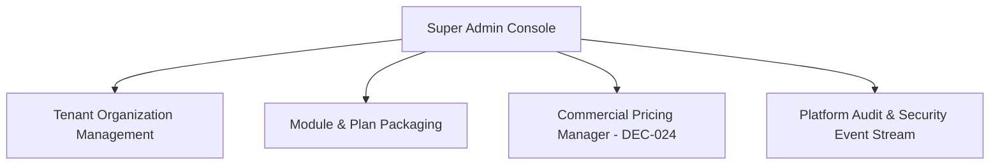

# ASSO Super Admin Console UX Specification

> **Version:** 1.0.0  
> **Status:** SPECIFICATION / DESIGN ARTIFACT (PHASE 4)  
> **Persona:** Platform Operator / Super Admin  
> **Authority:** Aligned with Phase 2 Architecture (`SUPER-ADMIN.md`) and DEC-024 (Commercial Pricing)  

---

## 1. Console Purpose & Ergonomics

The Super Admin Console is the dedicated control plane for platform operators to manage tenants, configure commercial subscription tiers, update SaaS pricing (DEC-024), and monitor cross-platform security:
- **Visual Identity:** Distinct platform badge (`ASSO PLATFORM CONTROL`), subdued slate theme, high-contrast operational indicators.
- **Mandatory MFA Verification:** Login requires verified TOTP authentication. Any administrative session without MFA is immediately redirected to the TOTP challenge screen.

---

## 2. Core Operational Modules

### 2.1 Tenant Organization Management
- **Tenant Directory Table:**
  - Columns: `Organization Name`, `Primary Vertical`, `Outlets`, `Active Plan`, `Status (ACTIVE, PAST_DUE, SUSPENDED)`, `MRR / Plan Rate`, `Created Date`, `Actions`.
  - Filter by vertical (`Hotel`, `Restaurant`, `Cinema`, `Mixed-Enterprise`) and status.
- **Tenant Provisioning Wizard (4 Steps):**
  1. *Business Details:* Legal name, trade name, tax identifier (GSTIN/VAT), primary contact email/phone.
  2. *Initial Outlets:* Add primary property/branch, vertical type, timezone, and base currency.
  3. *Subscription & Entitlements:* Select Base Commercial Plan (`Starter`, `Professional`, `Enterprise`), add-on modules (`Inventory`, `Procurement`, `Expenses`).
  4. *Admin Credentials:* Create initial Tenant Admin staff account with invitation email trigger.

### 2.2 Commercial Pricing Manager (DEC-024)
Allows platform operators to update subscription pricing without requiring code changes or schema migrations:
- **Price Matrix Table:**
  - Displays all billable targets (`Plans`, `Add-on Modules`, `Advanced Features`).
  - Columns: `Target Name`, `Type`, `Billing Interval (Monthly, Annual)`, `Base Price (₹)`, `Active Version`, `Effective From`, `Actions`.
- **Edit Price Dialog (Version-Preserved):**
  - Inputs: `New Base Price`, `Effective Date (Default: Immediate)`.
  - Explanatory Note: *"Updating price will close current pricing version and create Version N+1. Existing active tenant contracts will remain on their snapshot price until renewed."*
- **Tenant-Specific Override Sheet:**
  - Search and select specific organization.
  - Set custom negotiated price or percentage discount.
  - Mandatory `Approval Reason` text field for audit compliance.

### 2.3 Global Security & Compliance Audit
- **Security Incident Feed:** Real-time stream of high-severity events (MFA failures, suspicious QR scanning spikes, cross-tenant probing attempts).
- **Tenant Impersonation / Scoped Inspection:**
  - Strictly governed by Phase 3 RLS rules: Super Admin cannot query cross-tenant data in a single operational view.
  - To troubleshoot an organization, the Super Admin clicks `Inspect Tenant`, requiring reason logging and password re-entry. The session sets `SET LOCAL app.current_tenant_id = '<target_id>'`, scoping the operator strictly to that tenant's boundaries.
