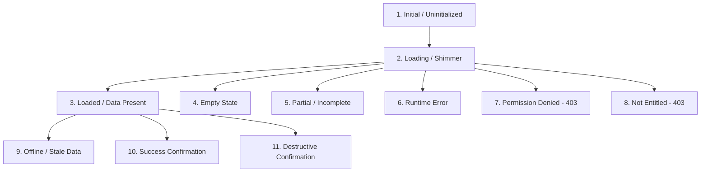

# ASSO Unified UX States Taxonomy

> **Version:** 1.0.0  
> **Status:** SPECIFICATION / DESIGN ARTIFACT (PHASE 4)  
> **Authority:** Aligned with `COMPONENT-SYSTEM.md` and Phase 3 API Error Model  

---

## 1. The Eleven Standardized Interface States

Every major view, dashboard card, table, and interactive widget in ASSO must explicitly account for the eleven standardized lifecycle states. Developing a screen without defining its error, empty, or permission states is strictly prohibited:

---

## 2. State-by-State Specification Matrix

| State | Visual Presentation | Micro-Copy Example | Primary User Recovery Action |
| :--- | :--- | :--- | :--- |
| **1. Initial** | Clean placeholder with contextual prompt. Zero flashing elements. | *"Select a room to view folio details."* | User clicks an entity from the list/grid. |
| **2. Loading** | High-fidelity Skeleton shimmer boxes mirroring exact component geometry. No layout shifts. | Shimmer wave animation (no text). | None (automated transition upon fetch). |
| **3. Loaded** | Full operational data grid, metric cards, or order ticket. | Standard typography and data tables. | User interacts with tools, filters, actions. |
| **4. Empty** | Contextual vector glyph + encouraging header + helper description. | *"No active orders. New orders from tables and rooms will appear here automatically."* | Primary Button: `+ Create Walk-in Order`. |
| **5. Partial** | Warning banner + partial records displayed with yellow warning dot. | *"3 items could not be loaded due to slow network. Remaining 12 items displayed."* | Button: `Retry Missing Items`. |
| **6. Error** | Clean error card with warning icon. Internal technical errors sanitized. | *"Unable to load room rates. (Request ID: req_981a2)"* | Primary Button: `Try Again`. |
| **7. Permission Denied**| Keyhole/Shield icon + Slate card. Explains missing RBAC role. | *"Access Restricted. You need 'inventory.adjust' permission to modify stock."* | Tertiary link: `Contact Outlet Manager`. |
| **8. Not Entitled** | Upgrade diamond icon + informative commercial banner. | *"Inventory Engine is not included in your current plan. Upgrade to unlock multi-location stock tracking."* | Primary Button: `View Available Add-ons` (Tenant Admin only). |
| **9. Offline / Stale**| Yellow/Amber warning ribbon locked to top of viewport. | *"Network disconnected at 12:44 PM. Showing cached data. [Reconnecting...]"* | Automated SSE reconnection loop + manual `Retry` button. |
| **10. Success** | Green checkmark animation + transient toast or confirmation card. | *"Payment of ₹1,450.00 successfully captured. Invoice #INV-102 generated."* | Button: `Print Receipt` or auto-dismiss in 4s. |
| **11. Destructive Conf.**| High-friction alert modal with Red accent border. Focus on Cancel. | *"Are you sure you want to void Bill #0042? This action cannot be undone."* | `Cancel` (Default Focus) vs `Confirm Void` (Solid Rose). |

---

## 3. Micro-Copy Standards Across States

1. **Human & Action-Oriented:** Avoid technical jargon. Use *"We couldn't connect to the printer"* instead of *"Socket connection error 504"*.
2. **Transparent Identifiers:** When an unexpected error occurs, always include the sanitized `requestId` (e.g. `req_01HAB98765`) so staff can quote it directly to technical support.
3. **No Blame Language:** Use neutral phrases (*"Payment could not be completed"*) rather than accusatory phrasing (*"You entered an invalid card"*).
