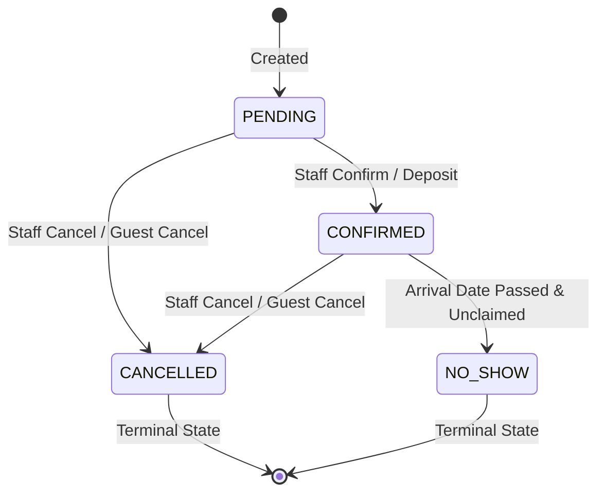

# ASSO — PHASE 7 HOTEL VERTICAL: SLICE 2 SPECIFICATION & RUNBOOK

## Guests & Reservations

---

## Executive Summary

Phase 7 Hotel Slice 2 implements the **Hotel Guest Domain** and the **Reservation Domain** on top of the established Hotel Slice 1 (Property, Room Types, Rooms, Room Rack) and ASSO Platform Foundation.

In strict adherence to the Master Architecture:
1. **Shared Customer Architecture**: Hotel guests are not an isolated identity system. Instead, the global `customers` entity houses identity (name, phone, email), while hotel-specific operational context (VIP tier, masked ID proof, preferences, notes) is encapsulated in `hotel_guests` linked 1:1 with `customer_id`.
2. **Planned Bookings vs. Active Stay**: Reservations represent planned future bookings (`hotel_reservations`) and do **NOT** mark rooms as `OCCUPIED`. Check-in, stay lifecycles, and check-out are deferred to Slice 3.
3. **Finite State Machine**: Reservations progress through server-side state transitions (`PENDING` → `CONFIRMED`, `CANCELLED`; `CONFIRMED` → `CANCELLED`, `NO_SHOW`). `CANCELLED` and `NO_SHOW` are terminal states.
4. **Availability & Conflict Prevention**: Overlapping active reservations for the same physical room are prevented server-side. Room-type capacity dynamically deducts active reservations and ignores `OUT_OF_SERVICE` / `OUT_OF_ORDER` rooms.
5. **Idempotency & Auditing**: Creation endpoints support the platform `Idempotency-Key` header and generate tenant-scoped audit records with sanitized PII.
6. **Native PostgreSQL RLS**: 12 RLS policies with `FORCE ROW LEVEL SECURITY` protect `customers`, `hotel_guests`, and `hotel_reservations`.

---

## 1. Domain Model & Entity Architecture

```text
Organization (Tenant Root)
   │
   ├── Shared Customer (customers)
   │      ├── full_name, phone, email
   │      │
   │      └── Hotel Guest Profile (hotel_guests)
   │             ├── guest_id, customer_id
   │             ├── id_proof_type, id_proof_number_masked
   │             ├── nationality, vip_status
   │             └── notes, preferences
   │
   └── Hotel Property (outlets: vertical_type = 'HOTEL')
          │
          ├── Room Types (hotel_room_types)
          │      └── Physical Rooms (hotel_rooms)
          │
          └── Hotel Reservations (hotel_reservations)
                 ├── reservation_number (e.g. RSV-2610-8491)
                 ├── guest_id ──► hotel_guests
                 ├── room_type_id ──► hotel_room_types (Capacity Allocation)
                 ├── assigned_room_id ──► hotel_rooms (Optional specific assignment)
                 ├── arrival_date, departure_date (TIMESTAMPTZ)
                 ├── adult_count, children_count
                 ├── status (Finite State Machine)
                 └── special_requests, total_amount
```

### Architectural Distinctions:

- **Customer vs. Hotel Guest**: Customer identity is global across ASSO verticals (Restaurant, Cinema, Hotel). Hotel operational preferences (bed configuration, masked ID proof, loyalty VIP status) attach strictly via `hotel_guests`.
- **Reservation vs. Stay**: A reservation does **not** create occupancy. The room status remains `AVAILABLE` until physical check-in occurs (Slice 3).
- **Room Type vs. Room Assignment**: A reservation reserves capacity against a `room_type_id`. A specific `assigned_room_id` can be assigned either at booking or at check-in. If a specific room is assigned, an exclusion check prevents any other active reservation from overlapping with that physical room.

---

## 2. Reservation Finite State Machine



### Allowed State Transitions:

| Current Status | Target Status | Transition Allowed? | Description / Invariants |
| :--- | :--- | :--- | :--- |
| `PENDING` | `CONFIRMED` | **YES** | Reservation confirmed by staff or automated confirmation. |
| `PENDING` | `CANCELLED` | **YES** | Reservation cancelled prior to confirmation. |
| `CONFIRMED` | `CANCELLED` | **YES** | Confirmed reservation cancelled; releases room allocation. |
| `CONFIRMED` | `NO_SHOW` | **YES** | Guest failed to arrive; terminal state. |
| `CANCELLED` | *Any* | **NO** | Terminal state; immutability enforced. |
| `NO_SHOW` | *Any* | **NO** | Terminal state; immutability enforced. |

---

## 3. Date Rules & Conflict Prevention Model

### Invariant 1: Date Order Enforcement
- `arrival_date < departure_date`: Enforced both in TypeScript validation schemas (`zod`) and via database check constraints (`chk_hotel_res_dates`).

### Invariant 2: Specific Room Conflict Prevention
If a reservation assigns a specific physical room (`assigned_room_id` is NOT NULL), no overlapping active (`PENDING` or `CONFIRMED`) reservation may exist for that room:
```sql
WHERE assigned_room_id = :roomId
  AND status IN ('PENDING', 'CONFIRMED')
  AND (arrival_date < :reqDeparture AND departure_date > :reqArrival)
```
Any overlap results in `422 Unprocessable Entity: BUSINESS_RULE_VIOLATION`.

### Invariant 3: Room Type Availability & Capacity Calculation
For room-type capacity queries and booking validation:
1. Total rooms of the specified `room_type_id` with `is_active = true` and `operational_status NOT IN ('OUT_OF_SERVICE', 'OUT_OF_ORDER')`.
2. Active reservations (`PENDING`, `CONFIRMED`) for the property and room type overlapping the requested date window are counted.
3. `available = total_operational_rooms - active_reservations`.
4. If `available <= 0`, booking is rejected with `422 Unprocessable Entity: No available rooms for room type`.

---

## 4. Database Schema & Migration

### Migration `0004_demonic_karma.sql`:

1. `customers` (Core Shared Engine)
   - `customer_id`: UUID PK default gen_random_uuid()
   - `tenant_id`: UUID FK -> organizations(organization_id)
   - `full_name`: VARCHAR(255) NOT NULL
   - `phone`: VARCHAR(50) NOT NULL
   - `email`: VARCHAR(255)
   - `created_at`, `updated_at`: TIMESTAMPTZ NOT NULL
   - `ENABLE ROW LEVEL SECURITY` & `FORCE ROW LEVEL SECURITY` (4 policies)

2. `hotel_guests` (Hotel Specific Operational Context)
   - `guest_id`: UUID PK default gen_random_uuid()
   - `tenant_id`: UUID FK -> organizations(organization_id)
   - `customer_id`: UUID FK -> customers(customer_id)
   - `id_proof_type`: VARCHAR(50) (e.g. AADHAAR, PASSPORT, DRIVING_LICENSE)
   - `id_proof_number_masked`: VARCHAR(100) (e.g. XXXX-XXXX-1234; PII masked)
   - `nationality`: VARCHAR(100) DEFAULT 'INDIAN'
   - `vip_status`: VARCHAR(50) DEFAULT 'STANDARD'
   - `preferences`: JSONB DEFAULT '{}'
   - `notes`: TEXT
   - `created_at`, `updated_at`: TIMESTAMPTZ NOT NULL
   - `ENABLE ROW LEVEL SECURITY` & `FORCE ROW LEVEL SECURITY` (4 policies)

3. `hotel_reservations` (Planned Bookings)
   - `reservation_id`: UUID PK default gen_random_uuid()
   - `tenant_id`: UUID FK -> organizations(organization_id)
   - `outlet_id`: UUID FK -> outlets(outlet_id)
   - `guest_id`: UUID FK -> hotel_guests(guest_id)
   - `reservation_number`: VARCHAR(50) NOT NULL UNIQUE
   - `room_type_id`: UUID FK -> hotel_room_types(room_type_id)
   - `assigned_room_id`: UUID FK -> hotel_rooms(room_id) NULLABLE
   - `arrival_date`: TIMESTAMPTZ NOT NULL
   - `departure_date`: TIMESTAMPTZ NOT NULL
   - `adult_count`: INT NOT NULL DEFAULT 1
   - `children_count`: INT NOT NULL DEFAULT 0
   - `status`: VARCHAR(50) NOT NULL DEFAULT 'CONFIRMED'
   - `special_requests`: TEXT
   - `total_amount`: NUMERIC(14, 4)
   - `created_at`, `updated_at`: TIMESTAMPTZ NOT NULL
   - `ENABLE ROW LEVEL SECURITY` & `FORCE ROW LEVEL SECURITY` (4 policies)

---

## 5. API Endpoints

All endpoints follow canonical ASSO API conventions:
- Security Pipeline: Authentication (`Bearer <jwt>`) → Tenant Context (`app.current_tenant_id`) → Module Entitlement (`HOTEL`) → RBAC check.
- Standard response envelopes: `{ success: true, data: ..., meta: { requestId, timestamp } }`.

| Method | Endpoint | Permission | Description |
| :--- | :--- | :--- | :--- |
| `GET` | `/api/v1/hotel/guests` | `hotel.read` \| `hotel.guests.read` | List hotel guests with search & pagination. |
| `POST` | `/api/v1/hotel/guests` | `hotel.manage` \| `hotel.guests.manage` | Create guest profile (links/creates Customer). |
| `GET` | `/api/v1/hotel/guests/[id]` | `hotel.read` \| `hotel.guests.read` | Get guest details & historical reservations. |
| `PATCH` | `/api/v1/hotel/guests/[id]` | `hotel.manage` \| `hotel.guests.manage` | Update guest details and operational notes. |
| `GET` | `/api/v1/hotel/reservations` | `hotel.read` \| `hotel.reservations.read` | List reservations with status & date filters. |
| `POST` | `/api/v1/hotel/reservations` | `hotel.manage` \| `hotel.reservations.manage` | Create reservation (idempotent, conflict check). |
| `GET` | `/api/v1/hotel/reservations/[id]` | `hotel.read` \| `hotel.reservations.read` | Get reservation details by ID. |
| `PATCH` | `/api/v1/hotel/reservations/[id]` | `hotel.manage` \| `hotel.reservations.manage` | Transition status or assign physical room. |
| `GET` | `/api/v1/hotel/reservations/availability` | `hotel.read` \| `hotel.reservations.read` | Calculate room-type availability for date range. |

---

## 6. Frontend Operations Screens

The ASSO Application Shell navigation is updated:
- `/hotel` — Operational Dashboard with quick links to Guests & Reservations.
- `/hotel/rooms` — Visual Room Rack & status transitions.
- `/hotel/room-types` — Category definitions & baseline rates.
- `/hotel/guests` — Data-dense Guest ledger, search, VIP badges, and guest detail modal with reservation history.
- `/hotel/reservations` — Booking ledger, status filters, "New Reservation" dialog with live availability lookup, and reservation detail drawer with state machine action triggers (`Confirm`, `Cancel`, `No-Show`, `Assign Room`).
- `/hotel/settings` — Multi-property context and timezone configurations.

---

## 7. Automated Test Suite & Verification Results

### Test Suite Summary:
- **Total Test Suites**: 12 passed (100%)
- **Total Automated Tests**: 81 passed (100%)
- **Hotel Slice 2 Integration Tests**: 13 passed against live Supabase PostgreSQL
- **Hotel Reservation State Machine Unit Tests**: 7 passed
- **Native Supabase PostgreSQL & RLS Validation**: 11 passed (100%)
- **TypeScript Static Verification**: `tsc --noEmit` passed with 0 errors
- **Production Build**: `next build` passed; 12 static/dynamic routes generated cleanly

---

## 8. Hard Scope Boundaries & Deferred Decisions

- **No Stay / Check-in / Check-out**: Physical occupancy, stay lifecycles, and keycard issuance are deferred to **Slice 3**.
- **No Housekeeping Task Assignment**: Housekeeping state machine transitions exist from Slice 1, but task assignment workflows are deferred to **Slice 4**.
- **No Folio / Billing / Payments**: Charges, billing, and folio generation are deferred to **Slice 9**.
- **No Restaurant / Cinema**: Cross-vertical features are strictly excluded.
- **Architectural Invariant Maintained**: Rooms are NOT marked `OCCUPIED` upon reservation.
